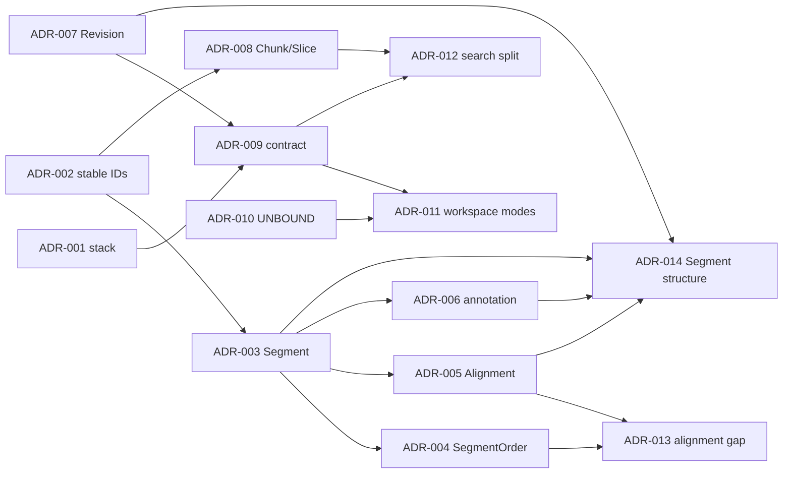

# Jueming Aligner MVP ADR index

_Phase 0 的 14 项架构决策索引；状态以本地单机 MVP 的合同冻结为准。_

---

## 📋 决策总览

| ADR | 决策 | 状态 | 主要约束 |
|---|---|---|---|
| [ADR-001](ADR-001-tauri-rust-vue-stack.md) | Tauri 2 + Rust Kernel + Vue 3 + TypeScript strict | Accepted | 桌面壳与领域核心分离 |
| [ADR-002](ADR-002-stable-ids.md) | Stable ID 与物理位置分离 | Accepted | ID 不等于 index/offset |
| [ADR-003](ADR-003-segment-canonical-unit.md) | Segment 是 canonical relation unit | Accepted | 内容、引用、对齐围绕 Segment |
| [ADR-004](ADR-004-segment-order.md) | SegmentOrder 独立于 Segment | Accepted | 重排不改身份和关系 |
| [ADR-005](ADR-005-alignment-segment-refs.md) | Alignment 只引用 Segment | Accepted | 支持 1:1、1:n、n:1、n:m |
| [ADR-006](ADR-006-human-annotation-sidecar.md) | HumanAnnotation 作为 sidecar layer | Accepted | 不污染 Segment/NLP 层 |
| [ADR-007](ADR-007-append-only-revision.md) | Append-only Revision 与恢复语义 | Accepted | Restore/Undo/Redo 都是新 Revision |
| [ADR-008](ADR-008-chunk-slice-storage.md) | Chunk/Slice 存储与交互边界 | Accepted | UI 只请求 Slice |
| [ADR-009](ADR-009-in-process-rpc-contract.md) | 本地 in-process Operation/Data contract | Accepted | 未来可替换 transport |
| [ADR-010](ADR-010-unbound-slot.md) | UNBOUND Slot 是合法运行时状态 | Accepted | 延期能力不做假按钮 |
| [ADR-011](ADR-011-parallel-workspace-modes.md) | ParallelWorkspace 共享四种模式 | Accepted | Review/Edit/Order/History 不复制数据 |
| [ADR-012](ADR-012-find-search-separation.md) | View Find 与 Project Search 分离 | Accepted | `Ctrl+F` 不扫描全工程 |
| [ADR-013](ADR-013-order-alignment-gap.md) | Order 空位使用原子关系重建 | Accepted | 不创建假 Segment/空 Alignment |
| [ADR-014](ADR-014-segment-structure-and-alignment-groups.md) | Segment 内容结构与 Alignment 分组解耦 | Accepted | Merge/Split 改内容；Group/Ungroup 改关系 |

### 决策依赖

## 🔗 使用说明

这些 ADR 与 [Phase 0 合同](../architecture/mvp-phase0-contracts-v0.1.md) 配套。ADR 描述为什么选择；合同描述实现必须满足的字段、协议和不变量。若实现需要破坏性改变，先新增 ADR 或提升合同版本，再修改实现。

参考输入：[MVP 实施计划](../../jueming-aligner-mvp-implementation-plan-v0.2.md)、[全局架构 handoff](../../jueming_global_architecture_handoff_v0.2.md)、[MVP 功能文档](../../jueming-aligner-mvp-functional-spec-v0.1.md)。

---

_Last updated: 2026-08-29_
