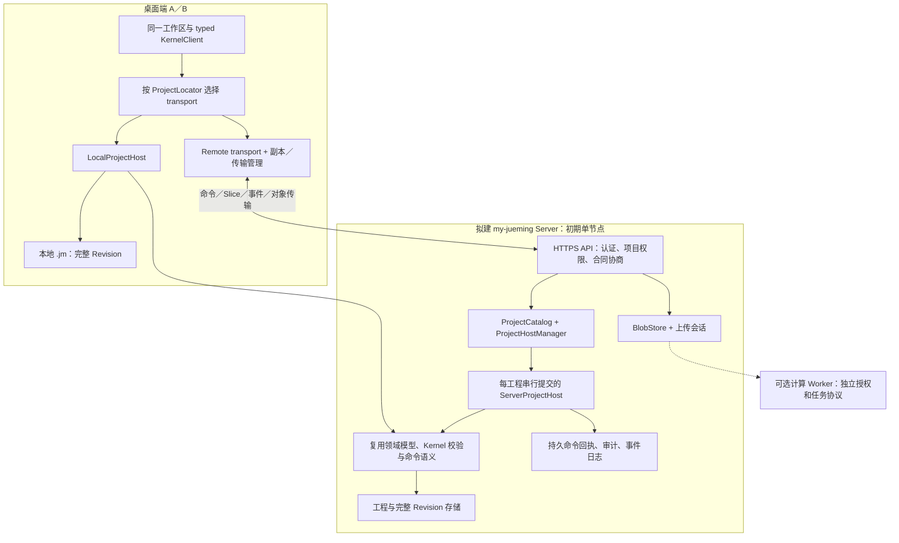
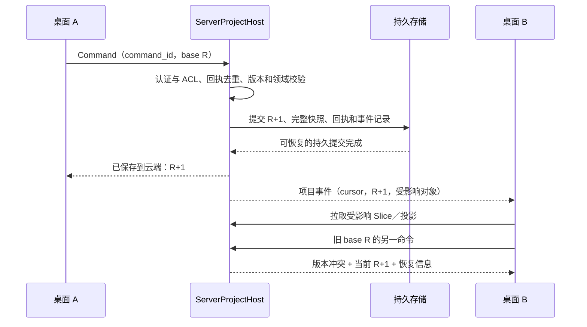
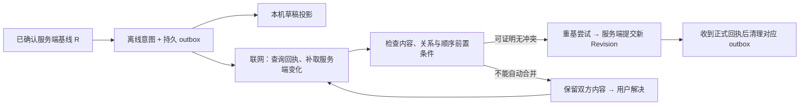
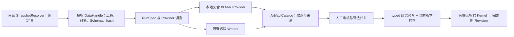

# 桌面／云工程、同步与协作审计及设计 v0.1

- 日期：2026-09-13。
- 状态：Discussion Note / ADR Candidate；区分代码事实、既有规划和本文建议，不表示云功能已经可用。
- 用户目标：自行部署一个决明 Server，使多个桌面端连接并共享工程；支持本地创建、云端创建、后台同步、工程传输与仅云端保存。
- 实施边界：本轮只编写设计文档，不修改代码、配置、工程格式或已接受 ADR，不创建 Docker 镜像，不部署、不启动服务。
- 审计基线：当前工作树，HEAD 为 `fdf4aacf4325a1d363a0e503c231e08a1793233e`；存在其他未提交改动，本文描述不等同于该提交的发布版本。
- 前置设计：[译法研究、Slot 与数据池／数据流设计](translation-research-slot-dataflow-design-v0.1.md)。

## 1. 结论与范围

**目标架构可以设计成“部署一个 Server，多个桌面端连接同一云工程”；当前仓库尚不具备直接部署该产品的完整实现。**

现有 `jueming-agent-transport` 中的 HTTP Server 是连接已打开桌面工程的本机 Agent 桥接。它只允许回环地址，依赖 `LocalAppHost`，不提供多用户工程目录、身份权限、共享写入或离线同步服务。将它装进 Docker、开放端口，不能自动得到多桌面协作。

适合本项目的第一步是**单节点服务端、每个工程由服务端串行提交、多个桌面端通过 typed API 访问**。继续复用 Rust 领域约束和完整 Revision；桌面与服务端使用不同 Host 和存储适配。无需为了小团队共享立即引入分布式微服务。

这里的“云工程”表示服务端持有正式提交权；服务器可以部署在局域网设备或用户租用的远程主机上，不要求使用特定公有云。各桌面需要能够连接该服务器并通过项目权限检查。

“本地／云端创建工程”在本文中指统一工程入口下的两种存储与访问方式。用户提及 Codex 是体验参照；本文不据此推断其他产品的内部协议或同步机制。

原有 MVP 明确延期云协作；当前请求授权审计与设计，不改变延期状态，也不应立即展示不可用的登录、同步或协作按钮。

## 2. 当前实现与预留程度

### 2.1 代码审计

| 领域 | 当前代码事实 | 可复用基础 | 仍需开发的部分 |
| --- | --- | --- | --- |
| 可部署 Server | 根 [Cargo workspace](../../Cargo.toml) 没有独立云工程 Server target；仓库未发现 Dockerfile／Compose 部署定义 | Rust 核心可以被其他宿主调用 | Headless Server、部署镜像、启动配置、升级与恢复流程 |
| 网络入口 | [server.rs](../../crates/jueming-agent-transport/src/server.rs) 的 `ServerConfig::validate` 拒绝非 loopback 地址；入口为 `/v1/agent/call` 和 `/v1/ag-ui/events` | HTTP 适配、请求校验、事件编码 | 面向远程用户的项目 API、TLS 接入、协议协商 |
| 身份权限 | 本机桥接采用共享 Bearer token 和 Origin 约束；不是用户／组织／项目权限模型 | 本机 Agent 信任边界 | 用户身份、设备会话、成员邀请、项目 ACL、撤权 |
| 工程宿主 | [host.rs](../../crates/jueming-application/src/host.rs) 的 `HostState` 只有一个 `current: Option<OpenProject>`，并持有浏览、搜索、提案等状态 | 调度 Kernel、单宿主串行处理 | 多工程 Host 管理、用户会话隔离、资源回收 |
| 命令合同 | [command.rs](../../crates/jueming-protocol/src/command.rs) 已有 contract／command／project／base revision 与 typed payload | 乐观并发检查、稳定命令身份 | 远程认证上下文、对象前置条件、同步意图与冲突协议 |
| 持久去重 | [host/native.rs](../../crates/jueming-application/src/host/native.rs) 已校验完整命令指纹，并将回执随提交后的 Snapshot 保存 | 同一命令重试不重复提交；更改负载复用 ID 会冲突 | 远程回执查询、授权关联、离线重基后的逻辑去重 |
| 文件写入 | [lock.rs](../../crates/jueming-storage/src/lock.rs) 使用 `.writer.lock`／`.commit.lock`；[persistence.rs](../../crates/jueming-kernel/src/persistence.rs) 校验磁盘当前版本，再保存新 Revision | 本机单写入者、陈旧快照拒绝、追加历史 | 服务端工程所有权、持久事件提交、分布式锁与 fencing 若未来多副本 |
| 历史 | [revision.rs](../../crates/jueming-core/src/revision.rs) 保存 Revision 元信息与 ChangeSet 摘要；完整版本另存 | 可恢复完整历史 | 可重放操作负载、用户审计、增量同步日志；摘要不等于操作日志 |
| Undo／Redo | [history.rs](../../crates/jueming-kernel/src/history.rs) 通过历史完整快照执行追加式状态恢复 | 单用户历史体验 | 多人环境中“撤销我的操作”的语义，不能直接恢复全项目前一状态 |
| 事件 | `LocalAppHost` 的 sequence 在内存；broadcast 缓冲有界；SSE 落后时提示 `jueming.resync_required` | 实时失效通知、重新取快照的恢复方向 | 跨服务重启的持久游标、断点补取、提交与事件一致性 |
| 桌面访问层 | [kernel-client.ts](../../apps/desktop/src/domain/kernel-client.ts) 是 typed façade，打开工程仍使用本机路径／Tauri | UI 与 Kernel 入口分离 | Remote transport、工程 locator、远程错误与认证生命周期 |
| 分片读取 | 当前 `WorkspaceProject` 以结构投影为主，正文通过有界 `ParallelSlice` 和缓存按需读取 | 适合迁移到远程正文读取；已有稳定 ID 与内容校验 | 大工程结构分页、远程搜索游标、网络取消与一致性水位 |
| 导入导出 | [import.rs](../../crates/jueming-protocol/src/import.rs)／[export.rs](../../crates/jueming-protocol/src/export.rs) 仍有本地路径语义 | 本地导入导出和格式规则 | 上传会话、对象句柄、服务端导入任务与客户端保存下载 |
| 设置 | 账号、上传等入口仍有 UNBOUND 能力；现有本地优先、自动保存、缓存设置不构成同步引擎 | 能力门控和设备设置基础 | Server profile、项目同步策略、传输队列与可观察状态 |

这里的“已有命令信封／回执／正文 Slice”是当前工作树事实。不能沿用旧规划，将这些全部描述为尚未实现；同样不能将已有本机实现直接宣称为云端合同已完成。

### 2.2 已有云架构文档

| 资料 | 已经预留的方向 | 本次补充／修正 |
| --- | --- | --- |
| [Agent／MCP／云／分享架构笔记](agent-mcp-cloud-share-architecture-notes-v0.1.md) | Local／Remote transport；Repository、OperationLog、BlobStore、IdentityPolicy；同步与发布分离 | 这些多数仍是规划；须补真实工程 authority、共享 Undo、后台同意范围和仅云端保存语义 |
| [全局架构 Handoff](../../jueming_global_architecture_handoff_v0.2.md) | Embedded／Local IPC／Network KernelHost；离线操作同步；数据与控制分离 | 不能把早期 illustrative API 当成已经可调用的 Slot／Port；以当前合同和 ADR 为准 |
| [Serverless 研究计算模型](serverless-research-compute-model-v0.1.md) | 控制、数据、计算分离；显式 Snapshot／DataHandle；研究运行独立版本 | 共享工程与远程 XLM-R 是独立能力，不能绑定为一个开关 |
| [设置系统设计](../design/jueming-settings-system-design-v0.2.md) | 账号、上传、发布、存储、隐私分类；默认不扫描自动上传 | 需增加私有持续同步的授权范围；逐次上传询问与已授权后台同步要明确区分 |
| [ADR-016](../adr/ADR-016-pipeline-method-artifacts.md) | Pipeline 方法和产物的当前持久化边界 | 备份／迁移须识别 `.jm/extensions/pipeline/` 的内容类型，不能按旧笔记一概视作普通 cache |

## 3. 先分清工程位置、备份、协作与计算

“工程存在云端”至少包含以下不同语义，不应共用一个含糊的同步开关。

| 工程模式 | 正式提交由谁决定 | 桌面保留什么 | 多桌面关系 | 断网行为 |
| --- | --- | --- | --- | --- |
| 本地工程 | 本机 Kernel／本地 `.jm` | 完整工程与历史 | 各自独立 | 完整本地工作 |
| 本地工程 + 私有云备份 | 仍是本机 | 完整工程；云端保存不可变备份版本 | 可以下载恢复；不因此共同编辑 | 继续本地工作，恢复网络后补传备份 |
| 云工程 + 按需缓存 | 服务端 | 视图、必要临时内容、可选有界缓存 | 连接同一个工程并在线共享 | 已缓存内容可读；未缓存内容和正式提交受限 |
| 云工程 + 离线副本 | 服务端；离线修改先是待同步工作 | 已下载的工程范围；后续可增加持久 outbox | 多个副本跟随同一服务端历史 | 先支持离线阅读；离线编辑须另建冲突与重基协议 |

工程 authority（正式提交权）、设备副本策略、成员权限、计算位置是四个独立维度。例如：云工程可以在桌面运行 XLM-R；本地工程也可以在明确授权后提交一次远程计算。开启共享不等于允许把正文交给任意模型服务。

备份是不可变恢复点；协作是同一工程持续接收成员修改；发布分享是经过选择的只读快照；工程传输负责可靠搬运对象。四者可以共用 BlobStore，但状态机和权限不同。

### 3.1 工程标识与创建入口

以下是概念模型，不是已存在 DTO：

```text
ProjectLocator =
  Local { project_id, local_path }
  Remote { server_instance_id, project_id, authority_epoch }

RemoteProjectBinding =
  locator + authenticated_session + capabilities + acknowledged_revision

ReplicaPolicy = OnDemandCache | OfflineReadable | OfflineEditableLater
ComputePolicy = LocalOnly | ApprovedRemoteProvider
```

服务端身份应被绑定到 Server profile；不能只靠 URL 字符串或本机路径识别工程，也不能将同域名新部署的不同服务端无提示地当作原工程 authority。登录用户身份由认证层确定，不能信任客户端任意填写的 `actor_id`。

“新建工程”先选择本地或已连接的服务器。云端创建由服务端分配／确认工程身份和权限；客户端输入文件通过上传句柄进入服务端，不能发送 `/Users/...` 路径要求服务端读取。

从云备份下载一个独立工程，与挂接同一共享工程的离线副本是两种操作。独立 fork 需要新 ProjectId 和来源记录；Segment 等内部 ID 的保留／映射规则需单独约定。正式迁移可以保留工程身份，但必须完成提交权转移。

## 4. 推荐架构：共享 Kernel，分别实现 Host



图中共享 Kernel 表示复用同一库与领域规则，不表示本地提交经过网络调用服务端。

### 4.1 为什么不直接复用一个 LocalAppHost

当前 Host 混合了工程生命周期与桌面会话状态。服务端必须区分：

- 工程状态：canonical Snapshot、当前 Revision、命令串行器、存储句柄。
- 用户／设备会话：当前浏览位置、搜索会话、提案、订阅游标、客户端能力。
- 临时协作状态：在线成员、选区或编辑提示；这些不是 canonical 内容，不应每次移动光标产生 Revision。
- 服务端资源：项目目录、身份、配额、任务、上传会话。

可以提取可复用的应用服务，但不能用一个全局 `current` 为所有用户轮流打开工程，也不能共享一个全局搜索结果或 UI action 队列。

本机 Agent 的“外部提案／原生批准”边界继续保留。远程人类用户写入由服务端身份和项目角色授权；不能通过对公网请求设置 `trusted_native=true` 绕过权限，也不能让普通网络调用自行声称是桌面原生操作。

### 4.2 Docker 的实际角色

未来可以提供一个逻辑上的 `my-jueming-server` 部署入口。初期服务端可用单节点进程和持久卷，每个工程的 canonical 写入经唯一 Host 串行执行；底层暂时复用文件式工程存储也有可能，但要先建立存储端口与提交恢复协议。

Docker 负责交付和运行隔离；Compose 可以部署在单台服务器上。命名卷可在容器删除后保留数据，卷本身不构成备份方案。[Docker Compose 官方部署说明](https://docs.docker.com/compose/how-tos/production/)、[Docker Volume 官方说明](https://docs.docker.com/engine/storage/volumes/)。

不应让多个桌面或多个 Server 副本通过网络盘共同写一个 `.jm` 目录。现有文件锁不解决跨节点身份、租约失效、重复写入和冲突合并。需要高可用时再增加数据库事务／CAS、工程租约与 fencing、对象存储和故障切换协议；不能仅增加容器副本数。

部署包至少还需要持久目录、凭据初始化、TLS 入口、健康状态、格式兼容检查、备份／恢复和升级路径。网络端口发布只让服务可达，不提供决明的项目权限或同步语义。[Docker 端口发布说明](https://docs.docker.com/engine/network/port-publishing/)。本仓库目前没有经过上述验证的 Server 镜像或 Compose 配置，本文也不提供可直接运行的假部署命令。

## 5. 远程协议、事件与共享写入

### 5.1 协议面应拆开

| 协议面 | 需要的能力 | 设计约束 |
| --- | --- | --- |
| 服务发现／身份 | 服务端身份、协议版本、能力、登录会话、设备信息 | 认证成功不自动取得任意工程访问权 |
| 工程目录 | 创建、列表、打开、成员、角色、归档 | 用稳定 ProjectId；默认私有；角色与工程绑定 |
| 领域读取 | 元数据、Revision、ParallelSlice、历史、搜索 | 显式 Snapshot／Revision；范围有界；跨页一致 |
| 领域写入 | typed CommandEnvelope、回执查询、冲突返回 | 服务端校验身份、前置版本和领域不变量 |
| 同步事件 | 自游标补取、订阅、失效、重新建立快照 | 持久日志是真值；SSE／WebSocket 只是传输 |
| 对象传输 | manifest、缺失对象、分块上传、校验、完成、取消 | 未完整校验的工程不能显示为可用；恢复需幂等 |
| 可选研究计算 | RunSpec、DataHandle、运行状态、产物索引 | 输入固定版本；计算权限与工程编辑权限分离 |

初期角色建议为 owner、editor、viewer。只有实现独立批注权限后才增加 commenter；不要用装饰性角色掩盖实际权限相同。成员撤权后服务端拒绝新读取／写入；已经下载到成员设备的数据无法承诺远程彻底抹除。

### 5.2 在线协作先复用保守的版本检查



第一阶段遇到陈旧 `base_revision_id` 就拒绝并指导刷新、比较、重新提交，保留用户草稿。即使两次修改实际上不相交，保守拒绝也比无定义地覆盖更可靠。之后可引入对象内容 hash、关系集合、顺序锚点等前置条件，只有证明读写依赖不冲突时才自动重基。

服务端命令回执必须代表正式提交已持久化。界面区分“草稿已保存到此设备”“正在上传”“已保存到云端 R”“有待处理冲突”，不能收到 HTTP 请求确认就显示所有成员已同步。其他客户端是否看到该版本是另一项状态。

提交、回执、审计与可补取事件必须在同一事务内完成，或用与正式提交绑定、可在崩溃后恢复的 journal／outbox 实现等效保证。不能先通知“成功”再异步碰碰运气保存日志。当前文件存储尚未实现这套远程事务边界。

### 5.3 当前去重基础与离线重基不能混为一谈

当前原生命令按 `command_id` 加整个信封指纹识别重试，包含 base revision。网络超时后重发完全相同的命令，应保留相同 ID 和内容；在结果不明时先查回执。

重基会改变 base revision，甚至改变 payload，因而不能修改信封后继续使用同一 `command_id`。后续可增加稳定 `ClientChangeId` 表示同一次用户修改意图，并为每次重基尝试创建新的命令 ID。服务端须把已接受的逻辑修改与实际提交关联，防止超时与重基交错导致双重提交。该模型需要新合同，不是给现有 DTO 随意加一个字段就完成。

### 5.4 事件恢复与重新连接

需要每工程持久事件 cursor 与服务端日志 epoch，并返回与快照对应的水位：取得 R／cursor C 的一致视图后，继续读取 C 之后的事件。若只“先读快照、稍后订阅当前事件”，两者之间可能丢失变更。

事件可重复投递；客户端按 cursor／事件 ID 去重。日志压缩导致游标过旧时明确要求重新取快照，再衔接后续事件。重启后不能把新的内存 sequence 从零开始冒充同一条持久日志。现有 `resync_required` 可以复用为恢复信号，但不能替代该协议。

## 6. 离线编辑与多人 Undo：后续独立阶段

### 6.1 离线副本不是另一个独立服务端

云工程断网时，设备保存最后确认的服务端基线 R，离线修改进入持久 outbox 和草稿投影。服务端正式 Revision 仍由服务端产生；设备不能各自用同一 ProjectId 生成 R+1，再把两份历史当成可以直接拼接。

建议区分 `CanonicalRevisionId` 与本地 `DraftSnapshotId`／待同步操作身份。当前 Kernel 的完整版本递增语义没有自动提供这种分叉草稿模型，因此先做离线阅读更稳妥。



离线 Split、Link 等命令还可能创建后续操作引用的新 ID。必须决定 ID 是由客户端预分配并由 Kernel 验证，还是由服务端分配后映射所有依赖；重试不应反复生成新对象。当前命令实现需要逐项检查，不能假设全部天然可重放。

### 6.2 冲突处理矩阵

| 并发情况 | 第一版共享写入 | 后续自动合并条件／人工路径 |
| --- | --- | --- |
| 两人改不同 Segment 正文 | 版本不同时先拒绝旧命令 | 校验各自完整读写依赖后才允许重基 |
| 两人改同一 Segment | 保留本地草稿，显示差异 | 用户选择／合并；不能按最后写入覆盖 |
| 一人改正文、一人 Split／删除该 Segment | 拒绝陈旧引用 | 显示结构变化，重新定位或人工修复 |
| 两人对同一 Segment 建立不同 Alignment | 领域不变量拒绝第二个冲突关系 | 明确选择关系，保持每 Segment 最多一个 active Alignment |
| 两人重排相邻位置 | 检查顺序基线与锚点 | 锚点变化时重新应用或人工决定，不能用数组索引重放 |
| 修改研究判断依赖的正文或对齐 | 保留研究事实来源与旧锚点 | 标记需复核，不能静默把旧词范围套到新文本 |
| 离线后账号被撤权 | 拒绝向原工程提交 | 保留本机工作，按权限提供独立导出或复制路径 |

全文 CRDT 不能自动解决 Alignment 的 n:m 关系、唯一成员约束或研究编码语义。若未来需要逐字同时编辑，可以局部采用文本协作机制，但仍须经 Kernel 提交领域事实。

### 6.3 Undo 必须重新定义

当前单用户 Undo 是恢复历史完整工程内容并追加新 Revision。多人模式若直接使用，A 的撤销可能消除 B 刚完成的修改。

建议共享编辑中的 Undo 作用于当前用户明确选定的已提交操作，生成带前置条件的逆操作，再由 Kernel 追加新 Revision。若原操作已经被别人依赖或修改，需显示冲突；Redo 同样是新的受校验操作。

“将整个项目恢复到某历史版本”保留为独立的工程级动作，具有明确权限、影响预览和新 Revision。在线共享写入开放前，必须实现可接受的协作撤销规则，或者明确限制相关操作能力；不得把现有快捷键原样接到远程全局 Undo。

## 7. 工程传输、后台同步与 authority 迁移

### 7.1 以固定版本 manifest 传输

不能对正在写入的 `.jm` 随意压缩或目录同步，期待得到一致可恢复的工程。传输开始时固定 canonical Revision，以及同次选定的方法版本／其他持久对象版本，生成不可变 manifest。

| 数据 | 备份／迁移处理 |
| --- | --- |
| 正文、SegmentOrder、Alignment、HumanAnnotation、完整 Revision | 正式工程内容；按明确历史策略完整传输并验证 |
| 未来人工研究判断、译法组、编码表 | 持久研究事实；与其来源版本一同保留 |
| Pipeline 方法和被引用的配置版本 | 按 ADR-016 的真实持久化分类纳入，不能当缓存丢弃 |
| 原始导入资产、附件 | 明确列入 manifest，按对象 hash 检查与上传；保留引用完整性 |
| 可重建索引、临时模型张量、普通缓存 | 默认不随工程传输；按显式保留策略处理研究运行产物 |
| 账号 token、本机绝对路径、设备私密设置、无关会话内容 | 不作为工程同步内容；凭据使用系统安全存储 |

流程为建立会话、提交 manifest、查询缺失对象、上传对象或分块、验证长度和 hash、完成提交、返回可读取的工程版本。中断后按会话和已确认对象恢复，不重传所有内容。相同文件内容不意味着无权限客户端可通过猜测 hash 取得对象；对象访问必须经工程／账户授权。

临时上传有独立状态和回收期限；仍被正式 manifest 或未完成授权传输引用的对象不能被普通 cache GC 删除。服务端空间不足、校验失败或上传超时都不应触发删除本机唯一副本。

### 7.2 后台运行边界

后台同步可以是在应用仍运行、窗口不在前台时工作；应用完全退出后继续运行需要额外 helper／系统后台服务，属于后续单独设计。不能只加一个设置就承诺退出应用仍持续同步。

首版支持队列、暂停／继续、网络恢复重试、退避、取消以及失败原因。系统睡眠、断网、服务端不可用时暂停；恢复后校验会话与回执再继续。没有待处理变化时不增加空闲轮询。计费网络和带宽限制是设备策略，不改变工程正式提交权。

### 7.3 从本地迁移成云工程

迁移需要区分“上传一个备份”和“让此后正式提交由服务端决定”。建议状态机：

1. 处理未保存草稿，固定源版本 R 和相关对象 manifest；为迁移分配稳定 ID。
2. 将完整选定数据上传至服务端 staging；源工程在 authority 切换窗口内禁止继续产生未纳入的提交。
3. 服务端验证数据和权限，准备接管同一工程身份，返回可恢复的迁移状态与目标 authority epoch。
4. 客户端持久保存 authority 转移记录，完成服务端激活／回执核验，并把原本地工程标为迁移后的归档副本。
5. 后续打开归档副本时连接对应云工程；若要独立继续本地编辑，应显式创建 fork，不冒充原工程的另一提交权持有者。

跨本机与服务器不能假设存在一个原子事务。必须有 journal、阶段查询与恢复规则：中途崩溃后，在确认哪一方持有提交权之前不能两边同时开放编辑。旧客户端、复制目录和离线设备的写入边界也需要 authority／格式兼容合同处理。

该流程是待评审的迁移协议方向，不是当前文件格式已具备的安全保证。仅需要私有备份时不执行 authority 迁移。

## 8. “仅云端保留”的具体含义

推荐产品文案为“工程保存在云端，本机按需缓存”。它表示不保留完整离线工程副本，而非保证正文从未进入本机内存、系统交换空间或临时存储。显示和编辑内容本身就需要本机获得相应数据。

| 本机数据 | 按需缓存模式的建议处理 |
| --- | --- |
| 已确认服务端保存的正文 Slice／缩略投影 | 可按容量、最近使用时间和退出策略回收 |
| 当前视图正在引用的内容 | 使用期间保留；释放后才回收 |
| 未提交草稿、尚未确认成功的上传、outbox | 禁止自动当缓存删除；明确提示未完成状态 |
| 用户主动下载的完整离线副本 | 切换策略前验证服务端完整性与未同步修改，再执行明确的本机副本移除操作 |
| 原本地 `.jm` 与 `revisions/` | 正式历史；不能被“清理缓存”顺带删除 |

如果另设“仅内存处理”的严格策略，必须说明关闭／崩溃后未提交内容的恢复限制，并与持久草稿及离线编辑互斥；本文不将此承诺纳入首版。

仅云端模式在服务器不可达时无法读取未缓存内容；需要离线能力的设备应选择离线副本。服务器端也必须有独立备份和恢复策略，否则本机副本移除后云端就成了唯一数据来源。

## 9. 设置与工程入口设计

### 9.1 设置分层

| 位置／作用域 | 设置项 | 推荐默认与行为 |
| --- | --- | --- |
| 设备：服务器连接 | 地址、显示名称、服务端身份、登录／退出、连接诊断 | 不自动扫描或上传本地工程；凭据不写入 `.jm` |
| 设备：全局隐私 | 强制仅本地使用 | 启用时暂停远程传输并保留队列；云工程显示离线受限，不虚报已云端保存 |
| 设备：后台任务 | 应用运行时允许后台同步、计费网络、带宽、并发数 | 后台同步默认关闭；用户开启后在授权工程范围内运行 |
| 设备：缓存 | 上限、回收、各云工程的本机副本大小 | 展示缓存与未同步数据分别占用；不清除未确认草稿 |
| 工程：存储位置 | 本地、云工程、从本地迁移 | 这是带状态迁移的工程动作，不是随意改写设备偏好 |
| 工程：私有云备份 | 目标服务器、备份范围、保留版本 | 与共享编辑分开；不自动改变 authority |
| 工程 × 设备：副本策略 | 按需缓存、离线阅读副本、未来离线编辑 | 由当前设备选择；不要求所有成员都下载完整工程 |
| 工程：成员 | owner／editor／viewer、邀请、撤权 | 默认私有；由有权成员管理 |
| 工程：研究计算 | 本地 Provider、已批准的远程计算目标 | 单独授权；不由共享工程或同步开关隐式开启 |
| 账号：设置同步 | 可同步的界面偏好 | 不等于同步工程正文；设备路径、凭据和本机存储策略不直接漫游 |
| 工作区：任务状态 | 上传／下载队列、已保存位置、冲突、失败重试 | 使用实际确认状态，允许定位到具体工程和操作 |

“暂停后台同步”不能让用户误以为云工程在线操作仍会自动完成正式提交。在线云编辑的前台提交、后台下载／备份队列和未来离线草稿需要分别展示；全局禁止联网则直接阻止远程提交。

### 9.2 与旧设置设计需要协调的点

现有设置设计要求登录／启动不自动上传，也写有“上传前询问固定开启”。持续后台同步需要更精确的授权边界：首次由用户明确选择服务器、工程和数据范围；在范围内的后续同步沿用该授权；改变目标、扩大内容范围、发布为公开或外发给模型服务时重新取得对应授权。

这属于后续设置合同修订建议，不代表已经取消旧限制。发布分享仍是独立动作；私有同步授权不能被解释为自动公开。能力未实现或服务器不支持时按 capability 门控，不显示不可执行的假按钮。

## 10. 与数据池、Slot 和 XLM-R 的衔接

前一份设计中的“版本化数据池 + 显式依赖图”可以同时用于本地和远程，但数据池不能退化为所有客户端共享读写的无类型目录。



远程 DataHandle 应携带服务端范围、固定版本、Schema、hash 和生命周期等信息，通过授权解析；不能直接暴露本机路径，或把对象 URL 本身当作永久无条件访问权。

Worker 只产生派生候选，不持有 canonical 写权限。结果绑定输入正文、Alignment、方法、模型／tokenizer 版本；源内容变化后可保留为旧版本证据，但不能自动套用到当前词范围。用户接受候选仍需检查当前研究实例是否有效。

原始模型张量适合保存在运行环境或可选 artifact 存储中，不应通过每次 SSE 事件发送，也不应为了接入 XLM-R 将每个模型内部对象加入 canonical 工程 Schema。正式人工研究记录则须有稳定 Schema、权限、Revision 与同步语义，不能藏在机器缓存中。

本地和远程可以实现同一逻辑 Provider 合同；调用位置由调度器选择。共享工程的上线不要求先实现 GPU 调度、远程模型或外部插件运行时。

## 11. 分阶段实施与决策门槛

| 阶段 | 可交付能力 | 开放下一阶段之前的条件 |
| --- | --- | --- |
| C0：合同与 ADR | authority、远程身份／权限、版本和回执、协作 Undo、数据分类、同步状态机 | 形成已评审合同；明确与现有 MVP／格式的兼容方式 |
| C1：服务端与远程读取 | 独立 headless Host；项目目录；基础创建／有界导入；认证；两个桌面读取同一工程；持久卷恢复 | 本地模式保持可用；权限隔离；重启后工程身份和版本一致 |
| C2：在线共享编辑 | typed 远程命令；每工程串行提交；保守 OCC；持久回执与事件补取；明确的协作 Undo | 并发、断线重试、撤销和进程崩溃均不丢失他人提交 |
| C3：传输与副本产品化 | 大文件断点传输；完整工程导入／导出；私有备份；后台队列；按需缓存／离线阅读；受控 authority 迁移 | 完整性校验、失败恢复、副本移除、后台授权和配额处理完成 |
| C4：离线编辑 | 持久 outbox、草稿版本、依赖重放、重基与冲突工作区 | 混合正文／关系／顺序／研究事实的冲突测试通过 |
| C5：按需增强 | 在线成员提示、精细同时编辑、服务端研究任务、扩容 | 各自有真实需求与独立能力合同；不作为基本共享的前提 |

C1 的基础导入必须使用客户端上传数据／对象句柄，不能把当前本机路径 DTO 原封不动搬到网络。C3 才产品化大型传输、恢复和迁移，并不意味着 C1 可以忽略基本完整性和权限。

### 11.1 验收场景

1. 两台桌面连接同一服务端和工程；服务端串行产生正式 Revision，两台按同一稳定 ID 定位和更新正文。
2. 无权限用户不能列出、读取、下载或修改工程；撤权后新请求失败，未同步工作不被静默删除。
3. 两个用户基于同一旧版本修改相同文本或冲突 Alignment，第二个请求得到明确冲突；两方内容和正式历史均可恢复。
4. 命令已提交但响应丢失，重试／查询回执不会重复产生对象或 Revision；服务端重启后仍成立。
5. 事件断开、积压、日志压缩和服务端重启后，客户端能补取或重新建立快照，最终得到正确投影。
6. A 修改后 B 修改；A 撤销自己的操作时不消除 B 的工作。工程级 Restore 有独立权限和影响预览。
7. 上传中断、对象损坏、配额不足、客户端崩溃后能恢复；未完成工程不冒充可用，唯一有效本地副本仍保留。
8. 按需缓存回收不删除未提交草稿、outbox、正式 Revision 或 Pipeline 方法；切换离线副本策略显示真实影响。
9. 隐藏窗口、应用退出、系统睡眠、计费网络与恢复联网行为符合设置文案，无工作时没有持续空闲轮询。
10. 容器重建后持久数据仍在；备份可恢复到可校验版本。单节点部署不被误报为已经支持多副本高可用。
11. 本地迁移到云端中途崩溃后，恢复流程能确定唯一正式提交权；归档副本不能无提示地产生同身份的竞争历史。
12. XLM-R 任务只读取获授权的固定版本；结果绑定来源；候选不会自行改写正文或人工研究记录。

## 12. 本轮交付与未执行事项

本轮新增本文件及前置译法研究设计文档。审计采用源码、当前架构资料和 Docker 官方文档；没有修改或执行实现代码，没有验证真实多客户端会话、离线同步、服务端打包或部署。

最优先的后续设计决策是工程 authority 与副本身份、共享编辑的 Undo、持久提交／事件边界、后台授权与本机数据回收规则。接受这些决策后，才适合进入 headless Server 和 Remote KernelClient 的实现。
