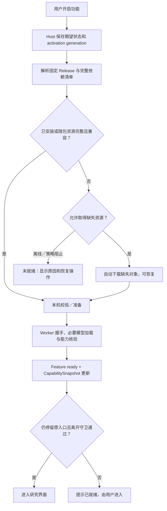
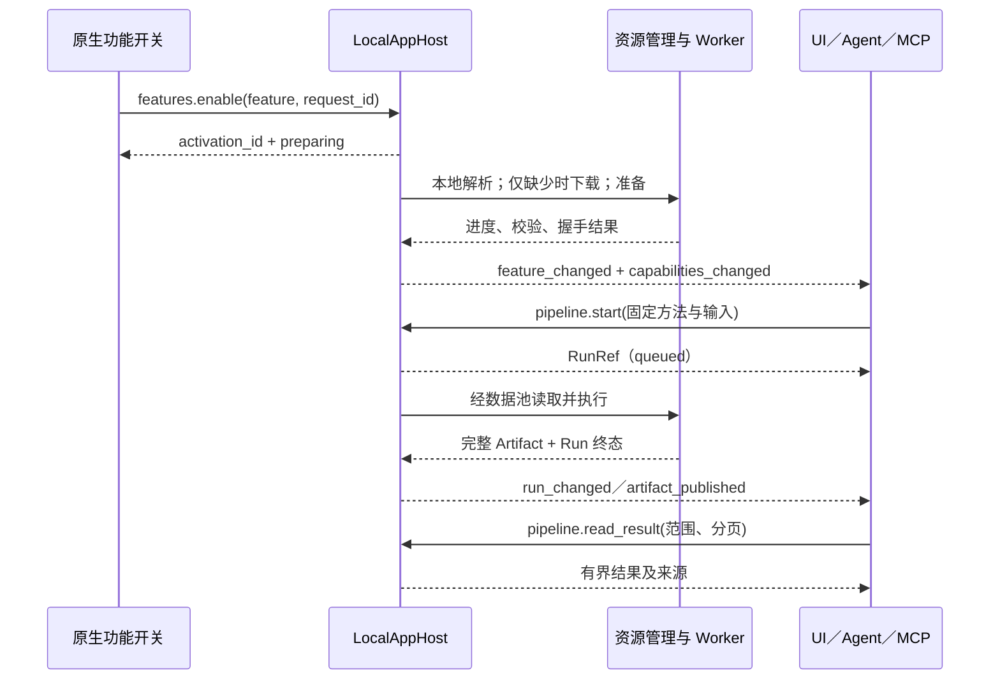

# 本地功能启用与 Pipeline／Agent／MCP 接口设计 v0.1

> 执行状态（2026-09-13）：已据此实现本地首版。本文保留设计目标；现有接口、实施取舍及发布限制见[实施交接](local-research-runtime-implementation-v0.1.md)。

- 日期：2026-09-13。
- 状态：计划配套讨论稿；仅记录审计和拟实施合同，不代表接口已实现。
- 关联：[总实施计划](local-slot-dataflow-plugin-implementation-plan-v0.1.md)、[研究工作区交互](../design/local-research-feature-interaction-plan-v0.1.md)、[设置更新计划](../design/local-research-settings-update-plan-v0.1.md)。
- 用户已确认：两个模糊算法 + XLM-R 词对齐；可独立安装、本地独立进程运行；普通用户通过功能开关自动准备；完整随包资源直接加载。
- 排除：云工程、headless Server、商业 license、登录账号和协作。插件资源分发是应用发行渠道，不要求建设云工程后端。

## 1. 功能是入口，插件是交付机制

普通用户流程为“开启译法研究 → 等待准备 → 开始使用”。无需选择插件包、依赖版本或 Python 环境。建议用一个“译法研究”功能开关准备两种模糊算法和 XLM-R；进入后再选择查询方法和译文定位方法。

新界面由桌面应用内置并按能力启用。首版算法插件只提供 Operator、参数与结果描述，不执行下载的 Vue／JavaScript 页面。高级 Pipeline 界面依然能看到真实 Slot、Provider、方法版本和产物来源。

开启已明确授权宿主准备该官方功能固定依赖清单，包含必要的缺失下载；同一流程不再逐包询问。该意图不扩展为任意第三方包、任意模型上传或公网服务授权。

### 1.1 四个独立维度

| 维度 | 权威状态 | 不能据此推断 |
| --- | --- | --- |
| 用户意图 | desired_enabled、generation | 开关为 true 不表示已准备完成 |
| 本机资源 | PackageRelease、runtime／model／tokenizer manifest、校验状态 | 包文件存在不表示完整或兼容 |
| 功能能力 | 必需 Slot 的合法绑定、协议／Schema／语言／资源可用 | 插件装好不表示所有功能都可运行 |
| 进程驻留 | stopped／starting／idle／busy／failed | Worker 空闲释放不表示功能已关闭 |

FeatureSnapshot 的 `ready` 表示可以接受任务并启动所需 Worker。首次启用须完成必要握手和健康验证；之后允许空闲回收模型和进程，不把开启一个功能变成长时间占用大量内存。

## 2. 自动准备与随包直接加载

### 2.1 ResourceResolver

优先使用已选 Release 的已安装完整资源或随应用附带的完整资源；选择以兼容性和固定版本为准，不因网络上出现 latest 就临时升级。缺少对象时才访问固定发行 manifest 指定的来源。

完整发行物必须包含对应平台的插件入口、依赖运行时、XLM-R 权重、tokenizer、配置及必要资源清单。只有插件脚本而没有模型的包不满足“不下载直接加载”。安装包验收必须在没有开发缓存、断网的目标环境中完成。

Tauri 支持把附加文件作为 resources 打包，也支持外部可执行文件的打包；具体目录和目标平台命名应通过对应打包机制解析，不能硬编码开发者路径。[Tauri 资源文档](https://v2.tauri.app/develop/resources/)、[Tauri 外部二进制文档](https://v2.tauri.app/develop/sidecar/)。

当前 [tauri.conf.json](../../apps/desktop/src-tauri/tauri.conf.json) 的 bundle 尚未配置这两类算法插件资源，现有 [打包工作流](../../.github/workflows/package-desktop.yml) 也不能被当作它们已经可离线分发的证据。需增加平台资源 manifest 和完整性检查，保留 Windows x64 与 macOS Universal 目标。

应用安装目录中的附带资源保持只读；需要解压、运行时状态或新增插件版本时使用宿主管理的用户数据目录。新模型不写进 `.jm`，多个工程共用兼容模型资源。平台可执行权限和 macOS 各架构依赖需要实际验证，不能只验证 Rust 主程序是 Universal。

### 2.2 准备任务的生命周期

- `features.enable` 幂等记录用户意图并快速返回 activation ID 和快照；重复开启复用同一未完成 generation，不生成重复下载。
- 准备任务将 resolving、downloading、verifying、installing、starting 等阶段持久记录。资源发布原子化；失败时保留已验证的完整对象，临时对象可以恢复或回收。
- 进度来自真实字节和阶段。未知总量用不定进度，不将模型初始化伪装成下载百分比。
- 取消后增加 generation 或进入明确终止状态；晚到回调不能重新启用功能。下载、解包或启动处在安全终止点之前可显示 cancelling。
- 关闭不卸载，不清除方法或人工研究记录。取消该功能的运行请求时按 Run 引用和 Worker 共享情况处理，不杀掉其他功能仍使用的进程。
- 故障重试延续相同用户意图但创建明确尝试身份；不能把用户已关闭的功能自动重试为开启。
- 应用重启后对账期望状态、完整资源和准备 journal；中断的运行不能冒充完成。程序完全退出时本轮不承诺后台继续下载。

设备功能准备可跨工程切换继续；工程数据读取和分析任务仍按 project／Revision 隔离。准备完成只改变能力，不自动开始用户尚未请求的工程分析。

## 3. 现有接口注册点审计

下列位置是当前源码事实；新增接口应在这些入口接通，而非另造一条算法调用通道。

| 层 | 真实位置与符号 | 现状及实施要求 |
| --- | --- | --- |
| 原生 Tauri 边界 | [commands/agent.rs](../../apps/desktop/src-tauri/src/commands/agent.rs) 的 `agent_call`；[lib.rs](../../apps/desktop/src-tauri/src/lib.rs) 的 `generate_handler!` | 原生调用进入 `dispatch_native`；组件不散落 invoke |
| 桌面 Pipeline façade | [pipeline-client.ts](../../apps/desktop/src/domain/pipeline-client.ts)、[agent-client.ts](../../apps/desktop/src/domain/agent-client.ts) | 当前通过原生 Agent bridge；扩展 typed 模块并由统一 façade 对外组合 |
| Host 应用路由 | [host.rs](../../crates/jueming-application/src/host.rs) 的 `dispatch_as` | 当前在这里识别 `pipeline.*`；新增 features／capabilities／slots／schemas／operators 路由和权限元信息 |
| 作用域与重试 | 同文件 `scoped_method`、`retryable_method` | 目前以硬编码方法表区分；设备接口不能被误判成需工程 binding；新任务必须明确幂等规则 |
| Pipeline gateway | [host/pipeline.rs](../../crates/jueming-application/src/host/pipeline.rs) 的 `pipeline_call`／`pipeline_execute`／`pipeline_cancel` | 已有工程与 revision 检查、提案、发起 binding 隔离；在这里适配 v2 数据池和异步 Run |
| Pipeline 执行器 | [pipeline/service.rs](../../crates/jueming-pipeline/src/service.rs) | 四算子封闭执行；通用 Slot 解析和 Worker 调用应进入此层的 Compiler／Scheduler |
| 内置 Agent 工具 | [agent-runtime/lib.rs](../../crates/jueming-agent-runtime/src/lib.rs) 的 `tools()`、`provider_tool_name`、`host_tool_method`、`allowed_tool` | 工具 Schema、别名和 allowlist 是多处手写；需与共享 MethodDescriptor 对齐 |
| Agent 任务隔离 | 同文件 `isolated_tool_arguments` 与工具执行循环 | 当前给 `pipeline.execute` 注入运行隔离的 operation ID；新异步任务还需保存子 Run、取消与恢复关系 |
| 本机 HTTP／事件 | [agent-transport/server.rs](../../crates/jueming-agent-transport/src/server.rs) 的 `/v1/agent/call`、`/v1/ag-ui/events` | 保持 loopback；只承载小请求和状态，不改成云服务或大模型数据传输口 |
| HTTP 二次方法分类 | 同文件 `is_native_only`／`requires_binding` | 与 Host 分别硬编码；后者目前仅排除 app.describe／app.bind_session，新设备查询必须同步修正 |
| MCP 工具路由 | [mcp/lib.rs](../../crates/jueming-mcp/src/lib.rs) 的 `#[tool_router]`／`#[tool]`、`McpServer` | 固定工具经 bridge 调 Host；新增通用能力／异步运行工具，不直接加载算法到 MCP 进程 |
| MCP 发现 | 同文件 `discovery_metadata`／`jueming_tool_discovery` | 当前插件加载声明不可用；需要分别描述算法运行时与任意 MCP 工具插件加载，不能错误合并 |
| MCP 设置元信息 | 同文件 `application_settings_metadata` | 当前仅转发 app.describe；应返回脱敏能力投影，不读取全部设备设置 |
| UI 投影与事件 | [agent-types.ts](../../apps/desktop/src/domain/agent-types.ts)、[useAgentWorkspace.ts](../../apps/desktop/src/composables/useAgentWorkspace.ts) | 扩充设备能力和研究事件；设备状态不能依赖打开工程后才建立的 binding |

### 3.1 当前 Pipeline 暴露不一致

| 方法 | 原生 Pipeline façade | 内置 Agent | MCP |
| --- | --- | --- | --- |
| pipeline.list／get | 有 | 有 | 有 |
| pipeline.preview_update／list_proposals | 有 | 有 | 有 |
| pipeline.execute | 有 | 有 | 有 |
| pipeline.reject_update | 有 | 未列入 tools／别名 | 有 |
| pipeline.artifacts | 有 | 未列入 tools／别名 | 有 |
| pipeline.cancel | 有 | 未列入 tools／别名 | 有 |
| pipeline.create_default／update／approve_update | 有 | 不暴露，原生专属 | 不暴露，原生专属 |

“一致”指同一权限角色下的方法、Schema 和行为一致，不是把原生批准接口全部开放给 Agent／MCP。内置 Agent 当前 5 个 Pipeline 工具、MCP 8 个，需补齐可用的读取、拒绝和取消能力。

另一个阻塞点是本机 HTTP 默认请求超时为 10 秒，而当前 `pipeline.execute` 等待同步执行完成。XLM-R 冷启动和长研究任务必须使用快速返回的 v2 start／status／result 接口，不能仅把超时调大掩盖生命周期缺失。

## 4. 共享方法目录与能力目录

新增 MethodDescriptor 描述稳定方法名、别名、输入／输出 Schema、作用域、权限、效果类型、幂等规则和所需能力。应用路由、Agent 工具与 MCP 参数 Schema 从同一来源生成，或用合同测试验证显式适配完全一致。

新增 CapabilitySnapshot，包含合同版本、状态 generation、FeatureSnapshot、Slot 状态、Provider Release、缺失资源原因及允许调用的方法。输入 Schema 必须有实际字段校验，不能仍把 v2 Plan 简写成不受约束的 `object`。

插件安装只注册算法 Operator／资源，不自动产生任意命名的 Agent 工具。Agent／MCP 使用稳定的通用能力查询和 Pipeline 工具，再通过 Provider ID 选择算法；两个模糊 Provider 不需要分别发明一套顶层 MCP 方法。

`tools/list` 表达已实现的工具协议；FeatureSnapshot 表达某工程／设备此刻能否执行某项算法。不能把“通用 start 工具存在”解释为“XLM-R 已安装”。每次调用仍由 Host 核验权限与实际能力，不能只依赖 Agent 看见的过期工具清单。

MCP 的 `executable_plugin_loading` 当前指向尚未具备的通用工具提供者边界。新增本地算法插件后，应单独报告 `algorithm_runtime` 能力；任意插件向 MCP 注入工具仍不在本版，避免仅把旧字段改成 true 后作出超范围承诺。

## 5. 拟新增的统一接口

以下名称是待冻结合同，不是当前可调用 API。现有 `pipeline.*` v1 方法保留兼容，新方法使用显式 v2 DTO。

| 方法组 | 最小输入／输出 | 作用域与调用位置 |
| --- | --- | --- |
| capabilities.get | 过滤条件 → CapabilitySnapshot | 设备级可读；工程上下文为可选、显式参数 |
| features.list／get | feature ID → FeatureSnapshot／目录 | 无工程也可读；UI、Agent、MCP 共用 |
| features.enable | feature ID、request ID、期望 generation → activation ID + snapshot | 原生用户开关；设备级；只选择 Host 已知依赖清单 |
| features.disable | feature ID、request ID、期望 generation → snapshot | 原生用户；先完成必要草稿守卫，再处理活动运行 |
| features.cancel_prepare／retry_prepare | feature ID、activation ID、期望 generation → snapshot | 原生用户；防止旧按钮取消新的准备任务 |
| features.get_preferences／update_preferences | typed 默认算法／自动定位／资源取得策略 → FeaturePreferences | 原生设置；局部更新与版本校验，不能修改安装事实 |
| features.reset_preferences | request ID、期望 generation → 已处理偏好与任务状态 | 原生重置协调；保留完整资源、工程和研究事实 |
| packages.list | 过滤 → 本地资源来源、引用、实际占用 | 原生资源管理；外部能力查询只暴露必要摘要 |
| packages.preview_remove／remove | 资源选择、引用基线 → 影响预览／回收结果 | 原生操作；移除前重验活跃引用，随包只读资源不伪装可移除 |
| slots.list／get | Slot 过滤／ID、可选工程上下文 → 描述与状态 | 同时返回合法 Provider、缺失原因、Schema 与绑定来源 |
| schemas.get | SchemaRef → 结构、语义与兼容信息 | 三端使用同一来源 |
| operators.list | Slot／语言／资源过滤 → OperatorDescriptor[] | 能力发现；不自动安装或启动 |
| slots.preview_binding | 方法／设备默认范围、选择、基线 → 可审核绑定变更提案 | Agent／MCP 可提出；不直接改变持久默认 |
| slots.bind／unbind | 经校验的选择和范围／提案 → 新绑定状态 | 原生提交；项目方法更改纳入新 MethodRevision |
| pipeline.list_templates | 能力／语言过滤 → 默认方法模板与所需依赖 | 目录读取不触发下载或模型运行 |
| pipeline.create_from_template | 模板版本、typed 参数、request ID、binding → MethodRevision | 原生研究入口／高级用户创建；首个研究任务可复用，不能硬套现有四节点模板 |
| pipeline.validate | v2 Plan、输入规格、binding → 诊断／已解析依赖摘要 | 不执行模型，不下载安装 |
| pipeline.start | method revision、input snapshot、选择与参数、request ID → RunRef | 工程绑定；已启用功能可运行；锁定资源版本后快速返回 |
| pipeline.get_run | RunRef → RunRecord | 项目与任务所有权校验；设备准备任务不混用此接口 |
| pipeline.cancel_run | RunRef、request ID → cancelling／终态 | 发起者或明确原生管理权限；不得仅凭猜到 ID 取消 |
| pipeline.read_result | RunRef／ArtifactRef、投影、cursor、limit → 有界结果 | 不向模型上下文塞入完整制品／张量 |
| research.* 查询／提案 | study／occurrence／revision／过滤 → 判断、组、统计或提案 | 与派生 Run 分开；正式研究命令仍经 Kernel |

实现时保持 `KernelClient` 为统一 typed 入口，可内部组合 featureClient／pipelineClient；不要求组件知道 Tauri command 或 loopback 地址。独立模块划分不意味着拥有第二套权限路径。

主题和普通界面偏好继续使用 AppSettings；FeaturePreferences、安装 Registry 和准备 journal 由 Host 单独持久化。现有 save_app_settings 接受全量 JSON，不能复用为覆盖功能策略或资源事实的入口；设置重置需显式协调 Host，不能只删除一个 JSON 文件。

设备接口可通过单独设备会话或现有原生 caller context 调用；不得捏造 UUID 工程来通过 `scoped_method`。工程分析继续使用真实 binding 和固定输入版本。

Run 的输入版本可以在运行中成为历史；任务查询／取消需要稳定的 RunAccessRef 与调用者关联，不能因为工程 Revision 前进就丢失管理旧任务的能力。实现需明确如何在重新绑定后延续同一调用者身份，禁止以放宽所有 binding 校验代替。

## 6. 异步控制、事件与 Agent 继续执行

事件分设备 scope 与工程 scope，携带 generation、activation／run、project／input revision 等适用身份。制品事件只传引用和摘要；正文批次与模型张量通过有界数据面获取。

UI 断流或发现序列缺口时重取 capability、准备任务和活动 Run 快照。当前本机广播不是跨重启持久日志；本版用持久任务状态和显式快照恢复，不宣称已经实现云协作事件补取协议。

内置 Agent 工具循环新增对子 Run 的关联：收到 queued 后记录任务，等待宿主完成通知再读取结果／继续推理，不重复调用 start 或让语言模型高频查询等待。取消 Agent 父任务时按其拥有的子 Run 传播取消；用户独立发起的其他任务不受影响。

外部 MCP 客户端可通过 `get_run`／`read_result` 读取明确终态；支持通知的客户端可使用对应适配。查询频率有界，不能依赖每个客户端都实现同一种后台通知。协议返回 queued 不表示研究结果已生成。

启动命令以 caller scope + request ID + 规范化参数指纹去重；响应丢失重试应返回同一 activation／Run。长任务重试与用户显式“再运行一次”要有不同意图身份。

## 7. 权限与产品意图边界

- 原生开关可以一次授权准备固定官方依赖；之后资源解析和进程启动沿用该意图。关闭后不得由后台 Agent 调用偷偷重新开启。
- Agent／MCP 可发现能力、验证计划、执行已启用的算法、读取有权结果和取消自己的任务。首次启用／安装／升级／卸载属于设备动作，引导用户到同一开关或原生管理入口。
- 功能未启用返回 `feature_disabled`；资源准备中返回 `feature_preparing` 及 activation；缺失或损坏返回具体原因。一次普通 `pipeline.start` 不隐式下载新插件。
- 已启用且资源完整，但 Worker 因空闲退出时，按需重启是运行的一部分，无需再让用户点开关。
- Pipeline 方法修改、绑定持久化与研究事实写入继续遵守原生提交／外部提案边界。插件和 MCP 不通过参数传 `trusted_native=true` 获得权限。
- 功能准备不要求 Agent 配置好聊天模型或账号；用户无需使用 Agent 也能完成整个研究工作流。
- 资源取得采用明确的新策略合同：用户明确禁止资源下载时，完整本地资源仍可加载，缺失资源进入 blocked。当前 `privacy.localOnlyMode` 默认 true、界面表示本地优先，并未实现严格禁网；不能直接拿旧布尔值阻止首次自动下载，也不能静默清零。具体迁移见设置计划，正文始终留在本地算法执行路径。

## 8. 注册与交付验收

1. 校验每个共享 MethodDescriptor 都有 Host handler；声明对 Agent／MCP 可用的方法均存在真实工具映射和输入／输出合同。
2. 三端同一角色查询到相同 Feature／Slot 状态；插件就绪后下一次调用立即按新能力验证，关闭后禁止新 Run。
3. 内置 Agent 补齐既有 Pipeline artifacts／cancel／reject_update，与 MCP 保持合法权限下的接口一致。
4. 无工程时能启用功能；有真实工程后能启动分析；演示 ID 不进入要求 UUID 的 Kernel 路径。
5. 完整安装包断网准备两种模糊算法和真实 XLM-R；不存在强制更新查询或下载请求依赖。
6. 缺失资源时点击一次开关自动完成；失败／取消／重启可恢复且不重复安装完整对象。
7. 准备或推理超过 10 秒仍可通过任务协议观测、取消；响应丢失不重复创建任务。
8. 工程切换和 Revision 前进后，旧 Run 可按权限管理，结果不会覆盖当前工程；新提交校验当前数据版本。
9. MCP 请求无法安装任意路径包、暴露 canonical 写权限或触发未授权开启；普通用户启用流程仍无逐包确认。
10. Worker 崩溃、退出、升级与模型释放不误报任务成功；现有结果不依赖插件保持运行才能阅读。

本轮只审计和补充计划，没有修改或运行实现代码，没有打包、下载模型或测试真实插件。
