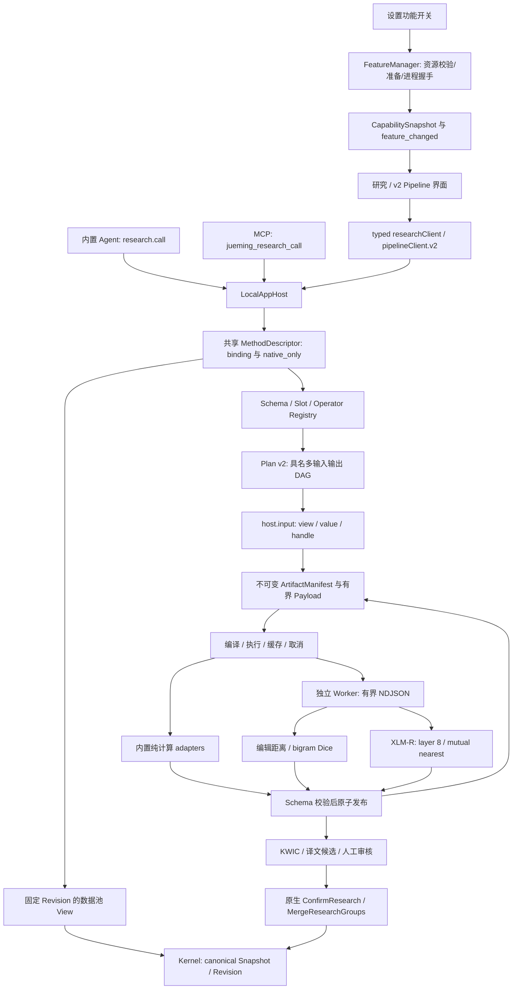

# 本地研究运行时实施交接 v0.1

日期：2026-09-13。范围依据用户“开始执行”和 [ADR-017](../adr/ADR-017-local-research-runtime.md)。本地首版已实现；算法质量和跨平台发布状态分别记录，不能用通过编译替代模型效果验收。

## 已实现的主路径

设置 → 数据与安全 → 译法研究：开启单个功能开关，宿主校验完整随包资源或按固定清单准备缺失文件，启动独立 Python Worker，完成真实模型加载后开放研究界面。关闭会取消相关任务、停止 Worker，保留资源、查询结果和人工事实。界面来自随应用交付的 Vue 组件，插件只提供算法。

研究界面支持精确／邻近查询、两个模糊 Provider、自动词对齐候选、原文范围高亮、译文拖选修正、Enter／O／P／E、历史查询、组名／策略、组筛选、归并和当前译本分布。列表虚拟化，统计分母来自整个 Run，区分全部命中与已确认。正文、Pipeline、研究草稿共享离开和历史操作保护。

当前 XLM-R 是可运行的上下文子词匹配基线。分数是未校准的定位证据，不是正确概率；所有候选需要人工判断。没有实现词形还原、自动省译判定或多译本工程集合。参见[真实效果记录](../testing/local-research-runtime-validation-v0.1.md)。

模型覆盖状态沿词对齐产物 → 候选投影 → ResearchOccurrence → 界面传递。输入截断、没有连线、缺少对齐上下文、未请求自动定位分别显示；旧产物未记录时显示未知，不推断为省译或已处理完成。

## 实际运行关系

执行器只处理 Operator、端口和数据合同，不按插件包名分支。算法内部分词、编码和矩阵匹配封装在 XLM-R Provider；公共产物是原文范围和对应边，未把模型张量强加给所有数据流。

## 注册点与开发入口

| 职责 | 实际位置 | 如何扩展 |
| --- | --- | --- |
| 41 个版本化 JSON Schema、33 个业务 Slot | `schemas/pipeline/catalog-v2.json`；源为 `scripts/generate-pipeline-catalog.py` | 修改生成源后重新生成；已发布的同名版本不允许换解释 |
| 旧名与迁移要求 | `schemas/pipeline/slot-migrations-v2.json` | 明确 alias 才自动解析；算法旧名要求选择 Provider；额外长期能力只记为扩展 |
| Registry / Compiler | `crates/jueming-pipeline/src/registry.rs` | 端口名、基数、Schema、配置、拓扑和可达性检查；无 Provider 拒绝执行 |
| 内置 Provider | `crates/jueming-pipeline/src/builtins.rs` | 注册到已有 Slot；只能输出计算产物／提案，不提交 canonical 数据 |
| 进程插件 | `plugins/*/plugin.json`、`worker.py`；`pipeline/src/plugin.rs` | manifest 指定 Operator → Slot；安装、握手后绑定，无需修改通用执行器 |
| 数据池 / GC | `pipeline/src/pool.rs`、`application/src/host/pool.rs` | Host 解析固定快照和权限；Worker 收到有界输入，宿主负责校验发布 |
| v2 方法 / Run | `application/src/graph.rs` | 独立方法修订、运行记录、节点状态、产物与取消 |
| 研究 recipe | `application/src/research.rs` | 实际调用搜索 + KWIC DAG，再调用词对齐 + 候选 DAG |
| 功能与插件管理 | `application/src/feature.rs` | 设备持久状态、资源清单、可信本地包、Worker 生命周期 |
| 所有新方法及权限 | `application/src/methods.rs` | 新接口必须先进入共享描述表，再实现 Host 路由 |
| Host 路由 | `application/src/host/research.rs`、`host/pool.rs` | 校验 binding、请求身份、原生提交边界 |
| 内置 Agent 注册 | `jueming-agent-runtime/src/lib.rs`；共享工具参数目录 | `research.call` 映射 `jueming_research_call`；仅允许共享目录中的外部安全方法 |
| MCP 注册 | `jueming-mcp/src/lib.rs`；`jueming-agent-transport/src/server.rs` | 同一方法描述和 Host；不让插件自行注册任意工具 |
| 桌面 typed façade | `apps/desktop/src/domain/research-client.ts`、`pipeline-client.ts`、对应 types | Vue 不直接散落调用 invoke 或访问 `.jm` |
| 人工事实 | `jueming-protocol/src/research.rs`、`jueming-kernel/src/research.rs` | ConfirmResearch / MergeResearchGroups 经现有命令信封、回执和 Revision |

`runtime.input.<Schema>` 是自动生成的宿主输入适配 Slot，不计入 33 个业务 Slot。它支持 typed `value` 或 opaque `handle`；只有 SegmentView／TextView 支持 `view: source|target`。

## Slot 的真实状态

- 常驻内置绑定：文本、剪贴板、规则分段、人工关系提案、基础字符串索引、精确搜索、TXT／JSON／XML 导出、中文分词、词项位置索引、KWIC、模糊搜索调度、译文候选投影、归并建议，共 15 个 Operator。
- 功能就绪后：`text.similarity` 绑定 `fuzzy.edit_distance` 与 `fuzzy.char_ngram`；`relation.word_alignment` 绑定 `xlmr.contextual_alignment`。
- 其余 OCR、字幕、语音、POS／Lemma／NER／依存、句段 embedding／translate、自动段落对齐、术语、向量索引、搭配／词云／质量 Provider 保持 UNBOUND。合同与状态查询已存在，未提供假算法。
- Slot 当前发布 bound／unbound，资源准备、禁用、失败的细分原因在 FeatureSnapshot；UI 应组合读取 capabilities，不能只凭 builtin.fuzzy_search 已绑定就声称评分插件可用。

## 数据池与数据流合同

DataHandle 为 UUID，Manifest 固定项目、输入 Revision、Run、Schema 名称/版本、SHA-256、字节数、Provider Release 和依赖句柄。读取会校验项目、版本和完整性。单份 Payload 上限 8 MiB，数据编码为 UTF-8 JSON；它与逻辑 Schema 分开。这里没有宣称已经实现 Arrow、共享内存或零拷贝。

`pool.open_view` 固定 Revision；`read_batch/read_slice` 每次最多 200 条，返回数据与已发布批次句柄；暂停就是不再拉取，关闭释放视图租约。`read_segment/read_alignment/read_annotation` 读取同一快照；`read_index_partition` 对基础倒排／词项位置索引作最多 200 词项的有界读取。索引保存原文和 UTF-8 范围，精确检索用倒排筛选，模糊检索可扫描保证近似词召回。

纯 DAG 节点共享同一上游产物；缓存键包含项目、Revision、完整 Provider 描述/资源摘要、配置、具名输入 Schema 和内容摘要。相同计算可复用，但为新 Run 重新发布来源记录。当前按整个 canonical Revision 保守失效；未做跨 Revision 的细粒度正文／词典失效优化。

GC 只回收 `cache/pipeline-v2` 中不被活跃 View、Run、方法引用的可重建 Payload，按依赖图保留上游；执行和读取期间有 pin，GC 会明确拒绝竞争。方法修订、研究页和 canonical 历史不在 GC 删除范围。

研究批次为 16 条原文 Segment，模型每次最多 32 个上下文、每上下文最多 64 条两侧 Segment。研究与通用图各最多 2 个活跃 Run，Worker 调用互斥，候选批次／帧均有上限。通用图的 `view` 输入是单个有界物化批次，大输入超过 8 MiB 明确拒绝；需要规模化调用时用 pool 分页句柄分批启动，不隐式截断。

运行记录保存确定的输入版本和 Provider 资源指纹，包含 queued/running/completed/cancelled/failed/interrupted；通用图还保存节点状态。重启后未完成 Run 标为 interrupted，重新启动新 Run，已经发布的历史仍可读。首版不恢复半条模型推理。

## 公共接口使用顺序

1. 无工程可查询 `capabilities.get`、`slots.list`、`slots.migrations`、`schemas.list/get`、`operators.list`。
2. 功能开关走原生 `features.enable/disable/cancel_prepare/retry_prepare/update_preferences`；Agent／MCP 不隐式下载或开启。
3. 工程计算先取得 binding。研究调用 `research.start` → `pipeline.get_run` → `pipeline.read_result`；或 `pipeline.list_methods_v2/save_method_v2` → `pipeline.start` → `pipeline.get_graph_run` → `pipeline.read_artifact`。
4. 数据池可独立调用 `pool.open_view` → 有界读取 → 把 handle 接入 DAG → `pool.close_view`。
5. 取消校验任务所有者；外部调用只能取消自己发起的任务。切换工程使旧 binding 失效。
6. 研究确认、归并、v2 方法保存、插件安装/移除、设备偏好及 GC 是 native_only；现有 Agent 提案/原生批准路径不被绕过。
7. 内置 Agent 通过 `research.call {method,params}`，MCP 通过 `jueming_research_call {method,params,binding_id?,request_id?}` 调用同一表中的安全方法。具体字段以 `methods.rs` 和共享 DTO 为准。

新算法接入步骤和 Worker 帧样例见 [插件开发说明](../../plugins/README.md)。

## 正式事实与兼容

人工记录保存来源 Revision、稳定 Segment 的原文 UTF-8 `[start,end)`、正文摘要、完整 n:m 上下文指纹、判断类别、表层组名和策略。后续正文或关系改变只使旧判断待复核，不抹除记录。确认时再次校验当前证据，禁止把过期模型位置直接写成人工事实。

首次确认后工程合同升级为 1.1；Undo/Redo/Restore 追加新 Revision 并包含 sidecar，恢复旧正文也不降级工程格式。旧 1.0 工程继续可读。IPC 命令合同保持 1.0；v1 分词方法和 normalized_content 偏移保持原路径，不偷偷改成原文坐标。v2 是独立编辑和执行路径，未实施任意 v1 图自动转换。

## 当前交付边界

- 可用的是本地工程和可信本地插件。云协作、headless、账号和商业授权继续延期。
- 完整资源包已在 macOS x64 跑通；Windows x64／macOS arm64 的构建脚本和 CI 门槛已接入，尚未在本机证明这些目标平台交付成功。
- 普通入口为单开关。完整包包含 CPython、精确锁定依赖及固定 XLM-R 模型；不依赖用户系统 Python。缺资源路径支持每文件 HTTPS URL，但当前仓库没有已发布的官方薄包下载端点，默认构建完整包。
- 独立本地插件包为含 manifest 的目录包，原生 `plugins.install_local` 校验后注册；`plugins.remove_local` 移除独立安装绑定，保留旧 Release 与产物。若覆盖随包同 ID，移除后恢复随包版本。未实现插件市场、任意运行时 ABI 或不可信代码沙箱。
- Worker 协议首版是宿主推送有界输入并接收输出；数据池拉取 API 在 Host。没有声称 Worker 已支持任意反向 Data RPC、共享内存或自发 canonical 写入。
- 旧 privacy.localOnlyMode 未作为严格防联网策略执行；用户主动开启官方功能是准备资源的入口。普通设置 JSON 不覆盖 Host 功能状态；没有另建商业授权依赖。
- 当前分组先按人工组名统计，并生成包含关系建议；不自动删除“了/的”、推断翻译策略或自动合并。两个模糊评分分别使用编辑距离与 bigram Dice 的工程起始阈值 0.75/0.65，均未校准；新 Provider 必须显式提供适合其分数语义的 minimum_similarity。
- 发布前仍需改进并评估 XLM-R 边界定位，扩充代表性标注集，以及完成 Windows／arm64 干净环境离线验收。
