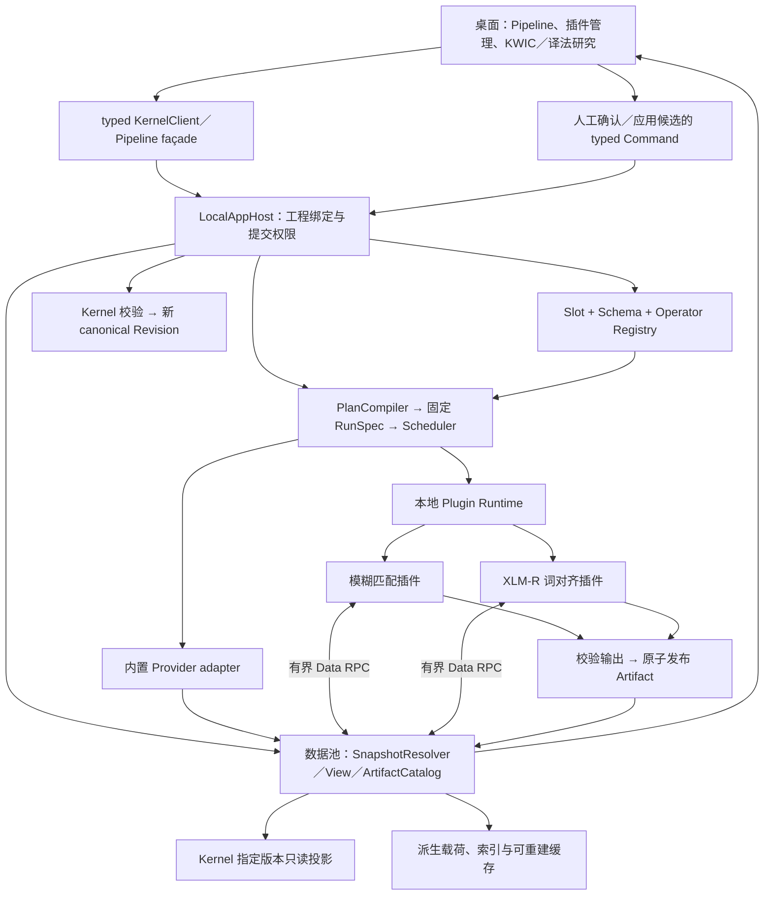

# 本地数据池、数据流与算法插件实施计划 v0.1

- 日期：2026-09-13。
- 状态：已按用户“开始执行”授权实施本地首版；ADR-017 已接受。本文保留原始阶段目标，实际实现、取舍与尚未通过的发布门槛见[实施交接](local-research-runtime-implementation-v0.1.md)及[验证记录](../testing/local-research-runtime-validation-v0.1.md)。
- 目标版本：用户开启功能后自动准备并运行本地插件，支持两个模糊匹配算法与 XLM-R 词对齐；完整安装包附带所需资源时直接加载。
- 依据：[译法研究与 Slot 设计](translation-research-slot-dataflow-design-v0.1.md)、[Phase 0 合同](mvp-phase0-contracts-v0.1.md)、[ADR-010](../adr/ADR-010-unbound-slot.md)、[ADR-016](../adr/ADR-016-pipeline-method-artifacts.md)、当前工作树源码。
- 暂缓：云端、headless Server、Docker 部署、商业 license／激活系统、login／account、云同步与协作。上述能力不成为本地插件工作的依赖。
- 工作树边界：已有大量其他未提交改动；未来实施从当时工作树重新确认基线，不能覆盖现有命令信封、锁、分片读取等工作。
- 配套设计：[功能启用与 Pipeline／Agent／MCP 接口](local-feature-activation-agent-mcp-contracts-v0.1.md)、[研究工作区交互](../design/local-research-feature-interaction-plan-v0.1.md)、[设置界面更新](../design/local-research-settings-update-plan-v0.1.md)。两份前端计划分别由用户指定的子代理只读规划，再由主代理统一合同。

## 1. 本版本要完成什么

把文档里已经规划、代码中尚不存在的本地架构落实为可调用、可持久化、可验证的系统：

1. 版本化数据池：固定快照读取、具名视图、数据句柄、有界批次、制品目录与依赖查询。
2. 数据流：具名多输入／多输出、Schema 校验、Provider 解析、运行快照、任务调度、取消、失败恢复与缓存失效。
3. Slot 体系：真实 Slot／Schema／Operator 注册表、绑定状态、能力查询、选择与切换、事件和旧名称兼容。
4. 本地插件：包发现与安装、协议握手、运行环境准备、子进程生命周期、数据访问与制品发布。
5. 两类算法：模糊匹配插件、XLM-R 词级对齐插件；通过 KWIC、译文候选和人工审核工作流看到真实结果。
6. 完整回归：旧工程、四节点分词方法、已有 Kernel 命令和本地离线体验保持兼容。

“所有 Slot 完成”在本计划中的可验收含义是：主 Profile 全部 29 个 Slot 有真实注册、稳定名称、明确输入／输出合同、可查询状态、绑定与执行限制；没有 Provider 的 Slot 仍是合法 UNBOUND。它不表示本次同时开发 OCR、语音转写、POS、NER、机器翻译等全部算法。

**UNBOUND 是缺少实现某项能力的算法；不能用来掩盖 Registry、Schema 校验、绑定、Data RPC 或调度器本身没有实现。** 暂缓 Provider 的 Slot 也应接受同一套合法绑定与不兼容拒绝测试。

### 1.1 已确认范围与实现建议

用户已明确确认：算法范围为“两个模糊匹配算法 + XLM-R 词对齐”；安装形态为“可独立安装的本地插件包，算法在独立进程运行”。“slotter”按 Slot 绑定与算法执行机制理解。基于这两项确认，实施建议如下：

- 两个插件包：`fuzzy-matching` 与 `xlmr-word-alignment`，名称暂定。
- 模糊插件内提供编辑距离、字符 n-gram 两个评分 Provider，以真正验证同一 Slot 的替换；XLM-R 是另一类能力，不与模糊字符评分强行共用输出 Schema。
- 首版交付可独立安装、进程外执行的本地插件包；P5 的安装、进程通信和生命周期是必要交付，不能以随应用编译的 Provider 替代。
- 默认交付不要求用户在自己的系统 Python 中手工安装依赖；平台运行环境与模型资源是插件包的交付内容或受管理依赖。

算法数量与独立安装／进程执行方式已经确认；具体采用编辑距离和字符 n-gram、两个插件包的划分、包名及运行环境仍是实现建议，需按 P0 的合同和技术验证固定。

用户进一步明确：普通流程只有功能开关；打开后自动准备缺失插件／模型，等待就绪后进入新界面，不要求手工寻找插件包或安装 Python。正式完整安装包已有全部依赖时直接校验／加载，不得先联网检查更新才能使用，也不能重复下载完整资源。模型与运行时必须纳入完整性判断；只附带插件代码不能宣称 XLM-R 可直接离线加载。

## 2. 当前空缺与复用基础

| 位置 | 已有 | 本计划补齐 |
| --- | --- | --- |
| [pipeline/model.rs](../../crates/jueming-pipeline/src/model.rs) | Method／MethodRevision、单 Segment 输入、TokenArtifact | 版本化计划 v2、端口引用、多种 Artifact、RunSpec／RunRecord |
| [pipeline/service.rs](../../crates/jueming-pipeline/src/service.rs) | 四个封闭算子、图校验、方法持久化、分词与取消 | 通用 Registry 解析、多输入执行、调度与通用结果，不继续堆算法名 match 分支 |
| [application/host/pipeline.rs](../../crates/jueming-application/src/host/pipeline.rs) | 工程 binding、真实正文读取、提案批准、调用者隔离 | 数据池会话、typed 控制面、Run／Provider 状态事件、过期结果处理 |
| `get_slot_states` | Phase 0 文档已有合同；当前 crates／桌面代码检索未见实现 | Rust 实际状态源、typed façade 和能力投影 |
| 注册表 | 当前源码检索未见通用 SlotRegistry／SchemaRegistry／OperatorRegistry | 三套职责明确的实际实现及生命周期 |
| `schemas/` | 根目录尚不存在计划中的公共 Schema 目录 | 公共 Schema 源、兼容规则、样例与跨语言一致性检查 |
| 数据池 | Kernel Snapshot 和正文 Slice 可复用 | CanonicalView、SnapshotResolver、PayloadStore、ArtifactCatalog 的统一读接口 |
| 本地插件 | 当前 Pipeline 没有插件加载与外部算法执行 | 包与 Release 身份、安装、协议、进程、模型与资源管理 |
| [PipelineWorkspace.vue](../../apps/desktop/src/components/PipelineWorkspace.vue) | 已有方法工作区 | 按端口和能力渲染、运行状态、算法选择和候选结果 |
| 搜索／研究 | 已有 Segment 搜索与平行视图 | 逐次命中、词距、KWIC、译文范围、人工判断与归并统计 |

现有方法历史、原子制品发布、稳定 ID、Canonical Revision、KernelClient、项目锁和命令回执继续复用。实施时不把本地数据池改成另一份可写正文，也不重写主平行视图的虚拟化方案。

## 3. 目标依赖关系

Slot 是介入位置，Operator 是可执行实现，Provider 是某次绑定的 Operator，插件是交付与运行容器。同一个插件可以提供多个 Operator；Slot 不以插件文件名命名。

数据池负责“如何找到并读到这份确定数据”，DAG 负责“这次计算依赖哪些数据和算法”。两者通过具名 Handle 连接；Provider 不使用隐含 latest 查询，也不获得任意 `.jm` 写权限。

## 4. 完整 Slot 工作清单

表中 Schema 为 P0 要冻结的逻辑合同族，尚非现有 DTO。每个合同必须定义 stable ID、版本与坐标、基数、语言、来源和缺失／覆盖状态；不得以 `Any`／任意 JSON 代替语义。跨层保留原有 canonical 对象身份。

| # | 主 Profile Slot | 输入 → 输出合同族 | 本版本目标 |
| --- | --- | --- | --- |
| 1 | source.text.parse | SourceAsset → ExtractedText | 现有文本导入逻辑的真实 adapter |
| 2 | source.clipboard | 用户提供的 ClipboardSnapshot → ExtractedText | adapter；插件不得自行读取系统剪贴板 |
| 3 | content.segment.sentence | ExtractedText → SegmentProposalSet | 复用规则分段；正式导入经 Kernel |
| 4 | relation.alignment.manual | ManualAlignmentIntent + CanonicalView → KernelCommandProposal | 注册业务能力；正式关系仍经 Kernel，不伪装成自动算法 |
| 5 | index.basic_string | SegmentView → BasicIndexRef | 实现绑定快照的基础字符串索引；旧扫描搜索可保留，但不能伪称已构建索引 |
| 6 | analysis.basic_search | QuerySpec + SegmentView／BasicIndexRef → OccurrenceSet | adapter 保留旧搜索，研究路径增加逐次范围 |
| 7 | export.txt | CanonicalView + ExportSpec → ExportArtifact | 现有导出 adapter，最终保存位置由宿主处理 |
| 8 | export.json | CanonicalView + ExportSpec → ExportArtifact | 同上 |
| 9 | export.xml | CanonicalView + ExportSpec → ExportArtifact | 同上 |
| 10 | source.subtitle.parse | SourceAsset → TimedTextRegions | 合同与注册完成，Provider UNBOUND |
| 11 | source.ocr | SourceAsset → SpatialTextRegions | 合同与注册完成，Provider UNBOUND |
| 12 | source.audio.transcribe | SourceAsset → TimedTextRegions | 合同与注册完成，Provider UNBOUND |
| 13 | layout.reading_order | SpatialTextRegions → RegionOrderProposal | 合同与注册完成，Provider UNBOUND |
| 14 | segment.tokenize | SegmentView → LinguisticTokenBatch + TextMap | 包装现有中文分词；研究查询需要的其他语言切分单独声明 |
| 15 | segment.embedding | SegmentView → SegmentEmbeddingBatch | 合同与注册完成，Provider UNBOUND；不混用子词隐藏状态 |
| 16 | segment.translate | SegmentView → TranslationProposalSet | 合同与注册完成，Provider UNBOUND |
| 17 | token.pos | LinguisticTokenBatch → TokenAnnotationBatch | 合同与注册完成，Provider UNBOUND |
| 18 | token.lemma | LinguisticTokenBatch → TokenAnnotationBatch | 合同与注册完成，Provider UNBOUND；不假装已支持词形还原 |
| 19 | token.ner | LinguisticTokenBatch → EntitySpanBatch | 合同与注册完成，Provider UNBOUND |
| 20 | token.dependency | LinguisticTokenBatch → DependencyGraphBatch | 合同与注册完成，Provider UNBOUND |
| 21 | relation.alignment.auto | 两侧 SegmentView + 参数／可选证据 → AlignmentProposalSet | 合同与注册完成，Provider UNBOUND；与词级定位分开 |
| 22 | relation.word_alignment | ParallelContextSet → WordAlignmentArtifact | 真实 XLM-R Provider；输出原文映射和覆盖状态 |
| 23 | relation.terminology | ParallelContextSet + 可选词对应 → TerminologyCandidateSet | 合同与注册完成，Provider UNBOUND |
| 24 | index.lexical | LinguisticTokenBatch → LexicalIndexRef | 实现支撑词距查询的词项／位置索引，绑定词切分版本和稳定 SegmentId |
| 25 | index.vector | EmbeddingBatch → VectorIndexRef | 合同与注册完成，Provider UNBOUND |
| 26 | analysis.kwic | OccurrenceSet + TextView + WindowSpec → KwicView | 真实 Provider，结果有界且可定位 |
| 27 | analysis.collocation | TokenView／LexicalIndexRef + Spec → CollocationResult | 合同与注册完成，Provider UNBOUND |
| 28 | analysis.wordcloud | TokenView／LexicalIndexRef + Spec → TermFrequencyResult | 合同与注册完成，Provider UNBOUND；图形由 UI 表达 |
| 29 | analysis.quality | CanonicalView + 可选证据 → QualityIssueSet | 合同与注册完成，Provider UNBOUND |

本轮讨论新增的候选 Slot：

| Slot | 输入 → 输出 | 本版本交付 |
| --- | --- | --- |
| text.similarity | TextPairBatch + 比较单位／归一化参数 → SimilarityEvidenceBatch | 编辑距离与字符 n-gram 两个可替换 Provider |
| analysis.fuzzy_search | QuerySpec + TargetTextView／IndexRef + ScoringBinding → OccurrenceSet | 模糊召回、范围与排序；分数带方法语义 |
| analysis.translation_candidates | OccurrenceSet + ParallelContextSet + WordAlignmentArtifact／记忆 → TranslationCandidateSet | 译文范围投影与多证据整合 |
| analysis.translation_grouping | ConfirmedJudgementView + 归一化方法／评分绑定 → GroupSuggestionSet | 真实建议；接受后的组由研究命令保存 |

旧名称如 `alignment.length`、`alignment.embedding`、`annotation.pos` 等建立完整 alias／迁移清单。先区分“Slot 旧名”和“Operator 算法名”；有歧义时不能自动映射。旧文档额外能力纳入扩展目录，不静默挤入主 Profile 或错误显示为可用。

人工对齐、导入和导出属于带宿主权限的业务边界；它们可以有 Slot 描述和 adapter，但不允许普通纯计算节点绕过用户意图执行文件写入或 canonical 提交。PlanCompiler 必须检查节点效果类型。

## 5. 数据与运行合同

### 5.1 数据池需要真正实现的接口

| 接口组 | 最小交付 | 必须满足 |
| --- | --- | --- |
| SnapshotResolver | 固定 Project／Revision／方法与资源版本，解析输入集合 | 同一 Run 全程读取一致快照；新编辑不篡改旧 Handle |
| View API | open_view、read_slice、read_segment、read_alignment、read_annotation | 有范围、列投影、上限、权限与关闭语义 |
| Batch API | stream_batches、暂停／恢复读取、取消、背压 | 内存随窗口和并发上限增长，不随全工程线性常驻 |
| ArtifactCatalog | 查询、读取、来源、依赖、兼容性、有效性 | 不混入 canonical 历史；拒绝不兼容 Schema |
| Artifact Writer | Run 范围临时写入、hash 校验、manifest 发布、失败清理 | 校验完成后才可发现；插件不能自行声明正式文件路径 |
| Index View | read_index_partition 与扫描 fallback | 查询范围绑定快照，分页不改变结果口径 |
| 保留与回收 | 活跃 Handle 引用、任务 pin、引用图、可重建 cache GC | 不删除方法历史、正式 Revision 或人工研究事实 |

DataHandle 是进程协议可传递的 opaque 引用，包含／解析到项目、输入快照、Schema、视图规格、内容摘要、访问范围和生命周期。不能把数组索引、Chunk offset 或文件路径当成业务身份。

大数据面先实现一种有界批次编码与宿主管理的二进制载荷传输；逻辑 Schema 独立于编码。Arrow、共享内存、零拷贝是可替换优化，本版无需同时实现全部运输方式；若 P0 选择 Arrow，就落实实际读写和跨语言测试，不保留只写在名称里的支持。

### 5.2 Plan／Run 合同

- Plan v2：显式格式版本；节点绑定 Slot、Provider 选择及参数；具名输入／输出；必需／可选、单个／多个输入；依赖与效果类型。
- PlanCompiler：拓扑、端口、Schema 结构和语义、Provider 能力、语言、缺失资源、版本约束、不可达节点与冲突的确定性处理。
- RunSpec：固定 MethodRevision、解析后的 OperatorRelease、模型／tokenizer／词典 hash、全部输入 Handle、参数、执行资源配置和缓存策略。
- RunRecord：queued／running／completed／cancelled／failed／interrupted、节点状态、诊断、已完整发布产物与耗时；应用重启后运行中任务不得假装完成。
- Scheduler：有界并发、共享依赖去重、内存与模型驻留预算、取消传播、错误归属；先做单机调度，暂不做分布式 lease 或跨节点任务迁移。
- ArtifactKey：输入与上下文、OperatorRelease、方法参数、模型资源及 Schema；跨 Run 可复用时仍保留每次 Run 的执行来源。
- 冲突语义：旧快照的派生产物可以完成并保留；UI 标明历史结果。把候选写成人工事实前再次校验当前正文／关系版本。

Provider 开始运行后不能因为默认绑定改变而中途换算法。绑定更新影响下一次运行；已有方法／运行的精确版本继续可读。删除插件不能让旧产物不可阅读，重算则明确提示缺少原 Release。

## 6. 本地插件交付边界

### 6.1 包与进程模型

建议公共 `PluginManifest` 至少描述 plugin ID、release、协议兼容范围、支持平台、入口、所提供 Operator、配置 Schema、运行环境与模型资源清单、内容摘要。身份、版本和包文件名分开。

安装顺序为读取 manifest、兼容检查、验证资源、解包到 staging、原子启用、启动握手、注册可用 Operator；失败不破坏已安装版本。升级允许旧 Release 为现有 Run 暂时保留；卸载先处理活跃引用，再注销 Provider。

运行协议覆盖 handshake、describe、execute、cancel、progress、data request、artifact finalize、shutdown。首版可用受管理子进程的定长／长度前缀帧；若用 stdout 传控制协议，日志必须走独立通道，不能混入模型库输出。

普通插件 API 不提供任意 shell、任意项目路径或可变 Kernel 对象。可执行插件首版定位为可信代码；进程隔离主要处理崩溃和生命周期，不能宣称已实现对恶意插件的操作系统级沙箱。第三方不可信执行、插件市场和多运行时 ABI 暂缓。

### 6.2 包含 XLM-R 的可安装版本

默认先验证 Python Worker + 固定模型资源的复合 Provider 路线，以便复用实际多语言模型生态；最终运行库版本、打包工具和平台支持在 P0 的可行性验证后固定。Rust／ONNX 可作为后续替换实现，无需提前把它们同时做成第一版依赖。

开启功能本身就是对该官方功能所需插件、运行时和模型准备的明确意图。宿主根据固定资源清单自动完成缺失下载与校验，不增加逐包确认；准备状态显示实际进度，技术详情按需展开。完成后应可断网运行。模型缺失、运行环境不兼容与 Slot UNBOUND 要有不同原因，不伪造模型输出。

macOS arm64／x64 与 Windows x64 均进入交付矩阵；不能用开发者电脑的现有 Python 环境冒充可分发插件。若某平台未完成打包与模型烟测，本版本在该平台的交付状态必须明确未通过，而非默认降级为已完成。

这里暂缓的是商业 license、登录和账号体系。随包依赖与模型的来源、版本和必要归属信息仍须保留在资源 manifest 中；本轮不引入激活服务或在线授权依赖。

### 6.3 用户功能与插件准备分层

新增 FeatureCatalog／FeatureActivationService 将产品功能映射到插件 Release、运行时、模型资源及所需 Slot。功能开关、资源可用、Slot 绑定、Worker 驻留分别建模，不能用一个 `installed` 布尔值表达全部状态。

开启流程为：记录用户期望状态 → 查找已安装／随包完整资源 → 必要时下载缺失对象 → 校验与原子准备 → Worker 握手／必要预热 → 核验所有必需 Slot → 发布能力就绪事件 → 打开功能界面。完整安装包的路径跳过下载。

关闭功能停止接收该功能的新任务，处理关联运行并释放不用的 Worker；保留已准备资源和研究结果，不等于卸载。多个功能共享资源时按依赖引用释放，不误杀其他任务。准备失败可以重试；连续点击、取消后晚到事件和应用重启须遵守 activation ID／generation，不能自行重新打开功能。

功能界面由桌面应用随版本交付并按能力启用；插件首版提供算法及描述，不下载任意 Vue／JavaScript 执行。准备完成时若用户已切换工程或进入有草稿的 Edit，不抢焦点；就绪状态与导航是否成功分别处理。

### 6.4 Pipeline、Agent 与 MCP 同步接入

新能力必须同时接入应用 Host 路由、typed façade、内置 Agent 工具目录和 MCP 工具路由；只在 Pipeline 图里能运行不算接口完整。当前内置 Agent 的 Pipeline 工具少于 MCP，需要一并补齐差异。

采用共享 MethodDescriptor／CapabilitySnapshot 描述实际可用接口与权限，普通算法通过 `slots`／`operators` 查询和通用 Pipeline 异步运行接口使用。插件不直接注册任意 Agent 或 MCP 工具，也不绕过 LocalAppHost 读取工程。

设备级功能准备不要求先打开工程；工程运行必须持有 binding／固定 Revision；Run 查询和取消还需所有者校验。下载和模型加载不能阻塞现有短 HTTP 请求：启动返回任务身份，再查询／订阅状态。详细注册位置、方法矩阵和异步协议见配套接口设计。

设置实施另需补齐：管理入口可见性与算法就绪分离；Host 单独持久化功能偏好／资源事实；旧 privacy.localOnlyMode 的显式语义迁移；普通设置全量 JSON 保存不能覆盖功能策略；研究、Pipeline 与正文草稿统一守卫。恢复默认与移除资源由 typed Host 操作协调，保留正式历史和研究结果。

## 7. 两类算法的实际闭环

### 7.1 模糊匹配插件

先固定比较单位和用途：同语言的查询近似命中、已确认译法之间的相似组建议。编辑距离不能用于直接判断英文 `heavy rain` 与中文“大雨”的翻译对应。

提供两个 `text.similarity` Provider：归一化编辑距离和字符 n-gram 相似度。两者接收同一 TextPairBatch，并返回相同结构的 SimilarityEvidenceBatch；各自声明 score_kind、范围、方向、归一化方法，阈值不跨算法盲目复用。

`analysis.fuzzy_search` 负责候选范围枚举／召回与排序，并通过 Slot 绑定调用评分能力。明确最小／最大窗口、阈值、重叠命中、top-k 和截断状态；不能对整个大工程构造不受限的所有字符子串。`analysis.translation_grouping` 可复用相似性证据，但保留原始表达，合并由用户执行。

验收时只切换 Provider 绑定，不改通用执行器、数据池或下游 UI；两种算法产生可解释的不同排序。算法选择必须实际影响运行，而非只修改界面标签。

### 7.2 XLM-R 词对齐插件

完整流程为固定双侧上下文、模型子词切分、原文映射、上下文编码、匹配提取、词级对应产物，再按某次查询命中投影译文范围。

XLM-R 提供上下文表示，译文范围仍需要匹配与映射。SimAlign 可作为匹配方法参考，但要验证其接口、词切分假设和所选模型兼容性；不把库的词索引直接当成决明原文坐标。[XLM-R 官方文档](https://huggingface.co/docs/transformers/model_doc/xlm-roberta)、[SimAlign 原实现](https://github.com/cisnlp/simalign)。

首版将模型内部 tokenizer／encoder／matching 封装成复合 Provider，公共输出包含双侧原文范围、对应边、来源、分数语义、未覆盖范围与运行诊断。暂不要求把每个张量都公开成 Slot；第二个实际消费者需要时才扩公共 Schema。

必须覆盖同一 Segment 多次命中、1:n／n:m 上下文、非连续对应、截断、特殊 token 与 Unicode 偏移。持久范围使用稳定 SegmentId、内容 hash 和原文 UTF-8 `[start,end)`，UI 转换到自身选择坐标。

找不到对应、执行失败、上下文未覆盖、人工省译是不同状态。模型分数不是未经校准的正确概率；不设置“词典匹配即置信度 1.00”的默认。

### 7.3 最小可用研究工作流

首版支持单个双语工程；人工确认、组身份、成员、名称和策略分配可保存、重开、撤销。候选和统计可重算，人工记录不能放在可删除 cache 中。多译本集合仍沿用前文后续扩展边界，不修改当前两个 Document 和 active Alignment 不变量。

“含词形变化”仅在实际 Lemma 能力存在时启用；本版不因展示了 XLM-R 就声称已具备词形还原。截图中的键盘操作需遵守输入焦点和 Edit 草稿守卫。

## 8. 实施阶段、依赖与完成条件

| 阶段 | 主要任务与交付 | 依赖 | 完成条件 |
| --- | --- | --- | --- |
| P0 合同与技术验证 | 29 Slot 清单与旧名映射；v2 Schema／Plan／Handle；effect 与提交边界；功能设置迁移／资源取得策略；插件握手；XLM-R 目标平台打包验证；ADR 提案 | 本计划范围明确 | 合同有可验证样例；模型输出可映回原文；完整随包加载路线可交付；旧本地优先偏好不误阻自动准备 |
| P1 注册与公共协议 | 三个 Registry、FeatureCatalog、MethodDescriptor／CapabilitySnapshot、版本兼容、绑定、查询／事件；Rust／TS／插件侧同源合同 | P0 | 全部 Slot 可真实查询；缺 Provider、禁用、不兼容、缺资源可区分；两个评分 Provider 能注册到同一 Slot；Host／Agent／MCP 方法目录一致 |
| P2 数据池与制品 | SnapshotResolver、View／Handle、批次背压、ArtifactCatalog、输入依赖、原子发布、引用与回收 | P0 | 编辑期间旧快照稳定；跨项目读被拒绝；大输入有界；失败无半制品；历史不受 GC 影响 |
| P3 通用数据流 | Plan v2、Compiler、Scheduler、RunRecord、共享上游、缓存键、取消／恢复、v1 adapter | P1 + P2 | 双侧多输入和分支汇合实际执行；未知／不兼容图明确拒绝；旧分词方法仍可运行 |
| P4 既有能力接入 | 文本／剪贴板／分段／人工对齐／搜索／导出 adapter；中文分词；基础字符串与词项位置索引；KWIC | P1 + P2 + P3 | 原有主流程通过；索引真实构建并可按版本读取；状态来自 Registry；新路径不形成第二套 Kernel writer |
| P5 本地插件运行时 | 安装、版本、进程、握手、Data RPC、取消、退出、升级／卸载、受管理依赖；功能自动准备与随包加载；最小 SDK | P1 + P2 + P3 | 开关自动准备完整依赖；完整安装包断网直接加载；新插件无需修改通用执行器；崩溃不带走宿主；失效 Handle 被拒绝 |
| P6 模糊匹配 | 两个评分 Provider、模糊召回、排序与范围、分组建议 | P4 + P5 | 切换绑定改变结果且无需改下游 Schema；Unicode、空串、重复／重叠与大范围检索有确定语义 |
| P7 XLM-R | 模型安装、复合 Provider、上下文与范围映射、候选生成、性能与效果评估 | P4 + P5；P0 技术验证完成 | 目标平台真实模型离线运行；覆盖状态可信；取消有效；无静默截断或伪造置信度 |
| P8 研究闭环与发布验证 | 前端启用交互、研究 sidecar、审核、归并编码、统计、历史迁移、跳转；Agent／MCP 端到端调用；打包与回归 | 研究合同可在 P0 后先行；整合依赖 P6 + P7 | 开关到新界面真实完成；桌面／Agent／MCP 使用同一能力和结果；重开／撤销保留研究事实；干净环境断网验证完整安装包 |

P1 与 P2 的内部任务可独立安排，P6 与 P7 在基础完成后也可独立推进；这表示依赖关系，不代表本轮启动并行代理或实施任务。

### 8.1 建议代码归属

以下为规划时的位置建议；已落地文件以实施交接中的注册表为准：

| 层 | 归属建议 |
| --- | --- |
| 共享协议 | `jueming-protocol` 的 Slot／Schema／Handle／Run DTO，配套公共 Schema 源；必要时提取轻量 plugin-api，避免依赖 Host |
| Registry／Compiler／Scheduler | 优先在 `jueming-pipeline` 分模块，不为每个概念立即新建 crate |
| 数据池 | `jueming-application` 负责 canonical Snapshot 解析和权限；Pipeline 依赖只读端口；存储适配落入相应存储层 |
| Plugin Runtime | 外部进程成为真实范围后建立独立模块／crate；仅依赖公共协议与受控数据接口 |
| 两类插件 | 独立包目录与版本，依赖公开 SDK／协议；不 import Host 私有实现 |
| 研究事实 | `jueming-core`／`jueming-protocol` 的结构化 sidecar，Kernel 命令、校验、迁移和历史 |
| 桌面 | 现有 typed façade、PipelineWorkspace 和能力状态；新增研究界面复用 ParallelWorkspace 跳转 |
| 设置 | SettingsWorkspace 增加译法研究入口／详情；AppSettings 仅保存普通偏好，FeaturePreferences／ResourceRegistry 由 Host 管理 |
| 测试与打包 | Rust 合同／集成测试、TS 跨层测试、插件协议故障样例、桌面实际交互与平台插件包验证 |

## 9. 兼容、迁移与验收门槛

### 9.1 兼容策略

- 现有 v1 方法／TokenArtifact 不原地覆盖，读取走显式 v1 adapter；用户修改方法时生成新方法修订与明确格式。旧版本不支持新格式时明确失败，不猜测降级。
- 当前 TokenArtifact 的偏移指向 normalized_content。接入新原文坐标前必须经过 source map 或重算；不能改字段解释后继续称为同一 v1 Schema。
- 新增研究 sidecar 需要工程格式、缺省行为、旧数据 round-trip 与历史恢复合同；不能只加前端 localStorage。
- Plugin Release、MethodRevision、Run、Artifact 与 canonical Revision 保持独立身份。方法更新、安装模型和缓存回收不生成伪正文 Revision。
- 绑定／默认参数更改不能重写已保存方法的历史依赖；运行记录能够解释当时实际选择了哪个 Provider。
- 项目关闭撤销运行的动态访问权限；已发布结果按项目归属保留。结果返回时再次检查绑定，防止前一个工程的异步结果显示到新工程。

### 9.2 必须通过的场景

1. 列出 29 个真实 Slot；逐个验证可用／UNBOUND／DISABLED／Schema 不兼容／资源未就绪的状态来源，禁止前端固定数组假装 Registry。
2. 安装第二个评分 Provider 并切换绑定，通用执行器和消费者均无需新增算法分支；测试后卸载仍能读取历史产物。
3. 多输入类型、必需／可选、多个 Provider、语言不符、无效配置和图循环均在运行前给出准确原因。
4. 两个下游复用同一上游制品，不重复编码；修改词典只失效依赖它的结果；修改上下文不能误用旧模型缓存。
5. 大批输入、消费者变慢、取消、Worker 崩溃、进程重启和缓存清理均有界、可诊断，且不破坏正式历史。
6. 同句多次命中、非连续对应、1:n／n:m、Unicode、规范化、模型截断都保留准确原文锚点与覆盖状态。
7. 找不到、模型失败与人工省译严格区分；更换模型不覆盖人工判断；正文／对齐改变后旧判断待复核。
8. 确认、修正、归并、编码、撤销、重开与历史恢复产生一致研究结果；统计不以已加载页面作为分母。
9. 干净目标环境安装两类插件，不依赖开发者现有 Python／模型缓存；断网后真实运行成功。
10. 现有导入、编辑、Link／Unlink／Merge／Split、Order、Search、History、导出和默认分词方法完成回归。
11. 缺资源时打开功能自动准备，完整资源已附带时不发起下载；关闭／重开不重复安装；后台完成不抢走新工程或 Edit 草稿的焦点。
12. Host、内置 Agent 与 MCP 的发现／调用一致；模型加载超过现有 HTTP 超时仍可跟踪；未启用功能不能通过 Agent／MCP 隐式下载执行。
13. 尚未下载时启用入口仍可见；旧设置迁移和全量保存不改写 Host 控制状态；恢复默认、资源回收和三个工作区的草稿守卫均按真实状态执行。

模型效果验收使用版本化的英中小型标注集，分别报告候选召回、范围精确率／召回率、边界完全匹配和人工修正耗时；单独统计意译、省译与截断。P0 定义数据和基线，P7 报告实测结果；不从参考截图或第三方通用数据集抄一个准确率作为承诺。

性能验收记录基准硬件、模型配置、窗口／批大小、冷启动、运行耗时和峰值内存。P0 先设可执行的资源预算与取消响应目标，若基线超出预算就在冻结发布范围前调整，不把未验证数字当作事实。

### 9.3 实施时运行的检查

按仓库规则执行相关 Rust 格式／Clippy／测试；涉及 DTO／IPC 时同时运行前端 typecheck／build、workspace tests 和 Tauri debug build。UI 改动用真实工程验证，插件包用目标平台干净环境验证。真实模型烟测单列为发布门槛，不能以 mock 推理测试替代。

规划阶段没有运行实现检查；执行阶段已安装受管理模型并运行真实离线验收，见配套验证记录。

## 10. 后续合同决策与完成定义

实施前需要正式记录的决策：主 Slot 命名与 alias、Schema 兼容策略、数据池快照／句柄生命周期、计划 v2 与 v1 adapter、插件协议与信任边界、人工研究 sidecar 和历史迁移。届时以新的 ADR 明确扩展旧 MVP 的延期范围，不直接把旧 ADR 的历史内容改成已实现。

本版本的完成标志是：**用户打开功能开关，宿主自动准备并运行两个本地插件包，提供两个模糊匹配算法和 XLM-R 词对齐；完整安装包直接离线加载；结果进入 KWIC／译法审核闭环；桌面、Agent 和 MCP 使用同一可用接口；换算法无需修改通用调度；整个过程可保存、追溯与取消。**

只有 Registry、trait、Schema 文件或示例插件，而真实桌面与模型未接通，不算此版本完成。云端、商业授权与账号继续按用户本轮要求暂缓。
