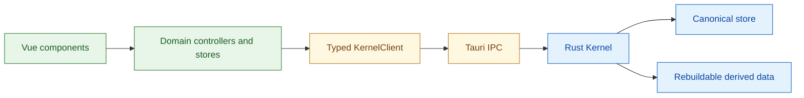

# Jueming Aligner MVP Phase 0 合同

_Phase 0 冻结的本地优先数据、协议和工程格式；供 Rust Kernel、Tauri UI 与 TypeScript `KernelClient` 共同实现。_

---

## 📋 范围与术语

本文件把 MVP 的架构决策落成可测试的 v1 合同。它只冻结语义和跨层边界，不冻结 SQLite 表、Chunk 二进制布局、Vue 组件内部状态或具体 Tauri 命令实现。

依据为 [MVP 实施计划](../../jueming-aligner-mvp-implementation-plan-v0.2.md)、[全局架构 handoff](../../jueming_global_architecture_handoff_v0.2.md) 和 [MVP 功能文档](../../jueming-aligner-mvp-functional-spec-v0.1.md)。三份输入中的延期功能在本合同中只保留 Slot 名称和 `UNBOUND` 状态。

### 合同分层



### 命名和序列化约定

| 项目 | 冻结约定 |
|---|---|
| JSON 字段 | `snake_case` |
| 对象 ID | UUIDv7 字符串，统一小写、带连字符 |
| `RevisionId` | 十进制无符号整数字符串，避免 JavaScript 精度问题 |
| 时间 | RFC 3339 UTC 字符串 |
| 语言 | BCP 47 字符串；MVP 工程固定一个 source 和一个 target |
| 空值 | 可选字段省略或使用 `null`，同一字段不可混用两种语义 |
| 文本 | 跨层一律为 Unicode 字符串；导入边界支持 UTF-8/UTF-8 BOM 和显式 GB18030，前端收到的正文已解码 |
| 版本 | 合同版本使用 `major.minor`；不兼容变更递增 major |

所有跨边界 DTO 都带 `contract_version: "1.0"` 或由外层协议声明版本。Rust 内部类型可以不同，但必须由 adapter 映射为本合同的 DTO。

---

## 🎯 Canonical 对象

Canonical 对象是工程事实的唯一来源。它们只通过 Kernel Command 改变；Query 返回只读投影，UI、索引和缓存不得成为第二个真相源。

### Project

```text
Project {
  project_id: ProjectId
  name: string
  source_language: LanguageId
  target_language: LanguageId
  document_ids: DocumentId[]
  current_revision_id: RevisionId
  format_version: "1.0"
  created_at: Timestamp
  updated_at: Timestamp
}
```

约束：MVP 必须恰好有 source/target 两种语言和至少一个对应 Document；Core 不把双语限制写死为只能有两个 Document。`document_ids` 是工程目录索引，不用于表达段落顺序。

### Document

```text
Document {
  document_id: DocumentId
  project_id: ProjectId
  language_id: LanguageId
  title: string
  source_asset_id: AssetId
  segment_order_id: SegmentOrderId
  created_revision_id: RevisionId
}
```

一个 Document 只属于一个 Project 和一个语言侧。`source_asset_id` 指向只读导入材料；用户编辑后的 Segment 文本是 canonical 内容，不回写原始 Asset。

### ImportProfile

```text
ImportProfile {
  encoding: "utf-8" | "utf-8-bom" | "gb18030"
  segmentation_mode: "non_empty_line" | "sentence_rules" | "legacy_tagged_line"
  strip_seg_wrappers: bool
  strip_pos_suffixes: bool
  compact_cjk_interchar_spaces: bool
}
```

`ImportProfile` 是导入事实的一部分，必须在预览中告知用户并随 SourceAsset 元数据保存。`legacy_tagged_line` 只是可逆、可预览的文本清理：可剔除 `<seg>` / `</seg>` 包装、词后 POS 后缀和中文字间空格；它不产生 POS Annotation，不把旧标记写入 canonical Segment，也不修改原始 Asset。

### Segment

```text
Segment {
  segment_id: SegmentId
  document_id: DocumentId
  kind: "sentence"
  content_ref: ContentRef
  content_hash: Hash
  created_revision_id: RevisionId
  updated_revision_id: RevisionId
}
```

`SegmentId` 是可编辑、可排序、可引用、可对齐的稳定身份。`content_ref` 是 Kernel 的存储引用；Segment DTO 必须提供已解码的 `content`，但不得要求 UI 理解 Chunk、offset 或 SQLite。MVP 的 `kind` 为 `sentence`，其他 `SegmentKind` 由未来 schema 扩展。

### SegmentOrder

```text
SegmentOrder {
  segment_order_id: SegmentOrderId
  document_id: DocumentId
  entries: OrderedSegmentRef[]
  updated_revision_id: RevisionId
}

OrderedSegmentRef {
  segment_id: SegmentId
  position_key: PositionKey
}
```

`entries` 是该 Document 当前显示顺序；`position_key` 由 Kernel 生成并按字典序比较。客户端只能提交 `segment_id + before_segment_id/after_segment_id`，不得提交数组 index 或自行生成 `position_key`。

### Alignment

```text
Alignment {
  alignment_id: AlignmentId
  project_id: ProjectId
  source_segment_ids: SegmentId[]
  target_segment_ids: SegmentId[]
  producer: "manual"
  cardinality: Cardinality
  created_revision_id: RevisionId
  updated_revision_id: RevisionId
}

Cardinality = "1:1" | "1:n" | "n:1" | "n:m"
```

每个 active Alignment 至少引用一条 source 和一条 target Segment；数组内部按各自 `SegmentOrder` 排序，不允许重复 ID。`cardinality` 由引用数量派生，不能由 UI 任意填写。未对齐 Segment 通过“不存在 active Alignment 引用”表达，不创建空 Alignment。

关系操作的身份语义如下：

| 操作 | 当前关系 | 提交后的关系 | ID 规则 |
|---|---|---|---|
| Link | 选中未占用 Segment | 一个新 Alignment | 新建 `AlignmentId` |
| Unlink | 一个 active Alignment | 无 active 关系 | 原关系只留在历史 |
| Merge | 多个合法关系/未对齐 Segment | 一个新关系 | 旧 ID 失活，新 ID 不复用 |
| Split | 一个复杂关系 | 一个或多个新关系，或全部未对齐 | 原 ID 失活，新 ID 不复用 |
| Edit Segment | 内容变化 | 关系保持 | `AlignmentId` 不变 |
| Move Segment | 顺序变化 | 关系保持 | `AlignmentId` 不变 |

### HumanAnnotation

```text
HumanAnnotation {
  annotation_id: AnnotationId
  project_id: ProjectId
  body: string
  status: "draft" | "in_progress" | "resolved"
  linked_segment_ids: SegmentId[]
  alignment_id: AlignmentId | null
  local_author_label: string
  created_at: Timestamp
  updated_at: Timestamp
  created_revision_id: RevisionId
  updated_revision_id: RevisionId
}
```

HumanAnnotation 是人工审校的 sidecar layer，不嵌入 Segment，也不等同于 POS/Lemma/NER 等机器 Annotation Layer。至少关联一个当前 Segment；`alignment_id` 仅是导航提示，不能替代 `linked_segment_ids`。MVP 状态只允许三值枚举。

### Revision

```text
Revision {
  revision_id: RevisionId
  project_id: ProjectId
  parent_revision_id: RevisionId | null
  operation_id: OperationId
  change_set: ChangeSetSummary
  author_label: string
  created_at: Timestamp
  summary: string
  state: "complete"
}
```

只有完整提交才可见；不存在 `partial` 或“半提交 Revision”状态。Revision 是 append-only，`parent_revision_id` 在同一工程内形成单一当前链。Undo、Redo 和 Restore 都是新 Command；Restore 不删除或覆盖旧 Revision。

---

## 🔧 Command 合同

Command 是唯一的 canonical 写入入口。每个 Command 必须携带 `command_id` 做幂等去重，携带 `base_revision_id` 做乐观并发校验，并在一个事务中完成校验、ChangeSet、Revision 和相关索引失效标记。

### Envelope

```json
{
  "contract_version": "1.0",
  "command_id": "018f7b1a-2c40-7e33-9a11-1e3a98d0f021",
  "project_id": "018f7b1a-2c40-7e33-9a11-1e3a98d0f022",
  "base_revision_id": "42",
  "kind": "update_segment",
  "payload": {}
}
```

### Command 清单

| Kind | 必要 payload | 语义 |
|---|---|---|
| `create_project` | name, languages, documents | 创建空工程并返回初始 Revision |
| `import_text_asset` | document_id, asset, import_profile | 按已确认编码原子导入并保留 Asset 引用与 profile |
| `apply_segmentation` | document_id, preview_token, mode, rules | 将预览确认的句段写入 Segment/Order；`mode` 为 `non_empty_line`、`sentence_rules` 或 `legacy_tagged_line` |
| `update_segment` | segment_id, content | 更新文本，保留 SegmentId 和 active Alignment |
| `move_segment` | segment_id, before/after_segment_id | 改变 SegmentOrder，不改 SegmentId |
| `create_alignment` | source_ids, target_ids | 创建手工 Alignment |
| `delete_alignment` | alignment_id | Unlink 当前关系 |
| `merge_alignment` | alignment_ids, unlinked_ids | 合并为新 Alignment |
| `split_alignment` | alignment_id, groups | 按明确分组拆分；不猜语义 |
| `add_bookmark` | segment_id | 创建稳定 ID 书签 |
| `remove_bookmark` | bookmark_id | 删除书签 |
| `create_human_annotation` | body, links, optional alignment_id | 创建 Draft 批注 |
| `update_human_annotation` | annotation_id, body, links | 修改批注内容或关系 |
| `resolve_human_annotation` | annotation_id, status | 设置 Draft/In Progress/Resolved |
| `delete_human_annotation` | annotation_id | 删除批注 |
| `replace_matches` | hit_ids, replacement, base_revision | 以一个 ChangeSet 原子替换 |
| `undo` | target_revision_id | 以逆操作创建新 Revision |
| `redo` | target_revision_id | 重放可重做 ChangeSet |
| `flush_project` | — | 刷盘日志、manifest 和必要数据 |
| `restore_revision` | revision_id | 恢复为新 Revision，保留历史 |

`kind` 只表达领域语义，不暴露 SQL 或文件路径。批量替换、Merge、Split 和恢复必须全成或全败；任意校验错误不得留下部分写入。

### Result 和错误

```text
CommandResult {
  command_id: CommandId
  status: "committed" | "rejected" | "duplicate"
  committed_revision_id: RevisionId | null
  affected_ids: StableId[]
  error: KernelError | null
}

KernelError {
  code: "invalid_input" | "not_found" | "stale_revision" |
        "invariant_violation" | "conflict" | "io_error" |
        "unsupported" | "cancelled"
  message: string
  details: object | null
}
```

重试同一个 `command_id` 必须返回相同的提交结果，不得生成第二个 Revision。`stale_revision` 必须包含当前 Revision，UI 不得静默覆盖用户的新修改。

---

## 🔍 Query 合同

Query 只读 canonical 或带版本标签的 derived projection。需要读取正文时，按 Slice/范围和投影字段请求，禁止要求“全工程可变数组”。

### Envelope 与结果

```text
QueryEnvelope {
  contract_version: "1.0"
  request_id: RequestId
  project_id: ProjectId
  revision_id: RevisionId | null
  kind: QueryKind
  payload: object
}
```

| Query | 结果 | 版本/定位要求 |
|---|---|---|
| `get_project_summary` | ProjectSummary | 返回 current revision |
| `load_parallel_slice` | ParallelSlice | 以 SegmentId/AlignmentId 为锚，返回 source/target 投影和上下文 |
| `get_segment` | SegmentView | 返回文本、顺序和关系摘要 |
| `get_alignment` | AlignmentView | 返回稳定 refs 与 cardinality |
| `list_unlinked_segments` | 分页 SegmentView | 以 stable ID 游标分页 |
| `search_segments` | HitSet | 返回 SegmentId、语言、上下文、Alignment 状态 |
| `preview_replace` | ReplacePreview | 固定 base revision；只读，不写入 |
| `list_bookmarks` | BookmarkView[] | 按 SegmentId 定位 |
| `list_human_annotations` | AnnotationView[] | 支持状态筛选和关联 ID |
| `list_revisions` | RevisionSummary[] | append-only 顺序，分页 |
| `diff_revisions` | StructuredDiff + TextDiff | 只比较明确的两个 Revision |
| `get_slot_states` | SlotState[] | 返回 BOUND/UNBOUND 等状态 |
| `validate_export` | ExportValidation | 校验不修改 Revision |

`load_parallel_slice` 的最小请求为 `anchor_segment_id` 或 `anchor_alignment_id`、source/target Document、halo、revision 和 projection。返回的 `display_row_key` 可以由 Kernel 派生，但 UI item key 必须是稳定的 Alignment/Segment 语义 key，而非数组 index。

Project Search 的 `HitSet` 必须携带 `base_revision_id`；替换提交前 Kernel 再次校验该版本。View Find 不经过此 Query，详见 ADR-012。

---

## 📡 Event 合同

Event 只在对应 Revision 完整提交后发出。它们是通知和失效信号，不替代 Query，也不携带需要 UI 长期镜像的全量正文。

```text
EventEnvelope {
  contract_version: "1.0"
  event_id: EventId
  project_id: ProjectId
  revision_id: RevisionId | null
  kind: EventKind
  emitted_at: Timestamp
  payload: object
}
```

| Event | payload 要点 | UI 动作 |
|---|---|---|
| `project_opened` | ProjectSummary | 建立 Session/句柄 |
| `revision_advanced` | previous/current revision | 使受影响 Slice 失效并 Query |
| `segment_changed` | segment_ids, content_hashes | 增量刷新相关 Segment |
| `segment_order_changed` | document_id, segment_ids | 失效排序投影 |
| `alignment_changed` | alignment_ids, affected_segment_ids | 刷新连接和 cardinality |
| `bookmark_changed` | bookmark_ids, segment_ids | 刷新书签标记/列表 |
| `human_annotation_changed` | annotation_ids, linked_ids | 刷新批注标记/列表 |
| `search_index_updated` | document_ids, segment_ids | 标记搜索结果可重算 |
| `save_state_changed` | `saving/saved/failed`, revision | 更新状态栏 |
| `operation_failed` | command/request, KernelError | 显示可行动错误，不改变 canonical |
| `slot_state_changed` | slot, state, provider | 更新能力入口 |

同一 Project 内按 Revision 顺序处理；客户端以 `event_id` 去重。断线或丢事件后以 `get_project_summary` 和受影响 Query 重新同步，不假设事件流是永久日志。

---

## 🖥️ Tauri KernelClient 边界

Vue 组件不得直接调用 `invoke`、监听零散 Tauri event、读取数据库或解析 Chunk。唯一调用链是：

```text
Vue component
  → domain controller / Pinia action
  → KernelClient
  → Tauri command / channel
  → Rust Kernel
  → typed result / event
```

### TypeScript façade

```typescript
export interface KernelClient {
  openProject(input: OpenProjectInput): Promise<ProjectHandle>
  closeProject(projectId: ProjectId): Promise<void>
  dispatchCommand<T extends CommandKind>(
    command: CommandEnvelope<T>,
  ): Promise<CommandResult>
  query<T extends QueryKind>(
    query: QueryEnvelope<T>,
  ): Promise<QueryResult<T>>
  subscribe(projectId: ProjectId, listener: KernelEventListener): Unsubscribe
  cancel(requestId: RequestId): Promise<void>
}
```

实现约束：

- `KernelClient` 是 typed adapter；DTO 不传播 `any`，未知枚举和未知版本进入显式错误；
- 小型 Command/Query 走 Tauri IPC；进度、保存状态和变更通知走 Tauri event/channel；
- 大 Slice 在 MVP 可由 typed command 返回，接口仍保持 Slice 语义，不能暴露数据库行或 Chunk offset；
- 文件/目录选择由 Tauri dialog 完成，路径只作为打开工程输入，不进入正文组件状态；
- Kernel 负责校验、Revision、事务和索引失效；前端只负责交互状态、投影和渲染；
- P1 原生 `WebviewWindow` 只传 `project_id`、`revision_id`、锚点和 Query，不复制可变 canonical state；
- transport 错误、Kernel 错误和用户取消必须保持可区分，禁止统一包装成字符串；
- `subscribe` 关闭时释放监听器；应用退出前通过 `flush_project` 或明确的关闭流程等待保存结果。

### 不属于 KernelClient 合同的内容

SQLite schema、`catalog.db` 路径、Chunk/overlay offset、Pinia 全文数组、DOM index、CodeMirror `EditorState`、Dockview panel ID、Tauri window label 都是实现细节，不得成为跨层 DTO。

---

## 💾 `.jm` 工程格式 v1

用户可见的工程是目录包 `project-name.jm/`。格式版本独立于应用版本；打开时先检查 `manifest.json`，未知 major 版本拒绝打开并保留原目录。

```text
project-name.jm/
├── manifest.json
├── catalog.db
├── chunks/
├── overlays/
├── revisions/
├── indexes/
│   └── basic-string/
├── assets/
└── cache/
```

### Manifest

```json
{
  "format_version": "1.0",
  "project_id": "018f7b1a-2c40-7e33-9a11-1e3a98d0f022",
  "name": "2024政府工作报告_中英对齐",
  "source_language": "zh-CN",
  "target_language": "en",
  "document_ids": [
    "018f7b1a-2c40-7e33-9a11-1e3a98d0f023",
    "018f7b1a-2c40-7e33-9a11-1e3a98d0f024"
  ],
  "current_revision_id": "42",
  "required_contract_version": "1.0",
  "created_at": "2026-08-27T15:42:00Z",
  "updated_at": "2026-08-27T15:42:12Z"
}
```

目录责任：

| 路径 | 内容 | 可否删除后重建 |
|---|---|---|
| `manifest.json` | 格式、身份、语言、当前 Revision | 否 |
| `catalog.db` | 元数据、ID 映射、书签、批注、Revision 索引 | 否 |
| `chunks/` | canonical 文本块 | 否 |
| `overlays/` | 未 compaction 的编辑增量 | 否 |
| `revisions/` | append-only 操作日志、ChangeSet、快照引用 | 否 |
| `indexes/basic-string/` | 基础字符串搜索索引 | 是 |
| `assets/` | 可选的原始导入副本/只读引用 | 仅在确认外部引用仍有效时 |
| `cache/` | Slice、Diff 等缓存 | 是 |

### 写入与恢复顺序

Kernel 按以下顺序提交，不完整事务对打开流程不可见：

1. 读取当前 Revision，校验 Command 和所有对象不变量；
2. 写入 `revisions/` 的 Operation/ChangeSet 记录并安全刷盘；
3. 写入 catalog、Chunk/overlay 和 manifest 的临时文件；
4. 原子替换对应文件，更新 `current_revision_id`；
5. 提交后发送 `revision_advanced` 和 `save_state_changed`；
6. 索引更新失败时保留 canonical Revision，标记索引待重建，不回滚已完整的 canonical 提交。

手动保存执行完整 flush；自动保存可合并连续编辑，但一个用户语义操作只产生一个 ChangeSet。`cache/` 损坏不应阻止工程打开，`catalog`、manifest 或 canonical chunk 损坏必须给出可行动错误。

---

## ✅ 不变量与测试断言

### 身份和归属

| 编号 | 不变量 |
|---|---|
| I-01 | 所有稳定 ID 在其命名空间内唯一，且不等于数组位置、DOM index、数据库 row 或 Chunk offset |
| I-02 | Segment 恰好归属一个当前 Project 的 Document；Document 的语言与 Segment 侧一致 |
| I-03 | Project 的 Document、SegmentOrder、Revision 引用都必须可解析 |
| I-04 | 编辑 Segment 只更新 content/hash/revision，不生成新的 SegmentId |

### 顺序和对齐

| 编号 | 不变量 |
|---|---|
| I-05 | 每个 active Document 的 SegmentOrder 对每个 active Segment 有且仅有一条 entry |
| I-06 | 同一 SegmentOrder 内 `position_key` 唯一且严格可排序；移动只改变顺序 |
| I-07 | Alignment 两侧都非空，refs 存在、语言正确、各自无重复 |
| I-08 | 一个 Segment 默认最多属于一个 active Alignment；替换占用必须显式 Command |
| I-09 | Alignment refs 可按当前 SegmentOrder 解释；Segment 重排不改变 AlignmentId |
| I-10 | 未对齐状态由无 active relation 表达，不创建空关系或伪造 1:1 |

### 批注、Revision 和事务

| 编号 | 不变量 |
|---|---|
| I-11 | HumanAnnotation 至少链接一个当前 Segment；其 body/status/link 修改不改变 Segment/Alignment |
| I-12 | Revision append-only；每个 complete Revision 有合法 parent（初始 Revision 除外） |
| I-13 | Restore、Undo、Redo 都创建新 Revision，既有 Revision 不被覆盖或删除 |
| I-14 | Command 事务全成或全败；失败 Command 不发送 canonical changed event |
| I-15 | Derived/index/cache 带输入 Revision/hash，可删除重建，不成为 canonical 历史 |
| I-16 | 同一个 command_id 幂等；过期 base_revision 不得静默覆盖当前数据 |

### 跨层和 Slot

| 编号 | 不变量 |
|---|---|
| I-17 | UI 只通过 KernelClient 访问 Kernel，不直接访问 SQLite、Chunk 或 Rust 内部类型 |
| I-18 | Event 只通知完整提交；丢失事件可通过 Query 以 Revision 重新同步 |
| I-19 | Project Search 在 Rust Kernel 执行；View Find 不扫描全工程或 DOM 外内容 |
| I-20 | 未绑定能力保持正式 Slot 的 `UNBOUND` 状态，不创建不可用的假 Provider |
| I-21 | 导入预览所确认的 encoding/profile 与提交完全一致；失败解码或清理不得暴露半工程，原始 Asset 不得被覆写 |

Phase 0 测试至少覆盖：ID 在编辑/移动/合并/拆分后的稳定性；四种 cardinality；重复占用拒绝；SegmentOrder 覆盖性；Annotation 锚定；command 幂等；stale revision；Restore 历史保留；崩溃点不可见半提交；UTF-8/GB18030 与 `legacy_tagged_line` 预览/提交一致性；`.jm` round-trip 和 cache 重建。

---

## 🔗 关联决策

- [ADR index](../adr/000-index.md)
- [ADR-002 Stable ID 与物理位置分离](../adr/ADR-002-stable-ids.md)
- [ADR-003 Segment canonical unit](../adr/ADR-003-segment-canonical-unit.md)
- [ADR-004 SegmentOrder 独立](../adr/ADR-004-segment-order.md)
- [ADR-005 Alignment 只引用 Segment](../adr/ADR-005-alignment-segment-refs.md)
- [ADR-006 HumanAnnotation sidecar](../adr/ADR-006-human-annotation-sidecar.md)
- [ADR-007 Append-only Revision](../adr/ADR-007-append-only-revision.md)
- [ADR-008 Chunk/Slice 存储边界](../adr/ADR-008-chunk-slice-storage.md)
- [ADR-009 本地 in-process Operation/Data contract](../adr/ADR-009-in-process-rpc-contract.md)
- [ADR-010 UNBOUND Slot](../adr/ADR-010-unbound-slot.md)
- [ADR-011 ParallelWorkspace 四模式](../adr/ADR-011-parallel-workspace-modes.md)
- [ADR-012 View Find 与 Project Search](../adr/ADR-012-find-search-separation.md)

_状态：Phase 0 baseline contract；已进入实现，跨层破坏性调整必须新增合同版本和 ADR。_
