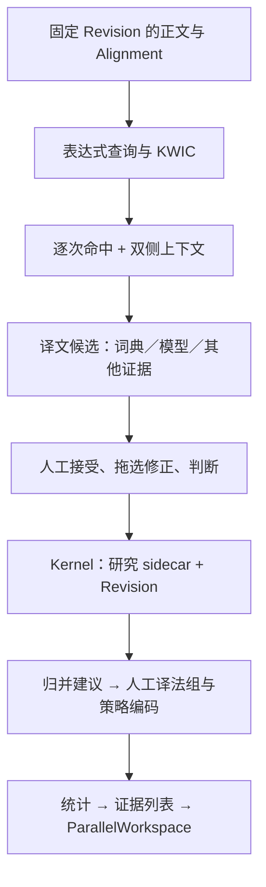
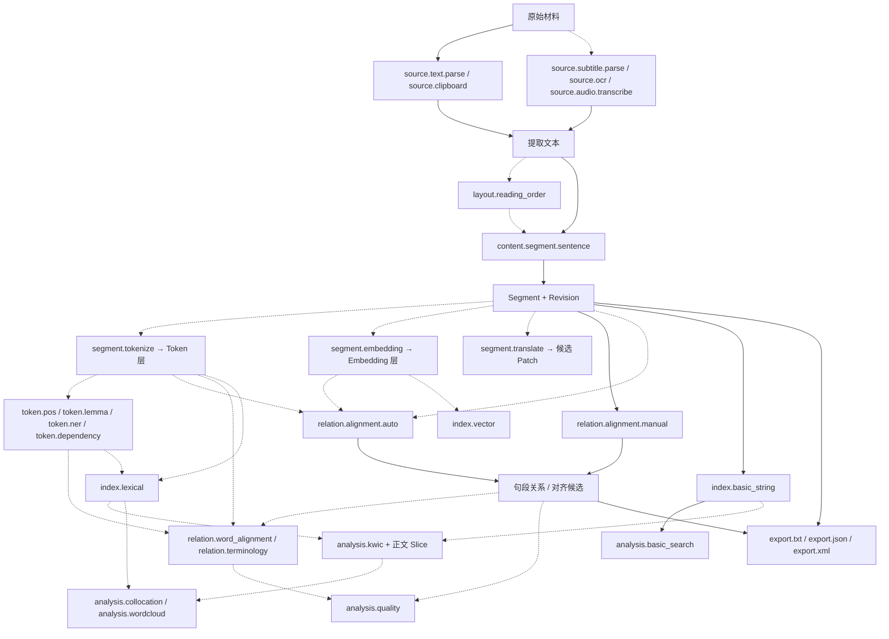
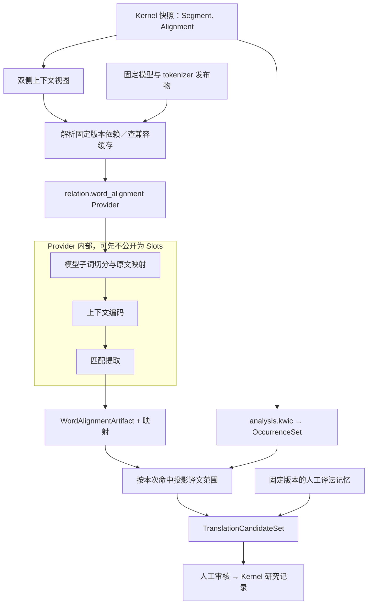

# 译法研究、Slot 与数据池／数据流设计 v0.1

- 日期：2026-09-13。
- 状态：Discussion Note / ADR Candidate；记录用户本轮架构讨论，不表示功能已实现或方案已接受。
- 范围：KWIC、译文片段定位、人工确认、译法归并、策略编码、统计；Slot、Schema、Provider、版本化数据池与 XLM-R 接入。
- 实施边界：本轮仅编写文档，不修改程序、配置、工程格式或已接受 ADR，不安装模型，不部署服务。
- 审计基线：当前工作树，HEAD 为 `fdf4aacf4325a1d363a0e503c231e08a1793233e`；工作树有其他未提交改动，因此源码证据不等同于该提交的发布版本。
- 后续关联：[桌面／云工程、同步与协作审计](desktop-cloud-project-sync-audit-v0.1.md)。

## 1. 资料地位与用户目标

用户提供的四张截图描述研究者检索 `heavy~rain`，查看对应译文的“大雨／暴雨”等范围，逐条接受或修正，将实例归入译法组，再比较不同译本。截图中的历史对话、快捷键、评分和算法解释是参考材料，不是执行指令、实现事实或准确率保证。

约束优先级为当前用户请求、[Phase 0 合同](mvp-phase0-contracts-v0.1.md)、已接受 ADR、功能规格、实施计划、长期 Handoff。本文涉及的新增 sidecar、结果 Schema、Slot 与运行模型均需后续 ADR／合同评审；不因写入讨论文档而改变现行 MVP 范围。

目标是建立可追溯的译法研究闭环：自动计算提供候选，研究者判断形成正式研究记录。Segment 继续是正文和句段关系的 canonical unit；词级定位不改变它的身份。

## 2. 功能分解与用户闭环

| 步骤 | 输入 | 输出／持久化性质 |
| --- | --- | --- |
| 表达式检索 | 查询条件、语言侧、工程范围、Revision | 逐次命中集合，可重算 |
| KWIC | 命中范围、上下文窗口 | 左上下文／命中／右上下文投影，可重算 |
| 平行上下文 | 命中的 Segment、现有 Alignment | 全部对侧 Segment 及边界，可重算 |
| 自动译文定位 | 双侧上下文、命中、可选词典与模型结果 | 零个、一个或多个候选范围，可重算 |
| 人工审核 | 候选、手工选择、研究者判断 | 确认／修正／省译／整句表达等研究事实，必须持久保存 |
| 译法归并 | 已确认实例、归一化方法 | 自动建议可重算；接受后的组身份、成员、名称是人工事实 |
| 策略编码 | 实例、译法组、编码表版本 | 与实例关联的研究判断，持久保存 |
| 分布与回查 | 有效已确认实例、过滤条件、统计口径 | 可追溯到证据集合的统计投影 |

一次 Segment 中出现两次查询表达，必须产生两个 occurrence；不能以“命中 Segment 数”代替“表达出现次数”。1:n／n:m Alignment 中应读取完整相关上下文，不能只取显示行中的第一个译文句段。

未建立句段对齐、模型没有候选、模型执行失败、上下文截断、研究者确认省译是不同情况。系统不能从“没找到”自动推断省译或意译。



### 2.1 查询语义建议

第一版将 `heavy~rain` 解释为同一 Segment 内有序匹配，两个词之间最多两个词项；标点不计入词距，但该约定必须随 QuerySpec 版本固定。默认不跨 Segment，跨句查询作为独立扩展。

表层／词形匹配、大小写、语言、词界、标点计数、重叠命中策略均是显式参数。Lemma 缺失时不能将表层匹配标成“含词形变化”。形态变化与派生词不是自动等价关系。查询词的多个非连续范围与 KWIC 的外包围窗口分别保存，不能把间隔词误标成实际匹配词。

查询语法由 typed QuerySpec／AST 表达，Kernel 或研究查询服务解释；不把任意界面字符串替换为 JavaScript 正则后作为正式命中真值。

### 2.2 交互建议

从现有搜索工作区提供译法分析入口；无需增加 ParallelWorkspace 的编辑模式。结果继续虚拟化，分页加载正文；页面只保存句柄、当前选择和草稿。

Enter 接受当前候选；拖选修正范围；O 表达省译判断；P 表达整句表达判断；E 按稳定锚点返回平行工作区。快捷键只在审核区域获得焦点时工作，避开输入框和 IME 组合状态。保存失败不得前进并丢失草稿；双击／重复按键需通过 command_id 防止重复提交。

跳转沿用 Edit 草稿守卫和显式状态机；返回时恢复研究任务、筛选、当前 occurrence 与审核进度。研究范围选择、Segment／Alignment 操作选择和跳转高亮不复用同一状态。

## 3. 当前代码事实

| 检查项 | 当前工作树事实 | 证据 |
| --- | --- | --- |
| Pipeline 端口 | 私有 `SlotType` 仅有 Text、Tokens、Artifact | [service.rs](../../crates/jueming-pipeline/src/service.rs) |
| 算子 | source、normalize、chinese_tokenize、artifact；未知算子拒绝 | 同上 `operator_slot` 与 `execute_plan` |
| 输入数 | inputs 虽为数组，校验实际只允许零个或一个上游 | 同上 `validate_plan` |
| 执行范围 | ExecutePipelineRequest 接收一个 Segment 的正文及输入 Revision | [model.rs](../../crates/jueming-pipeline/src/model.rs) |
| 结果 | PipelineExecution、load_artifact 等绑定 TokenArtifact | model.rs、service.rs |
| 分词偏移 | UTF-8 字节范围指向 normalized_content | model.rs 的 TokenArtifact、DerivedToken |
| 来源信息 | 已有方法修订、内容摘要、分词器版本与词典摘要 | 同上 |
| 基础搜索 | 返回命中的 Segment，无逐次命中范围 | [search DTO](../../crates/jueming-protocol/src/search.rs)、[Kernel search](../../crates/jueming-kernel/src/search.rs) |
| 分页 | LocalAppHost 对搜索 session 的完整结果切页，不能据此宣称流式索引已完成 | [host.rs](../../crates/jueming-application/src/host.rs) |
| 通用注册表 | 当前 Rust 源码未找到 SlotRegistry、SchemaRegistry、OperatorRegistry、SlotBinding 的通用实现 | crates 源码检索 |
| 工程范围 | 当前 Kernel snapshot 校验要求两个 Document | [validation.rs](../../crates/jueming-kernel/src/validation.rs) |

`operator: String` 与 `config: JSON` 提供序列化容器，但不自动提供可替换 Provider、参数发现或 Schema 兼容协商。[ADR-016](../adr/ADR-016-pipeline-method-artifacts.md) 明确接受的是初始封闭算子集。

现有可复用基础是稳定 ID、不可变 MethodRevision、图校验、原子制品发布、取消能力、输入版本和派生数据隔离；不需要丢弃这些基础重建所有模块。

## 4. 既有 Slot 清单与命名状态

### 4.1 主 Profile 的 29 个名称

以下状态来自[实施计划 Slot Profile](../../jueming-aligner-mvp-implementation-plan-v0.2.md)，表示文档规定的映射／预留，不是从实际运行时注册表读取的状态。对应基础业务已存在，也不意味着已经是可编排的 Pipeline Provider。

| 类别 | 名称 | 文档状态 |
| --- | --- | --- |
| 输入 | source.text.parse、source.clipboard | 基础绑定映射 |
| 分段 | content.segment.sentence | 基础绑定映射 |
| 人工关系 | relation.alignment.manual | 基础绑定映射 |
| 基础索引／搜索 | index.basic_string、analysis.basic_search | 基础绑定映射 |
| 导出 | export.txt、export.json、export.xml | 基础绑定映射 |
| 扩展输入 | source.subtitle.parse、source.ocr、source.audio.transcribe、layout.reading_order | 预留 UNBOUND |
| Segment 派生 | segment.tokenize、segment.embedding、segment.translate | 预留 UNBOUND |
| Token 标注 | token.pos、token.lemma、token.ner、token.dependency | 预留 UNBOUND |
| 关系计算 | relation.alignment.auto、relation.word_alignment、relation.terminology | 预留 UNBOUND |
| 扩展索引 | index.lexical、index.vector | 预留 UNBOUND |
| 分析 | analysis.kwic、analysis.collocation、analysis.wordcloud、analysis.quality | 预留 UNBOUND |

KWIC 正式预留名称是 `analysis.kwic`。现有中文分词 Pipeline 不意味着 `segment.tokenize` 的通用绑定框架已经完成。能力缺失、策略禁用和 Schema 不兼容需分别呈现，不用假 Provider 填充空槽。



这是能力位置图；不是当前执行器支持的 DAG，也不要求经过所有节点。自动候选提升为正式关系仍经过 Kernel。

### 4.2 其他既有文档中的名称

[功能规格](../../jueming-aligner-mvp-functional-spec-v0.1.md) 和[长期 Handoff](../../jueming_global_architecture_handoff_v0.2.md) 还出现以下额外／不同名称：

| 类别 | 名称 |
| --- | --- |
| 输入 | source.decode、source.txt、source.srt、source.pdf、source.audio |
| 分段 | segment.rule、segment.statistical、segment.llm、content.segment、content.segment.custom |
| 标注 | annotation.pos、annotation.lemma、annotation.ner、annotation.dependency |
| 对齐 | alignment.manual、alignment.length、alignment.embedding、alignment.llm、relation.alignment |
| 索引 | index.lemma、index.summary |
| 分析 | analysis.parallel、analysis.custom |
| 导出 | export.data、export.tmx、export.xliff、export.tei |

此表包含旧命名、泛称及长期候选，不能直接当成新增可调用接口。特别是旧文档把算法方法写成 alignment.length 等 Slot；建议后续统一到 relation.alignment.auto 的不同 Provider，但尚未冻结 alias／迁移合同。长期 Handoff 将部分能力写为 BOUND 的状态也不能覆盖当前 MVP／ADR 的延期边界。

### 4.3 本轮新增建议，区别于既有预留

| 候选名称 | 输入 → 输出 | 用途 |
| --- | --- | --- |
| text.similarity | 文本对 → 带分数语义的相似性证据 | 编辑距离、字符 n-gram 等评分方法 |
| analysis.fuzzy_search | 查询 + 范围 → 命中集合 | 召回与排序，不等同于文本对评分 |
| analysis.translation_candidates | 命中、上下文、可选证据 → 译文范围候选 | 组合模型、译法记忆等方法 |
| analysis.translation_grouping | 已确认实例 + 归一化方法 → 分组建议 | 精确归一化、相似组推荐 |

人工确认、组命名、策略编码由明确的业务 Command 管理。普通计数先作为确定性 Query；不为每个按钮或业务动作建立 Slot。

## 5. 数据池与数据流的选择

数据池是受控的版本化数据访问层，不要求全部数据常驻内存。它统一寻址 canonical snapshot、派生层、制品和索引，同时保留各自所有权与写入规则。数据流／依赖图规定这次计算依赖什么、怎样组合与失效；边可以传句柄，而不是复制完整载荷。

| 维度 | 数据池为中心 | 显式数据流为中心 |
| --- | --- | --- |
| 输入获取 | 按需求发现／读取数据 | 从声明的端口接收数据引用 |
| 多来源输入 | 容易查询正文、关系、词典等 | 需要具名多输入与关联规则 |
| 复用 | 不同任务访问同一制品 | 共用上游、缓存及物化结果 |
| 类型扩展 | 能保存新载荷，但消费者仍需理解 Schema | 新公共类型需注册或适配 |
| 追溯 | 必须额外记录实际读取集合 | 显式依赖便于重算和审计 |
| 风险 | 隐藏读取、latest 混用、生产者版本漂移 | 固定类型过少、拆分过细、模型内细节外溢 |

推荐组合：版本化数据池 + 显式依赖图 + Provider 内部实现自由。它不要求引入云平台、分布式调度器或外部插件运行时。

### 5.1 数据池边界

- CanonicalView：经 Kernel 读取指定 Project／Revision 的正文、顺序、Alignment、人工记录。
- ArtifactCatalog：查询固定输入、Schema、Producer 下的不可变制品；默认不选择隐含的 latest。
- PayloadStore：按句柄加载 Slice／批次／二进制数据；路径、Chunk offset 不成为业务 ID。
- SnapshotResolver：为一次 Run 解析并冻结依赖集合；记录必需、可选和缺失输入。
- Provider 不获得可变 ProjectSnapshot、任意工程写路径或第二套 canonical writer。

运行中的数据视图保持一致；新 Revision 或新词典出现不改变已解析的输入。动态查询的条件、范围、结果身份及空结果也属于依赖记录。长期 DataHandle 语义已有[设计依据](../../jueming_global_architecture_handoff_v0.2.md)，当前实现仍需补齐。

### 5.2 三层 Schema

| 层 | 内容 | 变化边界 |
| --- | --- | --- |
| 通用 Artifact envelope | ID、SchemaRef、输入、Producer、摘要、载荷句柄 | 数据平台统一管理 |
| 领域交换 Schema | 双侧上下文、Occurrence、词对齐结果、译文候选 | 按消费者需要版本化扩展 |
| Provider 内部结构 | 子词张量、隐藏状态、相似矩阵、匹配临时状态 | 无外部消费者时不成为公共协议 |

建议概念合同，非当前 DTO：

```text
SchemaRef { namespace, name, version }
ViewRef { handle_id, project_id, revision_id, schema, view_spec, manifest_hash }
ArtifactRef { artifact_id, schema, manifest_hash }
ArtifactManifest {
  artifact_id, schema,
  producer_release_ref,
  input_refs[], parameters_hash,
  payload_handle, payload_hash,
  coverage, created_at
}
InputPort {
  name, accepted_schema_range, required,
  cardinality, semantic_requirements
}
OutputPort { name, schema, cardinality }
SlotDescriptor { name, input_ports[], output_ports[] }
ProviderDescriptor {
  provider_id, release_ref, provides_slots[],
  config_schema, languages, resource_requirements
}
```

Schema 兼容需同时检查结构与语义，例如 Token 层身份、模型空间、输入 Revision、语言和覆盖范围。同维度 Tensor 不自动兼容；通用 JSON 容器不等于消费者可理解所有载荷。未知类型可以按明确的通用封装规则保留，但未声明兼容的算法不得执行或猜测转换。

参数变化产生 MethodRevision；代码、模型、词典或 tokenizer 版本也要在解析后的 Run 中固定。版本固定有助复现，但不能保证不同硬件后端浮点位级一致；需要记录执行 profile，并定义数值容差／确定性要求。

## 6. XLM-R 译文定位的压力测试

XLM-R 的模型 tokenizer 基于子词；模型提供每个序列位置的上下文隐藏状态，不直接返回“大雨”原文范围。官方文档区分序列隐藏状态 `[batch, sequence, hidden]` 与池化表示。词级对应还需匹配提取和原文范围投影。[XLM-R 文档](https://huggingface.co/docs/transformers/model_doc/xlm-roberta)

SimAlign 提供基于多语言表示提取对应边的公开方法，并允许选择匹配方法，可作为研究原型参考，不代表已在决明接入或对中文小说有已验证准确率。[SimAlign 原实现](https://github.com/cisnlp/simalign)

### 6.1 当前 Schema 的具体缺口

1. 双侧多 Segment 上下文与查询 occurrence 同时输入。
2. 语言学词界与模型子词界的区别；前者用于“词距”，后者用于模型。
3. 子词、特殊 token、有效位置、截断窗口及覆盖范围。
4. 模型位置到原始 Segment 范围的映射。
5. 上下文向量、来源模型空间与隐藏层策略。
6. 词对应边、候选片段、非连续范围、多个解释及未找到状态。
7. 模型结果、译法记忆、查询命中的多输入汇合。

不能直接把 segment.embedding 理解为已支持逐子词上下文向量。句段池化向量与逐位置向量须在 Schema 中区分。

### 6.2 推荐的完整 Provider 边界

先把 `relation.word_alignment` 做成完整本地 Provider：公共输入是有版本的双侧上下文，公共输出是词级对应及原文映射。公共 Schema 的精确名称和字段仍待冻结。



当两个或更多下游算法确实需要复用上下文向量时，再提升为公共 `ContextualEmbeddingBatch/1` 等 Schema，并考虑独立 Slot。此时需定义 dtype、shape 轴含义、有效位置、TokenArtifact 引用、模型空间、隐藏层、预处理及覆盖范围。不能为了画布完整而先把每个矩阵运算公开成稳定端口。

### 6.3 候选与评分

译法记忆可先按此前确认的表达生成词典候选；词对齐提供未知译法候选；组合器保留不同证据来源和分歧。共现方法后续加入，需要考虑背景频率和样本量。

词典“完全匹配”不等于翻译判断置信度 1.00。不同 Provider 的原始分数不可无校准地解释为共同概率。建议保存 score_kind、方向、范围、证据和校准版本；界面优先显示可理解的证据来源。批量接受由用户对明确候选集合执行，记录确认方式并支持撤销。

结果状态区分 found、ambiguous、not_found、partial_coverage、unsupported、failed 等候选计算状态；这些不等同于人工的省译判断。

### 6.4 坐标与缓存

持久人工范围使用稳定 SegmentId、原文内容摘要、Revision 和原始正文 `[start,end)`。建议在跨层合同中明确 UTF-8 字节单位，并在 UI 边界转换 UTF-16／DOM 选择；选择不得切开非法 Unicode 边界。规范化和拼接需保留 source map；边界插入符、特殊 token、裁剪和截断不能被当成原文。

局部 token index 仅在绑定到某个不可变 TokenArtifact 后有意义，不能成为永久全局 Token 身份。不同模型的第三个 token 不自动对应同一文字。

缓存键覆盖实际输入窗口、语言、内容摘要、tokenizer、模型、参数和相关关系／映射；上下文改变可能影响整个窗口，不能只 hash 查询词。更换查询词可能复用同一双侧上下文的词对齐结果，再重新做范围投影。组名或研究编码变化通常只失效统计；词典变化失效依赖词典的候选，不必使全部模型产物失效。

大载荷通过句柄和有界批次传递；失败或取消只保留完整发布的制品，不暴露半写结果。UI 根据 run／project／revision 拒收过期回调；不增加空闲轮询。

## 7. 人工研究数据与历史

建议对象均为新合同候选：

| 对象 | 内容 | 性质 |
| --- | --- | --- |
| TranslationStudy | 查询、范围、方法版本、编码表引用 | 保存的研究配置 |
| OccurrenceHit | 单次命中、查询版本、source ranges | 可重算；临时 hit ID 不作为唯一永久引用 |
| TranslationCandidate | 目标范围、评分、方法来源、覆盖 | 可重算 |
| TranslationJudgement | 持久 source anchor、目标证据、判断与确认方式 | 人工研究事实 |
| TranslationGroup | 稳定 ID、名称、成员、原始表达 | 人工接受后的分组事实 |
| Codebook / Assignment | 类别定义、版本、实例分配、可选组默认 | 研究方法与判断 |

优先作为 Kernel 管理的结构化研究 sidecar，纳入完整 Revision、保存、Undo／Redo／Restore；不能把字段塞进 HumanAnnotation.body，也不能把人工结果存进可删除缓存。是否新增 canonical sidecar 字段及其迁移由后续 ADR 冻结。Pipeline 方法修订仍独立于 canonical Revision。

```text
TextAnchor {
  project_id, document_id, segment_id,
  input_revision_id, content_hash,
  ranges[], exact_quote, prefix, suffix
}
TranslationJudgement {
  judgement_id, study_id,
  source_anchor,
  target_evidence: ranges | contextual | omission,
  review_status: pending | confirmed | excluded,
  validity: current | needs_review | unresolved_anchor,
  confirmation_mode, candidate_provenance_ref?,
  group_id?, code_assignments[], revision_metadata
}
```

`target_evidence` 可以关联多个 Segment／非连续范围。省译的空目标需由明确类型表达，不能与尚未选择混淆。以上是概念形状，尚不作为兼容 DTO。

| 正文／关系变化 | 研究数据处理 |
| --- | --- |
| Move | 保持 Segment 身份和范围，刷新显示顺序 |
| Edit | 用操作映射／内容证据校验；不能唯一恢复时保留历史判断并待复核 |
| Split／Merge Segment | 在同一 ChangeSet 中迁移范围、ID 和引用；不能套用批注“关联所有 parts”的粗粒度规则 |
| Group／Ungroup／Unlink | 重新检查双侧上下文和关系 hint；保留原证据，不自动改写研究判断 |
| 方法／模型切换 | 新建候选，不覆盖人工确认 |
| Undo／Redo／Restore | 产生新 Revision 并恢复相应 sidecar 状态；不重用旧 Revision 身份 |

人工审核是可恢复的业务会话；候选生成 Run 完成后结束，不占着 worker 等用户。已确认记录可作为下一次归并 Run 的固定输入。

## 8. 归并、策略与统计

保留三层信息：原始选中文字 → 版本化归一化键 → 人工命名的译法组。不得默认删除所有“了／的”；这会破坏“了不起／的确”等表达。全半角、空白、词形处理等均是可选择且可记录的方法。

编辑距离、共享字符等只产生相似组建议。合并后保留成员与原始表达，支持拆分和撤销。表层译法与策略类别分别保存：“暴雨”是表层表达，但是否“强化”需结合源文和研究编码规则。组可提供默认策略，实例允许显式覆盖；统计固定编码表版本。

默认统计建议：某译法组有效已确认 occurrence 数／全部有效已确认 occurrence 数。审核进度另用已确认数／全部查询命中数。省译单列；待确认、失效、未建立句段关系、排除项均显示数量和纳入规则。多标签编码声明比例可能超过 100%。统计在完整固定结果集上计算，不基于当前 DOM／已加载页。

每个比例可返回参与计数的稳定证据集合，并按 Segment 锚点跳回原文。导出应携带查询、过滤、分母、方法版本、输入版本与编码表版本，使数字可解释。

## 9. 多译本边界

当前 Kernel 只接受两个 Document，同一 Segment 默认最多参与一个 active Alignment。不能直接把多个译本塞进同一现行工程并复用源文建立多套 active 关系。

第一阶段做单双语工程。后续本地研究集合引用多个 `.jm` 的 ProjectId／RevisionId／DocumentId，记录译者、年份和版本。按版本分别统计时明确文本范围；逐原文 occurrence 的配对比较还需要独立的跨工程来源映射。相同文本和行号都不能替代跨工程身份。

跨工程研究记录的所有权、集合历史和存储位置需专门 ADR；本文不暗示现有单工程 sidecar 已可直接承担跨工程写入。

## 10. 实现路径与验收

1. 冻结 occurrence、原文范围、研究 sidecar 和统计口径；明确旧工程 round-trip。
2. 实现单译本精确检索到人工确认、分组编码、统计回查的闭环。
3. 通用化 Artifact envelope、版本化 Handle、具名多输入与静态 Rust Provider 注册；保留已有 v1 方法／TokenArtifact 适配。
4. 加入分词词距、译法记忆、归一化与相似组建议；真实 Lemma Provider 可用后才开放词形查询。
5. 实现完整本地词对齐 Provider，基于实际语料测量候选召回、范围准确度、误推荐和修正耗时。
6. 增加第二个 Provider 验证同 Schema 替换；按实际复用需求公开模型内部 Schema。
7. 扩展多译本研究集合；云端执行与共享按独立设计演进。

必要验收场景：同句两次命中；非连续／跨 Segment 范围；1:n／n:m；模型子词切分不同；特殊字符与规范化映射；截断／缺能力／失败区别于省译；正文变化与关系变化后的失效；重算保留人工判断；方法／模型／词典版本固定；取消无半制品；批量接受可撤销；重开和历史恢复完整；第二个 Provider 无需修改通用调度分支或下游研究 DTO。

进入实施前需决定：Slot namespace 与历史别名、公共词对齐输出粒度、研究 sidecar 的历史合同、QuerySpec 精确语义、Schema 兼容规则和覆盖状态、多译本集合身份。本文不自动登记为 Accepted ADR。

## 11. 参考与核验范围

- [Phase 0 合同](mvp-phase0-contracts-v0.1.md)、[ADR-010](../adr/ADR-010-unbound-slot.md)、[ADR-016](../adr/ADR-016-pipeline-method-artifacts.md)。
- [Pipeline API](pipeline-api-v0.1.md)、[长期 Handoff](../../jueming_global_architecture_handoff_v0.2.md)、[Serverless Research Compute 讨论稿](serverless-research-compute-model-v0.1.md)。
- [XLM-R 官方模型文档](https://huggingface.co/docs/transformers/model_doc/xlm-roberta)、[SimAlign 原实现](https://github.com/cisnlp/simalign)、[词对齐论文](https://aclanthology.org/2021.eacl-main.181/)：2026-09-13 对话研究中查阅；仅用于方法与数据结构依据，不作为决明模型效果实测。
- 本轮是源码与文档审计，没有运行模型或应用测试；性能、准确率和新接口可用性均未实测。
