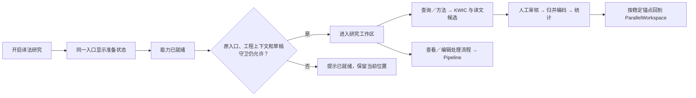

# 本地译法研究与 Pipeline 前端交互计划 v0.1

> 执行状态（2026-09-13）：已据此实现本地首版。本文保留设计目标；现有接口、实施取舍及发布限制见[实施交接](../architecture/local-research-runtime-implementation-v0.1.md)。

- 日期：2026-09-13。
- 状态：规划稿；按用户要求由 `frontend_plugin_plan` 子代理只读审计，主代理汇总并统一接口名称。没有修改或启动前端。
- 关联：[总实施计划](../architecture/local-slot-dataflow-plugin-implementation-plan-v0.1.md)、[功能启用与 Agent／MCP 接口](../architecture/local-feature-activation-agent-mcp-contracts-v0.1.md)、[设置更新](local-research-settings-update-plan-v0.1.md)。
- 范围：两个模糊算法、XLM-R 词对齐、研究工作区、Pipeline、导航和 typed 前端接口；账号、license、headless 与云端暂缓。

## 1. 用户流程

建议普通入口为一个“译法研究”功能开关。点击后宿主自动准备两种模糊匹配算法和 XLM-R 依赖，显示真实阶段与进度；准备完成后出现研究工作区。插件与模型的手工安装不进入日常流程。

完整安装包已有资源时直接校验／加载，断网可用；缺失时在已表达的启用意图范围内自动下载。界面本身随桌面版本内置，按能力启用，不从算法包执行任意界面代码。

用户可以在没有打开工程时准备功能；就绪后显示“打开工程后开始检索”。不能让演示 Segment ID 进入 Rust 工程调用。

## 2. 源码依据与要补齐的地方

| 位置 | 当前实现 | 前端实施任务 |
| --- | --- | --- |
| [PipelineWorkspace.vue](../../apps/desktop/src/components/PipelineWorkspace.vue) | 四算子标签、参数和 TokenArtifact 展示写死；已有 request generation／binding／operation 检查 | Descriptor 驱动端口、参数、Provider 和受支持结果类型；保留异步守卫 |
| [pipeline-client.ts](../../apps/desktop/src/domain/pipeline-client.ts) | 原生 agentClient façade；单 Segment 同步执行结果 | 增加 v2 validate／start／get_run／read_result／cancel_run |
| [pipeline-types.ts](../../apps/desktop/src/domain/pipeline-types.ts) | v1 Plan 与分词产物 | 显式 v2、端口、RunRef、ArtifactRef、结果分页；不改写 v1 字段语义 |
| [App.vue](../../apps/desktop/src/App.vue) | canLeaveDraft 检查正文 dirty；Pipeline 挂载未接收其 dirty emit | 统一正文、方法和研究确认草稿的 LeaveGuard |
| [useAgentWorkspace.ts](../../apps/desktop/src/composables/useAgentWorkspace.ts) | 打开工程后建立 project binding；已有 UI 请求和 ack | 设备能力投影独立；研究导航／reveal 使用稳定身份和明确 ack |
| [agent-types.ts](../../apps/desktop/src/domain/agent-types.ts) | 现有事件与投影没有功能准备、能力和新 Run 状态 | 新增同源类型及断流后快照重取 |
| [SearchReplaceWorkspace.vue](../../apps/desktop/src/components/SearchReplaceWorkspace.vue) | 搜索列表以 Segment ID 表示命中，使用 TanStack Virtual | 研究使用 occurrence 身份和有界分页；可复用虚拟列表经验 |
| [ParallelWorkspace.vue](../../apps/desktop/src/components/ParallelWorkspace.vue) | 主平行工作区和现有稳定对象操作 | 复用跳转与布局，仅增加研究范围高亮接口 |

设置页的导航、静态能力和保存机制由设置子代理单独审计，见配套设置计划。

## 3. 准备状态与文案

开关展示用户期望状态，旁边状态说明实际可用性；只有 Host 宣布 ready 才允许研究执行。开关不承担下载进度、安装状态和 Worker 存活的全部含义。

| 状态／阶段 | 推荐文案 | 交互 |
| --- | --- | --- |
| disabled | 译法研究 | 开关关闭；说明“检索相近表达，定位译文并归并译法” |
| preparing / resolving | 正在准备译法研究… | 可取消；技术详情默认折叠 |
| preparing / downloading | 正在准备所需资源 · 已下载／总量 | 使用真实字节；未知总量不显示百分比 |
| preparing / verifying | 正在检查所需资源… | 可请求取消，不虚构进度 |
| preparing / installing | 正在配置本地运行环境… | 取消等待宿主安全终止点 |
| preparing / starting | 正在启动译文定位… | 等待或取消 |
| ready | 译法研究已就绪 | “进入译法研究”；满足导航条件时自动进入 |
| cancelling | 正在取消准备… | 等待终态，不能立即伪装已取消 |
| failed | 准备未完成：下载中断／磁盘空间不足 | “重试”“关闭”；展开具体诊断 |
| blocked | 当前设备暂不支持／需要联网完成首次准备 | 准确原因和可执行恢复路径 |
| disabling | 正在关闭译法研究… | 处理该功能的活动任务后完成 |
| disabled / resources retained | 已关闭；下次开启可直接加载 | 资源保留，移除资源属于独立管理动作 |

ready 不要求 Worker 长驻。空闲释放后功能仍可用，下一次任务内部按需启动；界面不闪回“未安装”。

## 4. 研究工作区

建议新增宿主内置 `ResearchWorkspace`，按三个区域组织，不要求用户先绘制流程图。

### 4.1 查询与方法

- 查询输入、工程范围、精确／模糊模式、运行／取消。
- 模糊算法选择来自合法 Provider 描述；本计划建议编辑距离和字符 n-gram，最终名称随合同冻结。
- 译文自动定位使用独立方法配置，不能把 XLM-R 与两个字符评分算法混放成三个可互换选项。
- 默认使用可用方法模板；通过 pipeline.list_templates／create_from_template 在第一次执行前固定方法版本。高级“查看／编辑处理流程”按 method ID／node ID 跳到 Pipeline。
- 尚无 Lemma Provider 时不标示“含词形变化”；XLM-R 就绪不自动等于词形查询可用。

### 4.2 审核列表

每行代表一次 occurrence，显示原文 KWIC、完整平行上下文中的目标候选、证据来源、覆盖／审核状态以及接受／修正操作。同一 Segment 两次命中必须是两个稳定列表项。

1:n／n:m 上下文允许目标范围引用多个 Segment；非连续范围分别高亮。上下文截断、未对齐、未找到和计算失败均有各自状态，不能统一呈现为“省译”。

拖选译文形成待确认范围，显式接受后写入研究记录。Enter／O／P／E 仅在审核键盘作用域生效；输入框、contenteditable 和 IME composing 时不触发。审核选择、浏览器选区、Segment／Alignment 操作选择和跳转高亮分别管理。

### 4.3 归并、编码与统计

保留原始表达、人工组名和策略类别。模糊相似性只生成建议；合并由研究命令完成，支持拆分和撤销。批量确认呈现实际候选集合与条数，不把模型“高分”当自动确认。

统计使用完整固定结果集，显示审核进度、排除／失效项及分母；点击比例返回证据列表。不得从当前虚拟列表已加载页面推导总数。

已生成的结果和人工事实在功能关闭后仍可从研究历史阅读；关闭仅阻止新计算。缺少原插件 Release 时明确提示不能重算，不删除历史。

## 5. Pipeline 交互

节点由 Slot／Operator Descriptor 渲染命名端口、基数、参数和合法 Provider；不继续在组件里为每种算法写一个固定分支。Schema 不兼容时在连线／验证阶段说明原因。

方法编辑仍创建新 MethodRevision。Provider 切换不改变当前已运行结果；历史 Run 显示其固定 Release、模型、输入版本及参数。

结果渲染器由宿主支持的 Schema 选择，例如 TokenBatch、OccurrenceSet、WordAlignment、TranslationCandidate、GroupSuggestion。未知可保存类型显示元数据和兼容原因，不执行插件携带的前端脚本，也不把任意载荷猜成表格。

默认研究模板、Pipeline 高级编辑和 Agent 创建的提案共用方法／绑定合同，不能形成三份互不关联的配置。

## 6. Typed 接口与状态管理

新增接口以[统一方法表](../architecture/local-feature-activation-agent-mcp-contracts-v0.1.md)为准；以下是前端使用方式。

| 前端模块 | 输入／调用 | 本地状态职责 |
| --- | --- | --- |
| featureClient | features.list/get/enable/disable/cancel_prepare/retry_prepare | typed 包装，不自行管理包路径或下载 |
| 应用级 feature-runtime store | CapabilitySnapshot、FeatureSnapshot、设备事件 | Host 投影、generation 校验、准备进度、失序重取；不挂在研究组件生命周期上 |
| pipelineClient v2 | slots／schemas／operators、validate/start/get_run/cancel_run/read_result | 方法草稿、固定运行引用、有界结果缓存 |
| ResearchWorkspace | study／occurrence 查询、研究 typed Command | 用户选择、确认草稿、筛选与当前跳转锚点 |
| App 导航协调器 | 功能就绪、用户进入、Agent navigate／reveal | 动态导航、懒加载、上下文校验、LeaveGuard 与 UI ack |

组件通过统一 KernelClient 及其组合 façade 调用，不直接增加 Tauri invoke 或访问 loopback HTTP。已有原生 agentClient 可作为内部实现；算法使用不依赖聊天 Agent 的模型账号配置。

FeatureSnapshot 至少包含 feature ID、desired_enabled、status、stage、activation ID、generation、真实字节进度、原因和 readiness。Worker 状态和插件版本属于高级详情。计数字段遵循跨语言整数合同，不隐式转换超出 JS 精度的数值。

事件采用 `feature_changed`、`preparation_progress`、`capabilities_changed`、`slot_binding_changed`、`run_changed`、`artifact_published` 等拟定名称。设备事件与工程事件显式区分 scope，断流重取包含能力、准备任务和活动 Run 的快照，不能只刷新工程正文。

## 7. 草稿、导航与工程切换

统一 LeaveGuard 至少覆盖正文 Edit、Pipeline 方法草稿和研究范围／编码草稿。现有正文守卫不能直接作为全部已经实现的证据。离开或关闭功能时提供保存、放弃、取消，不能通过 forceMode 绕过。

准备完成自动进入需要同时满足：原启用入口仍有效、用户未主动导航到其他工作区、工程上下文符合当前入口、草稿守卫通过。否则只显示就绪提示；不因后台下载完成放弃草稿或抢焦点。

UI 应用异步数据时检查 project ID、generation、run ID 和输入版本。旧版本结果可保存为历史，但不能显示成新版本当前候选。设备准备可以继续，工程 A 的研究结果不能流入工程 B。

研究与编辑之间使用稳定 Segment／Alignment／study／occurrence 锚点。范围持久化为原文 UTF-8 `[start,end)` 并带内容 hash；前端 DOM／UTF-16 在边界转换，token 下标不能直接作为 DOM 坐标。正文保存返回后重新检查引用有效性。

Agent／MCP 请求同样经导航守卫和 UI ack；请求到达不代表页面已跳转。新增研究目标不接受 DOM 索引或行号。

## 8. 前端实施位置与验收

建议新增 `domain/feature-client.ts`、`domain/feature-types.ts`、`stores/feature-runtime.ts`、`components/ResearchWorkspace.vue` 及审核／归并子组件；实际文件在实施阶段建立。修改现有 App、Pipeline façade／types／Workspace、Agent types／workspace composable 和必要的 ParallelWorkspace 范围高亮接口。

前端验证至少包括：

1. 点一次开关完成自动准备，期间没有逐包安装流程；完整安装包断网直接加载。
2. 取消、断网、空间不足、校验失败、握手失败、重试、关闭后重开均显示真实状态。
3. 准备期间从工程 A 切到 B，完成事件不抢焦点；正文／方法／研究草稿均受保护。
4. 两个模糊 Provider 切换改变实际排序；XLM-R 独立配置并显示真实范围、覆盖与来源。
5. 重复 occurrence、非连续对应、n:m、Unicode 与过长输入有可解释结果；未找到不自动变成省译。
6. UI／Agent／MCP 的能力和 Run 身份一致；未启用功能被 Agent 请求时引导到同一开关，不自动安装。
7. 插件关闭／卸载后旧产物和人工事实可读；需原算法重算时显示实际缺失原因。
8. 研究结果保持有界分页和 TanStack Virtual；主平行视图继续现有 AlignedWorkspaceViewport／useAlignedBlockLayout。
9. 使用语义 CSS 变量，浅色／护眼模式可用；状态含文字和图标，键盘、输入法和减少动画模式正确。进度只播报关键阶段，不持续打扰屏幕阅读器。

本轮无前端实现、界面运行或模型实测；上述均是后续实现的具体交付条件。
