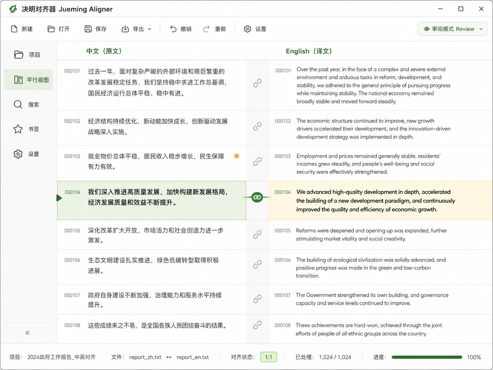
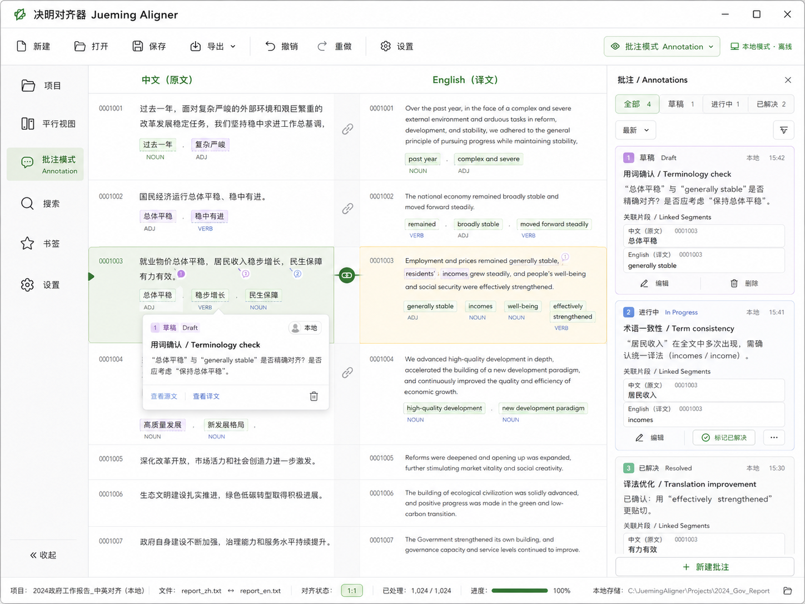

# Jueming Aligner MVP 功能文档

> 产品名称：决明 · 对齐器（Jueming Aligner）  
> 文档版本：v0.1 MVP  
> 产品阶段：Skeleton MVP / Local-first  
> 核心目标：完成一个明显优于传统人工平行语料对齐工具的现代 MVP，同时保留后续 NLP、索引、插件、云协同能力的架构插槽。  
> 核心原则：**基础架构保持不变，MVP 只装载最少组件。**

---

## 1. 文档目的

本文件定义 **Jueming Aligner MVP** 的功能范围、工作流程、页面结构、核心对象、人工对齐操作、保存与导出行为，以及它与完整“决明”架构之间的关系。

MVP 的定位是未来 Jueming 平行语料、NLP、KWIC、自动对齐、OCR、字幕、多用户协同等能力的**最小可运行骨架**。第一阶段优先解决四个问题：

1. 如何快速导入原文和译文；
2. 如何把文本稳定拆成可操作的 Segment；
3. 如何高效地人工调整平行对齐关系；
4. 如何可靠保存、重新打开和导出结果。

MVP 的产品判断标准是：**先把人工对齐做得清楚、稳定、可撤销、可保存、可扩展，再逐步填充自动化 Slot。**

---

## 2. 参考基线：SISU Aligner 2.0.0

Jueming Aligner MVP 的功能边界参考 SISU Aligner 2.0.0 的基础工作流。

《多语种语料平行对齐处理工具 SISU Aligner 2.0.0 使用说明》中展示的核心流程包括：

- 在左右两侧分别放入原文和译文；
- 通过标点替换和插入换行完成初步句级拆分；
- 通过复制、剪切、粘贴、撤销、删除等基础编辑操作人工调整对齐；
- 中途保存工程，完成后导出 TXT 或 XML。

Jueming Aligner 保留这条简单路径，同时把底层升级为：

```text
Project
  ↓
Document
  ↓
Segment
  ↓
Alignment
  ↓
Edit / Reorder / Segment Merge / Split / Alignment Group / Ungroup
  ↓
Save / Export
```

关键提升是：**用户操作的是稳定的 Segment 与 Alignment 对象，而不是依赖左右文本行号刚好一致。**

---

# 3. 产品定位

## 3.1 MVP 是什么

Jueming Aligner MVP 是：

> **面向双语 / 多语平行语料的本地人工对齐与编辑工具。**

第一阶段重点面向：

- 翻译研究；
- 语料库研究；
- 语言学研究；
- 人工构建平行语料；
- 双语文档清洗；
- 机器翻译后人工修正；
- 后续 NLP 处理前的数据准备。

---

## 3.2 MVP 暂不实现的能力

以下能力在架构上保留 Slot，但第一版可以处于 `UNBOUND`：

- 自动语义对齐；
- Embedding 对齐；
- POS 词性标注；
- Lemma；
- NER；
- Dependency；
- Collocation；
- Keyness；
- 高级 KWIC；
- 词云；
- OCR；
- PDF Parser；
- SRT / VTT 字幕；
- 音频转写；
- Python 插件；
- WASM 插件；
- 多用户协同；
- Server Kernel；
- 云同步；
- 远程计算。

MVP 要求的是：**这些 Slot 已经有命名、Schema 和 Registry 位置，功能 Provider 可以为空。**

---

# 4. MVP 核心功能总览

| 模块 | MVP 功能 | 作用 |
|---|---|---|
| 工程管理 | 新建 / 打开 / 保存 / 另存 | 管理完整平行语料项目 |
| 双语导入 | Paste / TXT | 快速导入左右语料 |
| 编码处理 | UTF-8 优先 | 稳定解码文本 |
| 分段处理 | 规则分句 | 将长文本拆成 Segment |
| 平行视图 | 双栏显示 | 观察原文 / 译文 Segment |
| 人工对齐 | Link / Unlink | 建立或解除关系 |
| Segment 内容结构 | Merge 内容 / Split 内容 | 合并或无损拆分同侧 Segment 文本 |
| 对齐分组 | Group / Ungroup | 构造或拆开 1:n、n:1、n:m Alignment |
| 顺序调整 | Move / Drag | 调整段内 Segment 顺序 |
| 单句编辑 | Segment Edit | 修改原文或译文 |
| Review | 当前对齐点突出 | 辅助逐句检查 |
| 书签 | Bookmark | 标记重要 Segment |
| 基础搜索 | Ctrl+F / Basic Search | 快速寻找文本 |
| 历史 | Undo / Redo | 撤销当前操作 |
| 保存 | Local Project | 持久化工程 |
| 导出 | TXT / JSON / XML | 输出对齐结果 |
| 设置 | 字体 / 字号 / Theme | 改善阅读与可访问性 |

---

# 5. MVP 主工作流

```text
New Project
    ↓
Import Source / Target
    ↓
Decode
    ↓
Rule Segmentation
    ↓
Initial Parallel Layout
    ↓
Manual Alignment
    ↓
Reorder / Segment Merge / Split / Link / Group / Ungroup
    ↓
Edit Segment
    ↓
Review
    ↓
Bookmark / Search
    ↓
Save Project
    ↓
Export
```

---

# 6. UI 效果图

## 6.1 Jueming Aligner MVP 主界面方向

下图展示 Jueming Aligner MVP 的建议视觉方向：白色主体、淡绿色主色、淡黄色辅助色，双栏平行文本、Review、Edit、Order、Search、Bookmarks 等功能围绕同一 Project 展开。



## 6.2 功能总览效果图



---

# 7. 工程管理

## 7.1 新建工程

入口：

```text
File → New Project
```

或首页：

```text
New Parallel Project
```

创建时至少包含：

```text
Project Name
Source Language
Target Language
Source Text
Target Text
```

第一版只要求双语工程，但 Core 数据模型不限制语言数量。新建向导冻结为 curated top-ten LTR 语言集：`en` English、`zh` 中文（普通话，横排）、`hi` हिन्दी、`es` Español、`fr` Français、`bn` বাংলা、`pt` Português、`ru` Русский、`id` Bahasa Indonesia、`de` Deutsch。语言代码是 BCP-47 基础代码；脚本方向以 Unicode CLDR 资料校验。RTL 语言在本版本不提供选择，不能通过自动检测或布局镜像绕过此限制。导入向导按语言预填分句提示（中文按句末标点而非空白；印地语/孟加拉语识别 `।`；其余按各自 Latin/Cyrillic 空白与句末标点），但不实现 NLP 自动分词。

内部继续使用：

```text
Project
Document
Segment
Alignment
Revision
```

---

## 7.2 打开工程

支持：

```text
Open Project
Recent Projects
```

打开后恢复：

- 左右文本；
- Segment；
- Segment 顺序；
- Alignment；
- Bookmark；
- 项目设置；
- 当前工程版本信息。

---

## 7.3 保存工程

建议内部工程形式：

```text
project-name.jm/
├── catalog.db
├── manifest.json
├── chunks/
├── alignment/
├── bookmarks/
└── cache/
```

用户侧只看到：

```text
Save
Save As
```

内部存储细节不暴露到 UI。

---

# 8. 双语导入

## 8.1 支持方式

MVP：

```text
Paste Text
Open TXT
```

左右分别：

```text
Source
Target
```

例如：

```text
Source: Chinese
Target: English
```

---

## 8.2 导入界面

建议：

```text
┌──────────────────────────────┐
│ New Parallel Project         │
├──────────────────────────────┤
│ Source Language: Chinese     │
│ [Paste] [Open TXT]           │
│                              │
│ Target Language: English     │
│ [Paste] [Open TXT]           │
│                              │
│ [Next: Segment]              │
└──────────────────────────────┘
```

---

## 8.3 编码

MVP 优先：

```text
UTF-8
UTF-8 BOM
```

架构层保留 Decoder Slot：

```text
source.decode
```

未来可以接：

```text
GB18030
Big5
Shift_JIS
EUC-KR
Windows-125x
```

前端统一接收 Unicode。

---

# 9. Segment 处理

## 9.1 为什么使用 Segment

MVP UI 中最常见的 SegmentKind 是 Sentence，但 Kernel 统一使用：

```text
Segment
```

这样后续可以直接支持：

```text
Sentence
SubtitleCue
OCRRegion
TranscriptUtterance
CustomSegment
```

MVP 默认：

```text
SegmentKind::Sentence
```

---

## 9.2 Rule Segmenter

第一版使用规则分句。

中文默认规则：

```text
。
！
？
……
```

英文默认：

```text
.
!
?
```

规则可配置。

---

## 9.3 分句预览

执行前提供：

```text
Preview
```

例如：

```text
原文：
现在，我代表国务院，向大会报告政府工作，请予审议。并请全国政协委员提出意见。

预览：
1. 现在，我代表国务院，向大会报告政府工作，请予审议。
2. 并请全国政协委员提出意见。
```

确认后：

```text
Apply
```

---

## 9.4 分句结果

每个 Segment 获得稳定 ID：

```text
Z1001
Z1002
Z1003

E2001
E2002
E2003
```

UI 默认隐藏内部 ID；调试或高级模式可显示。

---

# 10. Parallel Review View

这是 MVP 最核心页面。

基本结构：

```text
┌─────────────────────────────────────────────────────┐
│ Source                       Target                 │
├─────────────────────────────────────────────────────┤
│ Z1001                         E2001                  │
│ 中文第一句                    English sentence 1    │
├─────────────────────────────────────────────────────┤
│ Z1002                         E2002                  │
│ 中文第二句                    English sentence 2    │
├─────────────────────────────────────────────────────┤
│ Z1003                         E2003                  │
└─────────────────────────────────────────────────────┘
```

---

## 10.1 Review Mode

Review 用于逐句检查。

当前 Alignment 使用：

```text
淡绿色 / 淡黄色轻度突出
```

上下文保持可见。

例如：

```text
上一组
────────────────────────

★ 当前组
Z1002 ↔ E2002

────────────────────────
下一组
```

第一版不要求完整 Lyrics-like 复杂跟随算法，只要求：

```text
点击左侧 Segment
→ 激活其 Alignment
→ 右侧定位到对应 Segment
```

反向同理。

---

# 11. Alignment Model

MVP 要支持：

```text
1:1
1:2
2:1
2:2
n:m
unlinked
```

例如：

```text
Z10 ───── E10
```

或：

```text
Z10 ───── E10
    └──── E11
```

---

## 11.1 Link

用户选择左右 Segment：

```text
Z10
E10
```

点击：

```text
Link
```

得到：

```text
Z10 ↔ E10
```

后台产生：

```text
CreateAlignmentPatch
```

---

## 11.2 Unlink

点击当前 Alignment：

```text
Unlink
```

结果：

```text
Z10     E10
```

两者重新变成未连接状态。

---

# 12. Segment 内容结构：Merge 内容 / Split 内容

`Merge 内容` 与 `Split 内容` 都是同一语言侧的 Segment 内容/结构操作，不是 Alignment 操作。它们会改变 Segment content、当前 Segment 集合和 `SegmentOrder`，并在一个原子 ChangeSet 中维护书签、批注、索引与 Revision。

```text
Merge 内容
Z10 + Z11  →  Z10

Split 内容
Z10  →  Z10 + Z-new
```

Merge 只接受同一 Document 中相邻的 Segment：当前顺序的第一个 Segment 保留 `SegmentId`，其余 Segment 被吸收进历史；合并后的正文必须由用户确认。Split 的 `parts[]` 必须是原正文的无损、有序、非空划分：原 `SegmentId` 保留第一 part，后续 part 新建 ID 并紧邻插入 `SegmentOrder`。

当所选 Segment 全部未对齐，内容操作后仍未对齐。当它们全部属于同一个 Alignment，Merge 后该 Alignment 的 ref 收缩；Split 后所有 parts 首先继承该 Alignment 的 ref。不得把文本 Merge/Split 当成猜测新的翻译对应关系。

## 12.1 跨 Alignment Block 的内容操作

Alignment Block 只是当前两侧顺序与 refs 计算出的视觉投影，不保存 Block ID。若被 Merge 的 Segment 跨越两个 active Alignment/Block，界面必须拒绝直接执行并提示用户先 `Group`；可提供“Group 后继续”的明确预览，但提交时必须列出关系变化和内容变化。Split 后若用户希望不同 parts 分别对齐，先完成 Split，再显式 `Ungroup`；不能由 Split 自动切分 Alignment。

# 13. Alignment 关系：Group / Ungroup

`Group` 是原 Alignment Merge 的新名称，只改变关系，不改 Segment 正文或顺序。它要求选择完整 Alignment（或一个完整 Alignment 加未对齐 Segment），并创建一个新的 Alignment；所有被 Group 的旧 `AlignmentId` 失活。

```text
Z10 ↔ E10       Z10 + Z11 ↔ E10
Z11       Group
```

`Ungroup` 是原 Alignment Split 的新名称，只改变关系，不改 Segment 正文或顺序。它必须显示并提交明确、双侧均非空的 groups；原 `AlignmentId` 失活，每个子组使用新 ID。完全拆散为未对齐项使用 `Unlink`，不是 Ungroup。

```text
Z20 + Z21 ↔ E20 + E21
        Ungroup
Z20 ↔ E20
Z21 ↔ E21
```

Group/Ungroup 不猜语义。若提议的子组会留下不确定成员、交叉关系或未对齐项，必须在预览中显示并由用户修改或确认。

---

# 14. Order Mode

Order Mode 用于调整段内 Segment 顺序。

视觉原则：

- 所有 Segment 等权；
- 取消 Review 的淡化；
- 取消当前句过度突出；
- 显示清楚的拖动手柄；
- 保留轻量 Alignment 关系提示。
- 可跨 Alignment Block 拖动；Block 只是 UI 投影，跨越后可以显示 non-contiguous、interleaved 或 crossed 警示，但不修改关系成员。
- 拖动卡片使用独立 Overlay；连线以稳定 `SegmentId` 的实时端口坐标跟随 Overlay，原位保留占位，drop 后完成虚拟列表重新测量才移除 Overlay，避免连线停在旧行。

示例：

```text
≡ 1  Z100
≡ 2  Z101
≡ 3  Z102
≡ 4  Z103
```

---

## 14.1 支持操作

```text
Move Up
Move Down
Move to Top
Move to Bottom
Drag & Drop
```

MVP 至少实现：

```text
Move Up
Move Down
Drag
Insert Blank Above / Below
```

---

## 14.2 数据语义

UI 拖动不直接把 DOM index 当作真实数据。

提交：

```text
MoveSegment(
  segment_id,
  before / after
)
```

Kernel 维护真实顺序。

Order Mode 选中任一真实已对齐 Segment 后，可在其上方或下方插入同侧视觉空位。该操作不创建空文本 Segment，而是解除边界处另一侧 Segment 的关系，并按两侧当前顺序重建后续 1:1 Alignment；尾部无法配对的 Segment 保持未对齐。整个操作产生一个可撤销 Revision。

拖放适配层只提交 stable ID 及 before/after 锚点。虚拟列表可卸载原 draggable，但必须用 monitor/稳定 target 按 ID 接续；动态高度使用 `measureElement`/`ResizeObserver`，不可对同一 virtual index 混用 `resizeItem`。拖动手柄至少 24px，原项约 0.4 opacity；Overlay 通过 Vue `Teleport` 置于 workspace 根层，避开父级 transform/overflow 的 stacking context，Windows 原生 preview 超过 280px 显著变淡时使用受控 Overlay。

本迭代暂缓自动化 drag E2E 和视觉测试；仍必须覆盖 stable-ID 顺序提交、端点注册和 drop 后重新测量的单元/集成契约，不能把暂缓理解为放弃连线稳定性。

---

# 15. Segment Edit Mode

用户双击 Segment 或按：

```text
Enter
```

进入单句编辑。

正文编辑使用 CodeMirror 6 或等价轻量编辑器。

支持：

```text
Ctrl+C
Ctrl+X
Ctrl+V
Ctrl+Z
Ctrl+Shift+Z
Backspace
Delete
```

---

## 15.1 保存编辑

```text
Save
Ctrl+Enter
```

产生：

```text
EditSegment
```

或：

```text
UpdateSegmentPatch
```

---

## 15.2 取消编辑

```text
Esc
```

恢复编辑前状态。

---

## 15.3 编辑后的 Alignment

MVP 不做自动重新对齐。

编辑文本后：

```text
Alignment identity 保持
```

用户通过：

```text
Merge 内容
Split 内容
Link
Unlink
Group
Ungroup
```

手工修正。

未来 `alignment.embedding` / `alignment.llm` Slot 可以提供自动建议。

---

# 16. Bookmark

第一版提供简单书签。

点击：

```text
★
```

保存：

```text
Bookmark {
    segment_id
}
```

---

## 16.1 Bookmark Panel

显示：

```text
★ Z107  现在，我代表国务院……
★ Z158  一、2020年工作回顾
★ E324  Fellow Deputies, on behalf…
```

预览来自当前 Revision 的 Segment 内容、语言与顺序号，Bookmark canonical data 仍只保存稳定锚点和可选 label，不复制正文。Segment Merge 将被吸收 Segment 的书签迁移到保留首项；Split 使书签继续锚定第一 part；Group/Ungroup/Unlink 无法唯一映射关系时清除可选 AlignmentId，但绝不丢失 Segment 锚点。

点击书签：

```text
→ Parallel View
→ 定位对应 Segment
```

---

## 16.2 Tags

架构预留：

```text
tags: string[]
```

MVP 可以只做 Bookmark，Tags 作为次级功能。

---

# 17. Search

## 17.1 Ctrl+F

用于当前工程基础文本搜索。

支持：

```text
Plain Text
Case Sensitive
Basic Regex
```

MVP 不要求完整 AntConc KWIC。

---

## 17.2 Search Result

显示：

```text
Segment ID
Matched Text
Language
Alignment Status
```

例如：

```text
Z108  ……疫情……
Z215  ……疫情防控……
E302  pandemic……
```

点击结果：

```text
→ Parallel View
→ 激活对应 Segment
```

---

# 18. History

MVP 只要求：

```text
Undo
Redo
```

操作至少覆盖：

```text
EditSegment
MoveSegment
Link
Unlink
MergeSegments
SplitSegment
GroupAlignment
UngroupAlignment
```

复杂 Git-like History Trace 放到后续版本。History 必须把内容结构操作与关系操作分开呈现，显示 Segment/Alignment ID 迁移、正文与顺序变化，以及书签/批注迁移摘要；弃用的 `MergeAlignment` / `SplitAlignment` 不得出现在新 UI 或 Revision 摘要。

---

# 19. Export

## 19.1 Parallel TXT

推荐：

```text
source<TAB>target
```

例如：

```text
现在，我代表国务院……    Fellow Deputies, on behalf of the State Council...
一、2020年工作回顾        I. Work of the Government in 2020
```

---

## 19.2 JSON

建议结构：

```json
{
  "alignment_id": "A100",
  "source": ["Z1001"],
  "target": ["E2001"]
}
```

复杂 Alignment：

```json
{
  "alignment_id": "A101",
  "source": ["Z1002"],
  "target": ["E2002", "E2003"]
}
```

---

## 19.3 XML

用于与传统语料工具交换。

第一版只要求稳定表达：

```text
alignment
source refs
target refs
text
```

---

# 20. Settings

MVP 建议支持：

```text
Theme
Eye-care mode
UI Scale
Reader Font
Reader Font Size
Source Font
Target Font
```

主题：

```text
Jueming Light
Jueming Eye Care
```

设计色：

```text
白色背景
淡绿色
淡黄色
深绿色强调
```

---

# 21. 快捷键建议

| 功能 | 快捷键 |
|---|---|
| 保存 | Ctrl+S |
| 打开 | Ctrl+O |
| 新建 | Ctrl+N |
| 查找 | Ctrl+F |
| 撤销 | Ctrl+Z |
| 重做 | Ctrl+Shift+Z |
| 复制 | Ctrl+C |
| 剪切 | Ctrl+X |
| 粘贴 | Ctrl+V |
| 编辑 Segment | Enter |
| 保存编辑 | Ctrl+Enter |
| 取消编辑 | Esc |
| Move Up | Alt+↑ |
| Move Down | Alt+↓ |
| Merge 内容 | Ctrl+M |
| Split 内容 | Ctrl+Shift+M |
| Group Alignment | Ctrl+Alt+M |
| Ungroup Alignment | Ctrl+Alt+Shift+M |
| Bookmark | Ctrl+B（可配置） |

---

# 22. MVP 页面结构

第一版只需要：

```text
Project
Parallel
Search
Bookmarks
Settings
```

Parallel 内：

```text
Review
Edit
Order
```

暂时隐藏：

```text
Advanced KWIC
POS
NER
Embedding
Word Cloud
Collocation
History Trace
Plugins Marketplace
Collaboration
Cloud
```

---

# 23. MVP 架构骨架

业务功能很少，但底层保持决明总体架构：

```text
Vue / Tauri UI
      ↓
KernelClient
      ↓
Operation RPC / Data RPC
      ↓
Rust Kernel
      ↓
Project
Document
Segment
Alignment
ChangeSet
      ↓
Storage / Index / Slot Registry
```

MVP 允许 Operation RPC / Data RPC 使用本地 in-process 实现。

---

# 24. Slot 状态

## 24.1 Source Slots

```text
source.txt          BOUND
source.clipboard    BOUND

source.srt          UNBOUND
source.pdf          UNBOUND
source.ocr          UNBOUND
source.audio        UNBOUND
```

---

## 24.2 Segment Slots

```text
segment.rule        BOUND

segment.statistical UNBOUND
segment.llm         UNBOUND
```

---

## 24.3 Annotation Slots

```text
annotation.pos          UNBOUND
annotation.lemma        UNBOUND
annotation.ner          UNBOUND
annotation.dependency   UNBOUND
```

---

## 24.4 Alignment Slots

```text
alignment.manual        BOUND

alignment.length        UNBOUND
alignment.embedding     UNBOUND
alignment.llm           UNBOUND
```

---

## 24.5 Index Slots

```text
index.basic_string      BOUND

index.lexical           UNBOUND
index.lemma             UNBOUND
index.vector            UNBOUND
```

---

## 24.6 Analysis Slots

```text
analysis.basic_search   BOUND

analysis.kwic           UNBOUND
analysis.collocation    UNBOUND
analysis.wordcloud      UNBOUND
```

---

## 24.7 Export Slots

```text
export.txt      BOUND
export.json     BOUND
export.xml      BOUND

export.tmx      UNBOUND
export.xliff    UNBOUND
export.tei      UNBOUND
```

---

# 25. MVP 数据对象

## 25.1 Segment

```rust
struct Segment {
    id: SegmentId,
    language: LangId,
    content: ContentRef,
    order: PositionKey,
    kind: SegmentKind,
}
```

MVP：

```text
SegmentKind::Sentence
```

---

## 25.2 Alignment

```rust
struct Alignment {
    id: AlignmentId,
    source: Vec<SegmentId>,
    target: Vec<SegmentId>,
}
```

---

## 25.3 ChangeSet

```text
EditSegment
MoveSegment
CreateAlignment
DeleteAlignment
MergeSegments
SplitSegment
GroupAlignment
UngroupAlignment
```

---

# 26. 缓存与性能

MVP 仍保留：

```text
Chunk
Slice
Cache
```

第一版数据规模可以较小，但实现不能依赖：

```text
把整个未来亿级语料永久绑定在一个 DOM / Editor 中
```

前端：

```text
Segment Virtual List
```

后端：

```text
Chunk / Slice
```

即使 MVP 只测试几万句，也使用与后续大语料兼容的访问方式。

---

# 27. 与完整 Jueming 的关系

Jueming Aligner MVP 可以理解为完整 Jueming 的第一个 Product Profile：

```text
Jueming Kernel
      │
      ├── Jueming Aligner
      ├── Future Corpus Lab
      ├── Future Subtitle Aligner
      ├── Future OCR Corpus
      └── Future Collaborative Translation
```

基础 Kernel 不因 Product Profile 改变。

---

# 28. 后续能力如何插入

## 28.1 自动对齐

安装 Provider：

```text
alignment.embedding
```

即可增加：

```text
Auto Align
Suggest Alignment
Confidence Score
```

---

## 28.2 POS

安装：

```text
annotation.pos
```

UI 开启：

```text
POS Overlay
```

无需修改 Segment 模型。

---

## 28.3 OCR

安装：

```text
source.ocr
```

形成：

```text
Image
↓
OCR
↓
Segment
↓
Alignment
```

---

## 28.4 字幕

安装：

```text
source.srt
```

形成：

```text
SRT
↓
SubtitleCue Segment
↓
time-based alignment
```

---

# 29. MVP 验收标准

## 29.1 项目

- 可以创建工程；
- 可以重新打开工程；
- 可以保存当前结果；
- 工程关闭后再打开，Alignment 与 Segment 顺序保持一致。

## 29.2 文本

- 可以粘贴双语文本；
- 可以导入 TXT；
- 可以规则分句；
- 分句结果可人工修改。

## 29.3 Alignment

- 可以建立 1:1；
- 可以 Group / Ungroup Alignment；
- 可以 Merge 内容 / Split 内容；
- 可以 Link；
- 可以 Unlink；
- 可以处理 1:2 / 2:1；
- 未对齐 Segment 可以被明确识别。

## 29.4 顺序

- 可以 Move Up；
- 可以 Move Down；
- 可以拖动调整；
- 重排后 SegmentId 保持不变。

## 29.5 编辑

- 可以编辑单个 Segment；
- 可以撤销；
- 可以重做；
- 编辑后已有 Alignment 仍可继续显示。

## 29.6 阅读

- 左右双栏；
- 当前对齐点可突出；
- 点击一侧可以定位另一侧；
- 当前 Alignment 上下至少保留有限上下文。

## 29.7 搜索

- Ctrl+F 可找到 Segment；
- 支持基础正则；
- 点击结果可回到正文。

## 29.8 书签

- 可以添加；
- 可以删除；
- 可以从 Bookmark Panel 跳转。
- Bookmark Panel 显示正文预览而不只显示编号。

## 29.9 导出

- TXT；
- JSON；
- XML；
- 复杂 1:n Alignment 能够被完整表达。

---

# 30. 推荐的 MVP 开发顺序

```text
Phase 1
Project + TXT/Paste + Segment

Phase 2
Parallel View + Manual Alignment

Phase 3
Link / Unlink / Group / Ungroup + Segment Merge / Split

Phase 4
Order Mode + Segment Edit

Phase 5
Save/Open + ChangeSet + Undo/Redo

Phase 6
Search + Bookmark

Phase 7
TXT/JSON/XML Export

Phase 8
UI polish + Theme + Font + Scale
```

不要在 Phase 1–7 中插入自动 NLP 功能开发。

---

# 31. MVP 的最终功能边界

第一阶段真正实现：

```text
TXT / Paste
规则分段
双栏显示
人工对齐
Merge 内容 / Split 内容
Link / Unlink
Group / Ungroup
编辑
重排
Review
Bookmark
Basic Search
Save / Open
Undo / Redo
TXT / JSON / XML Export
```

底层保留：

```text
Segment
Alignment
Chunk / Slice
Slot
Schema
Operator
Artifact / Patch
Data RPC
Operation RPC
KernelClient
```

最终定位：

> **先做一个明显优于 SISU Aligner 的现代平行语料人工对齐器，同时所有未来 NLP / 云能力已经有插槽。**

这就是 **Jueming Aligner Skeleton MVP** 的完整边界。
