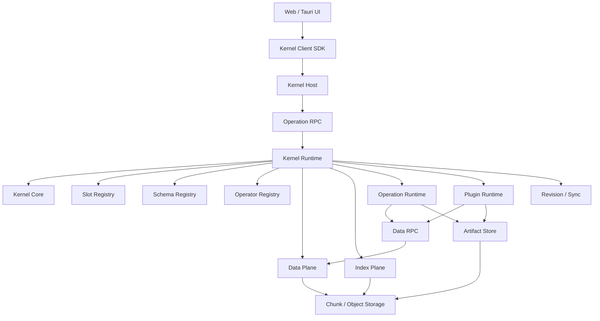
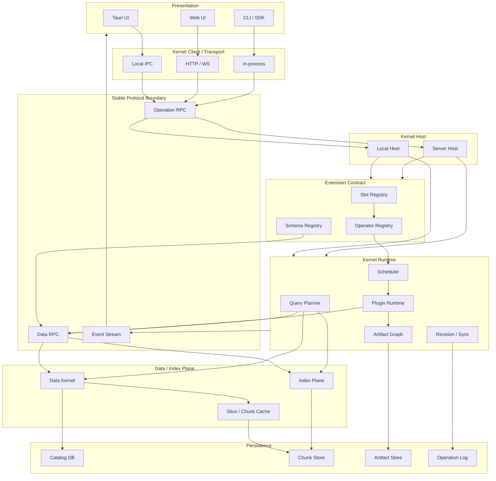

# 决明（Jueming）全局 Architecture Handoff

> 版本：Architecture v0.2  
> 状态：工程 Handoff / Slot & Protocol Architecture Candidate  
> 核心语言：Rust  
> UI：TypeScript + Web UI / Tauri UI  
> NLP 扩展：Python Worker / Rust Plugin / WASM Plugin  
> 架构目标：本地优先、原生云协同、亿级 Token、平行语料、开放 NLP Pipeline、可增量计算、有限内存运行、Slot-first 扩展

---

## 0. 文档目的

“决明”是一套面向平行翻译、平行语料研究、语言学分析、异构内容解析与协同编辑的语言数据运行时和应用架构。

它同时承担五类工作：

1. **平行翻译编辑器**
   - 中英、多语言平行阅读
   - Segment 级对齐，默认以 Sentence Segment 工作
   - 翻译修改
   - 段内 Segment 顺序重排
   - 对齐点合并 / 分离
   - 书签、历史、多人协作

2. **语料库分析平台**
   - KWIC
   - Word / Lemma / POS / N-gram
   - Collocation
   - Keyness / Dispersion
   - 词云
   - 平行检索
   - 多语言统计

3. **开放 NLP Runtime**
   - Parser / Extractor
   - Segmentation
   - Tokenization
   - POS / Lemma / NER / Dependency
   - Embedding
   - Segment Alignment
   - Terminology
   - Translation Quality
   - 第三方研究 Operator

4. **开放数据介入 Runtime**
   - TXT / CSV / TMX / XLIFF / TEI Parser
   - SRT / VTT 字幕 Parser
   - OCR
   - PDF / Image Text Region
   - Audio Transcript
   - 自定义 Segment Builder
   - 自定义 Index / Analysis / Exporter

5. **本地 + 云统一运行平台**
   - Tauri 本地 App 默认启动 Local Kernel
   - Web UI 可连接 Local Kernel 或 Server Kernel
   - Server 使用与本地语义兼容的 Kernel Core
   - 支持本地离线工作、同步、多人协作、远程计算、Artifact 共享

本文件用于统一数据模型、Kernel 边界、Slot/Plugin 协议、Data RPC、Operation RPC、协同协议、索引架构和项目目录，避免后续各模块各自定义一套数据语义。

### 0.1 v0.2 相比 v0.1 的核心变化

v0.2 固定以下架构升级：

```text
Sentence Canonical Unit
        ↓
Segment Canonical Unit

Plugin Runtime
        ↓
Slot Registry + Schema Registry + Operator Registry

Plugin direct integration
        ↓
Operation RPC + Data RPC + Artifact/Patch Commit

Future extension points
        ↓
MVP 内已经存在、允许 UNBOUND 的正式 Slots
```

Sentence 继续作为平行翻译最常用的内置 `SegmentKind::Sentence`；Kernel 的最高层关系原语升级为 Segment，因此字幕 Cue、OCR Region、Transcript Utterance、Legal Clause 等数据无需伪装成 Sentence 才能进入系统。

v0.2 的插件稳定边界是：

> **Slot + Schema + Operation RPC + Data RPC + Artifact/Patch。**

Kernel 内部的 `Vec`、arena、mmap、compressed posting、SoA 均属于实现细节，不构成第三方插件 ABI。

---

# 1. 核心架构结论

决明采用：

```text
Rust Kernel Core
        +
Segment-Centric Canonical Data Model
        +
Chunk / Slice Out-of-Core Data Model
        +
Segment-Level Alignment Graph
        +
Columnar Annotation Layers
        +
Persistent / Derived Index Plane
        +
Slot Registry / Schema Registry / Operator Registry
        +
Operation RPC / Data RPC
        +
Operation DAG
        +
Artifact / Provenance Graph
        +
Plugin Runtime
        +
Append-only Operation Log
        +
Local / Server Compatible Kernel Host
        +
TypeScript Web / Tauri UI
```

核心原则：

> **稳定逻辑对象与物理存储位置分离。**

> **Canonical Data、Derived Data、Index、UI State 分离。**

> **Data Flow 与 Operation Flow 分离。**

> **Segment 是可对齐、可编辑、可引用的通用内容单位；Sentence 是默认 SegmentKind。**

> **Slot 表示“数据流中允许组件介入的位置”；Operator 表示“执行能力的提供者”。**

> **MVP 中未实现的能力以 UNBOUND Slot 存在，而不是从架构中消失。**

> **插件读取 DataView，输出 Artifact/Patch，不直接获得 `&mut Corpus`。**

> **Operation RPC 负责控制与调度；Data RPC 负责大规模数据读取、流式批次和 Artifact 交换。**

> **本地 Kernel 与 Server Kernel 共享相同的 Core Contract 和 Protocol Semantics。**

> **大规模计算围绕 Chunk 调度，小规模交互围绕 Slice 运行。**

# 2. 架构不变量

这些规则应视为工程级不变量。

## 2.1 Segment 是平行关系与内容介入的 Canonical Unit

平行翻译中的基本关系：

```text
SegmentId
    ↕
AlignNode
    ↕
SegmentId
```

Sentence 是内置 Segment 类型：

```rust
pub enum BuiltinSegmentKind {
    Sentence,
    Paragraph,
    SubtitleCue,
    OcrRegion,
    TranscriptUtterance,
    LegalClause,
    Custom,
}
```

Token 属于文本内部结构层。

Paragraph 可以表现为 Segment 类型，也可以作为 Document Structure / Grouping 结构存在；具体 Parser 可根据格式选择。

词对齐、短语对齐属于可选稀疏 Relation Layer。

禁止把 Token、Sentence、Paragraph、OCR Region、Subtitle Cue 等关系全部编码为不同 Kernel primitive。Kernel 统一理解 `SegmentId + SegmentKind + Content + Order + Metadata + Relations`。

## 2.2 Stable ID 与数组位置分离

以下 ID 均为稳定逻辑身份：

```rust
CorpusId
ProjectId
DocumentId
SegmentId
AlignmentId
RevisionId
ArtifactId
BookmarkId
OperationId
SlotId
OperatorId
SchemaId
```

物理位置属于运行时：

```text
ChunkId
LocalOffset
RowOffset
ArenaOffset
ColumnOffset
```

任何模块都不得长期假设：

```text
SegmentId == Vec index
TokenId == physical offset
AlignmentId == storage row
```

## 2.3 Chunk 是存储和调度边界

Chunk 用于：

- 冷存储
- mmap
- 压缩
- 缓存
- 并行任务切分
- 增量索引
- Artifact 分区
- 云端按需同步

Chunk 不能成为：

- Segment 语义边界
- Paragraph 语义边界
- Alignment 语义边界

跨 Chunk Segment 通过逻辑坐标表达。

## 2.4 Slice 是交互边界

UI、KWIC、当前段落、局部 NLP 使用 Slice。

```text
Cold Chunk
   ↓
SliceLoader
   ↓
Hot Slice
   ↓
UI / Operator / Plugin
```

Slice 可指定：

```text
language
segment/range
columns
halo
revision
priority
```

## 2.5 Annotation 永远是 Layer

Token Core 不应该不断增长：

```rust
// 避免
struct Token {
    surface: ...,
    pos: ...,
    lemma: ...,
    ner: ...,
    sentiment: ...,
    embedding: ...,
}
```

采用：

```text
Token identity / surface
        │
        ├── POS Layer
        ├── Lemma Layer
        ├── NER Layer
        ├── Morph Layer
        ├── Dependency Layer
        └── Plugin Layer
```

同一类型可以存在多个 Producer：

```text
POS/spacy/4
POS/stanza/1
POS/custom/2
```

## 2.6 Derived Data 必须可重建

以下数据属于 Derived：

- Tokenization（当 Source/Segment 内容为 canonical 时）
- POS
- Lemma
- NER
- Embedding
- Segment Alignment Proposal
- Posting Index
- N-gram Index
- Frequency Summary
- KWIC Result Cache
- Word Cloud Summary
- Statistics Cache

Derived 数据带：

```text
input hash
source revision
operator id
operator version
parameters hash
schema version
```

Canonical Data 永远优先。

## 2.7 Slot 是正式架构对象

Slot 表示 Data Graph 中允许组件介入的稳定位置：

```text
Slot = where
Operator = who/how
Schema = what
RPC = how to exchange/control
```

Slot 可以拥有：

```text
0 provider  → UNBOUND
1 provider  → direct provider
N providers → selectable / composable providers
```

UNBOUND 是合法状态。

## 2.8 插件 ABI 与 Kernel 内部 ABI 分离

Kernel 内部允许使用：

```text
Vec
SoA
SmallVec
mmap
arena
compressed posting
RoaringBitmap
custom binary layout
```

插件只依赖：

```text
Schema
DataHandle
Data RPC
Operation RPC
Artifact
Patch
Capability
```

因此 Kernel 可以持续优化底层布局而不破坏插件生态。

# 3. 系统总体结构



逻辑层次：

```text
┌──────────────────────────────────────────────┐
│               UI / Components                │
│ Reader │ Editor │ KWIC │ Alignment │ Cloud  │
├──────────────────────────────────────────────┤
│            Client / Command Layer            │
├──────────────────────────────────────────────┤
│ Operation RPC │ Data RPC │ Event Stream      │
├──────────────────────────────────────────────┤
│ Slot Registry │ Schema Registry │ Operators  │
├──────────────────────────────────────────────┤
│ Operation Runtime │ Plugin Runtime │ Sync    │
├──────────────────────────────────────────────┤
│     Artifact Graph │ Query Planner           │
├──────────────────────────────────────────────┤
│               Index Plane                    │
├──────────────────────────────────────────────┤
│               Data Kernel                    │
├──────────────────────────────────────────────┤
│       Chunk / Object / Metadata Store        │
└──────────────────────────────────────────────┘
```

Slot Runtime 在 MVP 第一日即存在。能力缺失通过 `UNBOUND` 表达，而不是删除接口。

# 4. Data Kernel

Data Kernel 只维护稳定、低语义、可寻址的核心事实。

## 4.1 Canonical hierarchy

```text
Project
 └── Document
      └── SegmentOrder / Structure
           └── SegmentId
                └── ContentRef
                     └── optional TokenSpan
```

Translation relation：

```text
SegmentId
    ↕
AlignmentGraph
    ↕
SegmentId
```

NLP relation：

```text
Segment / Token
      ↕
AnnotationLayer
```

Optional relation：

```text
AlignmentId
    ↕
WordAlignmentLayer
PhraseAlignmentLayer
TerminologyLayer
```

## 4.2 推荐核心 Rust 类型

```rust
pub struct ProjectId(pub u128);
pub struct DocumentId(pub u128);
pub struct SegmentId(pub u128);
pub struct AlignmentId(pub u128);
pub struct RevisionId(pub u64);
pub struct ArtifactId(pub [u8; 32]);
pub struct SlotId(pub u64);
pub struct OperatorId(pub u128);
pub struct SchemaId(pub u128);

pub struct TokenRange {
    pub start: u64,
    pub len: u32,
}

pub struct SegmentRange {
    pub start: SegmentId,
    pub count: u16,
}
```

稳定 ID 可以采用：

- UUIDv7
- ULID
- 自定义 sortable 128-bit ID

工程第一版建议 UUIDv7/ULID 风格，便于分布式创建和时间排序。

## 4.3 SegmentRecord

```rust
pub struct SegmentRecord {
    pub id: SegmentId,
    pub document_id: DocumentId,
    pub kind: SegmentKindId,
    pub content_ref: ContentRef,
    pub token_span: Option<TokenRange>,
    pub metadata_ref: MetadataRef,
    pub revision: RevisionId,
}
```

`SegmentId` 表示内容单位的稳定身份。

`SegmentKind` 表示语义类型，不决定 Kernel 的存储 primitive。

例如：

```text
Sentence
SubtitleCue
OcrRegion
TranscriptUtterance
LegalClause
Custom(plugin-defined)
```

## 4.4 SegmentOrder / Structure

```rust
pub struct SegmentOrder {
    pub owner: StructureOwnerId,
    pub segments: Vec<OrderedSegmentRef>,
}

pub struct OrderedSegmentRef {
    pub segment_id: SegmentId,
    pub position: PositionKey,
}
```

这样：

- Segment identity 与 display order 分离
- 句子/字幕 Cue/文本块重排不会破坏 Alignment
- 多人协同时可采用 ordered-set / sequence CRDT 或 server operation merge

## 4.5 Segment Metadata 与插件扩展

核心 metadata 保持少量稳定字段：

```text
language
document
source reference
revision
kind
```

格式专属信息进入 schema 化 metadata：

```text
SubtitleCue:
  start_ms
  end_ms
  speaker?

OcrRegion:
  page
  bbox
  confidence

TranscriptUtterance:
  start_ms
  end_ms
  speaker_id
```

Kernel 通过 `SchemaId` 管理字段语义，避免为每种格式扩充核心 Rust struct。

# 5. Alignment Model

## 5.1 AlignNode 只表达 Segment 关系

逻辑 API：

```rust
pub struct AlignNode {
    pub id: AlignmentId,
    pub refs: Vec<AlignRef>,
    pub status: AlignmentStatus,
    pub confidence: Option<f32>,
    pub producer: AlignmentProducer,
}
```

底层紧凑存储建议：

```rust
pub struct AlignNodeCompact {
    pub refs_start: u32,
    pub refs_len: u16,
    pub flags: u16,
}

pub struct AlignRefCompact {
    pub lang: LangId,
    pub segment_start: SegmentId,
    pub segment_count: u16,
}
```

## 5.2 句子型 Segment 对齐示例

中文：

```text
ZS1001 [Sentence] 电机温度过高。
ZS1002 [Sentence] 我们降低了注射速度，但报警仍然出现。
ZS1003 [Sentence] 随后重新检查了冷却水路。
```

英文：

```text
ES2001 [Sentence] The motor temperature is too high.
ES2002 [Sentence] We reduced the injection speed.
ES2003 [Sentence] However, the alarm still occurred.
ES2004 [Sentence] Then we checked the cooling circuit again.
```

自动对齐：

```text
A100: ZS1001 ↔ ES2001
A101: ZS1002 ↔ ES2002 + ES2003
A102: ZS1003 ↔ ES2004
```

A101 是：

```text
1 : 2
```

## 5.3 Pair Fast Path

大量 alignment 为 1:1，可独立压缩：

```rust
pub struct PairAlignment {
    pub source: SegmentId,
    pub target: SegmentId,
}
```

复杂情况才进入 General AlignNode：

```text
1:2
2:1
2:2
多语言
缺失翻译
复杂 Segment 群
```

## 5.4 Word Alignment 独立 Layer

词对齐按需存在：

```rust
pub struct WordAlignmentBlock {
    pub alignment_id: AlignmentId,
    pub edges: Vec<WordAlignEdge>,
}

pub struct WordAlignEdge {
    pub src_local: u16,
    pub dst_local: u16,
}
```

使用 Alignment-local token coordinate，可显著压缩空间。

## 5.5 Subtitle / OCR 同样使用 AlignNode

字幕：

```text
ZH SubtitleCue ZC1 00:01:12.200-00:01:14.500
你去哪儿？

EN SubtitleCue EC1 00:01:12.100-00:01:14.600
Where are you going?

ZC1 ↔ EC1
```

OCR：

```text
ZH OcrRegion ZR17 page=12 bbox=(...)
EN OcrRegion ER22 page=13 bbox=(...)

ZR17 ↔ ER22
```

Alignment Store 不需要知道 Segment 来自 TXT、字幕、OCR 或转写。

# 6. Token / Text Storage

## 6.1 每种语言独立线性 Token Space

```text
ZH Token Stream
0 ───────────────────────── N

EN Token Stream
0 ───────────────────────── M
```

每种语言独立：

```rust
pub struct LanguageStore {
    pub text: TextStore,
    pub tokens: TokenColumnStore,
    pub sentences: SegmentStore,
    pub paragraphs: ParagraphStore,
}
```

## 6.2 Token 使用 SoA / Columnar

推荐：

```text
surface_id[]
text_offset[]
text_len[]
segment_boundary[]
```

Annotation 独立：

```text
pos_id[]
lemma_id[]
ner_id[]
```

避免大量 heap object。

---

# 7. Chunk / Slice Out-of-Core Model

## 7.1 Chunk

建议第一版：

```text
默认 Chunk：512K tokens
可调范围：256K ~ 1M tokens
```

Chunk 负责：

- 冷存储
- 压缩
- mmap
- hash
- cache
- cloud transfer
- task partition

```rust
pub struct ChunkManifest {
    pub chunk_id: ChunkId,
    pub language: LangId,
    pub token_range: TokenRange,
    pub content_hash: ContentHash,
    pub columns: ColumnMask,
}
```

## 7.2 SliceLoader

```rust
pub struct SliceRequest {
    pub lang: LangId,
    pub range: TokenRange,
    pub columns: ColumnMask,
    pub halo: u32,
    pub revision: RevisionId,
    pub priority: Priority,
}
```

返回：

```rust
pub struct SliceHandle {
    pub id: SliceId,
    pub revision: RevisionId,
}
```

内部可能映射到：

- mmap
- decompressed block
- cached Arrow batch
- native Rust SoA view

## 7.3 冷热四级

| 层 | 内容 |
|---|---|
| L0 Resident | manifest / top-level directory / hot metadata |
| L1 Hot | 当前 paragraph / KWIC context / active alignment |
| L2 Warm | 最近 chunk / posting block / mmap pages |
| L3 Cold | corpus / annotation / index / history |

Kernel Cache 必须支持显式预算：

```rust
pub struct CacheBudget {
    pub hot_slice_bytes: u64,
    pub index_bytes: u64,
    pub artifact_bytes: u64,
}
```

---

# 8. Index Plane

Index Plane 分：

```text
Primary Runtime Index
Persistent Search Index
Derived Analytical Index
Delta / Incremental Index
```

## 8.1 Runtime Index

热路径：

```text
SegmentId → SegmentRecord
SegmentId → AlignmentId
AlignmentId → AlignRef[]
ChunkId → memory handle
DocumentId → sentence range
```

常用结构：

- Vec
- sorted array
- bitmap
- FST
- compact hash
- mmap

## 8.2 Persistent Search Index

用于：

```text
word → posting list
lemma → posting list
POS → posting list
n-gram → postings
metadata → bitmap
alignment → sentence mapping
```

Posting 以 Chunk 分区：

```text
LexemeId
 ├── PostingBlock(C10)
 ├── PostingBlock(C31)
 └── PostingBlock(C381)
```

编辑 C381 时只重建 C381 posting block。

## 8.3 Derived Summary

每 Chunk 保存：

```text
word frequency
lemma frequency
POS frequency
document count
sentence count
optional n-gram summary
```

词云优先合并 Summary：

```text
ChunkFreq[]
    ↓ parallel reduce
TopK
    ↓
Render
```

动态复杂条件才流式扫描 Token columns。

---

# 9. KWIC Execution Path

KWIC 主要压力位于 Persistent Index / Query Planner。


数据库 / Index 输出：

```rust
pub struct Hit {
    pub sentence_id: SegmentId,
    pub token_ref: TokenRef,
    pub score: Option<f32>,
}
```

UI 只 materialize 当前页。

语言学统计分支对整个 HitSet 运行并行 reduction。

---

# 10. NLP / Data Pipeline

Pipeline 是由 Slot 和 Operator 构成的 Data DAG，不写死进 Data Kernel。

典型 TXT：

```text
Raw Text
   ↓
[parser.text]
   ↓
Segment
   ↓
[segment.tokenize]
   ↓
Token
   ↓
 ┌──────────┬──────────┬──────────┐
 POS      Lemma       NER      Embedding
   │          │          │          │
   └──────────┴──────────┴──────────┘
                       ↓
                [relation.align]
                       ↓
                   Alignment
```

字幕：

```text
SRT Asset
   ↓
[source.subtitle.parse]
   ↓
SubtitleCue Segment
   ↓
Tokenize / POS / Embedding
   ↓
Alignment
```

OCR：

```text
Image/PDF Asset
   ↓
[source.ocr]
   ↓
OcrRegion
   ↓
[layout.reading_order]
   ↓
Segment Builder
   ↓
Tokenize / NLP / Alignment
```

## 10.1 Operator Descriptor

```rust
pub struct OperatorDescriptor {
    pub id: OperatorId,
    pub version: SemVer,

    pub provides_slots: Vec<SlotCapability>,
    pub inputs: Vec<DataRequirement>,
    pub optional_inputs: Vec<DataRequirement>,
    pub outputs: Vec<ArtifactType>,

    pub scope: ExecutionScope,
    pub halo: u32,

    pub execution: ExecutionMode,
    pub reduction: ReductionMode,

    pub resource: ResourceClass,
    pub cacheable: bool,
    pub deterministic: bool,
}
```

示例 POS：

```text
provides:
  token.pos/UD

requires:
  TokenLayer

scope:
  Segment

parallel:
  ChunkParallel
```

示例 Aligner：

```text
provides:
  relation.alignment

requires:
  SegmentLayer

optional:
  SegmentEmbedding
  TokenLayer
  LemmaLayer
  TimestampMetadata
```

Optional Slot 未绑定时 Operator 仍可选择降级路径。

# 11. Data DAG、Operation DAG 与 Slot Graph

## 11.1 Data DAG

描述数据依赖：

```text
SourceAsset
 ↓
ExtractedContent
 ↓
SegmentLayer
 ↓
TokenLayer
 ├── POSLayer
 ├── LemmaLayer
 └── EmbeddingLayer
        ↓
   AlignmentLayer
```

用于：

- invalidation
- provenance
- dirty range
- incremental recompute

## 11.2 Operation DAG

描述能力：

```text
Importer / Parser
 ↓
Segmenter
 ↓
Tokenizer
 ├── POSTagger
 ├── Lemmatizer
 └── Embedder
        ↓
      Aligner
```

用于：

- provider resolution
- scheduling
- capability
- plugin substitution
- local / remote execution

## 11.3 Slot Graph

Slot Graph 固定“哪里允许接入”：

```text
L0 Asset
 │
 ├─ source.ocr
 ├─ source.subtitle.parse
 ├─ source.text.parse
 │
 ▼
L1 Extracted Content
 │
 ├─ layout.reading_order
 └─ content.segment
 │
 ▼
L2 Segment
 │
 ├─ segment.tokenize
 ├─ segment.embedding
 ├─ segment.translate
 │
 ▼
L3 Token
 │
 ├─ token.pos
 ├─ token.lemma
 ├─ token.ner
 └─ token.dependency
 │
 ▼
L4 Annotation
 │
 ▼
L5 Relation
 ├─ relation.alignment
 ├─ relation.terminology
 └─ relation.word_alignment
 │
 ▼
L6 Index
 ├─ index.lexical
 ├─ index.vector
 └─ index.summary
 │
 ▼
L7 Analysis
 ├─ analysis.kwic
 ├─ analysis.collocation
 ├─ analysis.wordcloud
 └─ analysis.custom
 │
 ▼
L8 Presentation Artifact
```

Data DAG 回答“这个结果依赖哪些数据”。

Operation DAG 回答“谁能计算这个结果”。

Slot Graph 回答“系统允许能力在哪些数据阶段介入”。

# 12. Slot / Plugin Runtime

v0.2 中 Plugin Runtime 的稳定核心升级为：

```text
Slot Registry
      +
Schema Registry
      +
Operator Registry
      +
Operation RPC
      +
Data RPC
      +
Artifact/Patch Commit
```

插件最小契约：

```text
DataView / Handle
       ↓
Operator
       ↓
Artifact / Patch
```

插件不能获得：

```rust
&mut Corpus
&mut ChunkStore
&mut SqlConnection
```

## 12.1 Slot Descriptor

```rust
pub struct SlotDescriptor {
    pub id: SlotId,
    pub name: SlotName,
    pub input_schema: SchemaId,
    pub output_schema: SchemaId,
    pub stage: DataStage,
    pub cardinality: ProviderCardinality,
    pub mutability: Mutability,
    pub required_capabilities: CapabilitySet,
}
```

Slot 是稳定架构端口。

Operator 是 Slot 的 Provider。

## 12.2 Schema Registry

Schema Registry 管理跨插件、跨 RPC 的逻辑数据模型：

```text
SourceAsset/1
ExtractedTextRegion/1
Segment/1
TokenBatch/1
AnnotationBatch/1
AlignmentBatch/1
HitSet/1
ArtifactManifest/1
Patch/1
```

Schema 版本独立于 Kernel 内部 Rust struct。

升级示例：

```text
Segment/1
  id
  kind
  content
  language

Segment/2
  + provenance_ref
  + optional temporal_range
```

Provider 可以声明兼容：

```text
accepts Segment >=1,<3
provides Annotation/1
```

## 12.3 Operator Registry

Operator 注册：

```text
operator id
version
provides slots
requires schemas
optional schemas
resource requirements
parallel semantics
cache policy
capabilities
```

例如：

```text
operator: paddleocr
provides: source.ocr
requires: SourceAsset<Image>
outputs: ExtractedTextRegion/1
resource: CPU/GPU
```

## 12.4 Slot 的 0 / 1 / N Provider

### 0 Provider

```text
source.ocr = UNBOUND
```

MVP 正常运行，OCR 功能不可用。

### 1 Provider

```text
segment.tokenize.zh = builtin-tokenizer
```

Runtime 直接选择。

### N Provider

```text
token.pos.en:
  spacy-ud
  stanza-ud
  research-pos-v3
```

用户可选择 Active Provider，也可同时运行多个 Provider，形成多个 Annotation Layers。

## 12.5 Required / Optional Slot

例如 Aligner：

```text
required:
  Segment

optional:
  SegmentEmbedding
  TokenLayer
  LemmaLayer
  Timestamp
```

Embedding Slot 为空时仍可使用长度、顺序、词法相似度对齐。

安装 Embedding Provider 后，同一 Aligner 可以自动采用更丰富输入。

## 12.6 Plugin 类型

### Annotation Plugin

输出：

```text
POS
Lemma
NER
Dependency
Sentiment
```

### Transform Plugin

输出：

```text
SegmentPatch
TokenizationPatch
AlignmentPatch
TranslationPatch
```

### Parser / Extractor Plugin

输入：

```text
TXT
SRT
VTT
PDF
Image
Audio
TEI
```

输出 Segment 或中间 Extracted Content。

### Index Plugin

输出：

```text
IndexHandle
IndexDelta
```

### Function Plugin

输出：

```text
KWIC ResultSet
Collocation ResultSet
Keyness ResultSet
Terminology ResultSet
```

### Import / Export Plugin

处理：

```text
TXT
CSV
TMX
XLIFF
TEI
JSONL
custom corpus formats
```

## 12.7 Patch Commit

会修改 canonical data 的插件统一输出 Patch Proposal：

```rust
pub enum Patch {
    CreateSegment,
    UpdateSegment,
    SplitSegment,
    MergeSegment,
    ReorderSegment,

    CreateAlignment,
    ReplaceAlignment,
    SplitAlignment,
    MergeAlignment,
}
```

流程：

```text
Plugin
 ↓
Patch Proposal
 ↓
Validation
 ↓
Revision / Conflict Check
 ↓
Commit
 ↓
New Revision
 ↓
Dependency Invalidation
```

插件没有直接数据库写权限。

## 12.8 Capability Negotiation

插件启动：

```text
Plugin → HELLO
```

Kernel 返回：

```text
Kernel API v1
Schemas:
  Segment/1
  TokenBatch/1
  AnnotationBatch/1
  AlignmentBatch/1

Slots:
  source.ocr
  source.subtitle.parse
  segment.tokenize
  segment.embedding
  token.pos
  relation.alignment

Transports:
  ArrowIPC
  SharedMemory
  Stream
```

插件声明：

```text
provides:
  token.pos/UD

requires:
  TokenBatch/1
```

Runtime 完成 provider binding。


## 12.9 Built-in Slot Catalog

v0.2 建议从 MVP 起注册以下稳定 Slot 名称。Provider 可以为空。

| Stage | Slot | 输入 | 输出 | MVP 默认 |
|---|---|---|---|---|
| L0→L1 | `source.text.parse` | TextAsset | ExtractedContent / Segment | BOUND |
| L0→L1 | `source.subtitle.parse` | SubtitleAsset | SubtitleCue Segment | UNBOUND |
| L0→L1 | `source.ocr` | Image/PDF Asset | ExtractedTextRegion | UNBOUND |
| L0→L1 | `source.audio.transcribe` | AudioAsset | TranscriptUtterance | UNBOUND |
| L1→L2 | `layout.reading_order` | TextRegion | OrderedRegion | UNBOUND |
| L1→L2 | `content.segment.sentence` | TextContent | Sentence Segment | BOUND |
| L1→L2 | `content.segment.custom` | ExtractedContent | Segment | UNBOUND |
| L2→L3 | `segment.tokenize` | Segment | TokenLayer | BOUND |
| L2→L4 | `segment.embedding` | Segment | EmbeddingLayer | UNBOUND |
| L2→L2 | `segment.translate` | Segment | Translation Patch / Segment | UNBOUND |
| L3→L4 | `token.pos` | TokenLayer | POS Annotation | BOUND |
| L3→L4 | `token.lemma` | TokenLayer | Lemma Annotation | UNBOUND |
| L3→L4 | `token.ner` | TokenLayer | NER Annotation | UNBOUND |
| L3→L4 | `token.dependency` | TokenLayer | Dependency Annotation | UNBOUND |
| L2/L4→L5 | `relation.alignment` | Segment + optional Layers | AlignmentLayer | BOUND |
| L3/L5→L5 | `relation.word_alignment` | Token + Alignment | WordAlignment | UNBOUND |
| L3/L4/L5→L5 | `relation.terminology` | Token/Annotation/Alignment | TermRelation | UNBOUND |
| L3/L4→L6 | `index.lexical` | Token/Annotation | Posting Index | BOUND |
| L2/L4→L6 | `index.vector` | Segment/Embedding | Vector Index | UNBOUND |
| L3/L4→L6 | `index.summary` | Token/Annotation | Chunk Summary | BOUND |
| L6→L7 | `analysis.kwic` | Index + Slice | HitSet / ResultSet | BOUND |
| L6→L7 | `analysis.collocation` | Index/HitSet | Statistics | UNBOUND |
| L6→L7 | `analysis.wordcloud` | Summary/Scan | TopK Frequency | BOUND/可简化 |
| L5/L6→L7 | `analysis.parallel` | Alignment + Index | Parallel ResultSet | BOUND |
| L2-L7→L8 | `export.data` | DataView/Artifact | ExportAsset | BOUND |

Slot 名称属于 protocol namespace，应避免随 UI 功能名称频繁变化。

## 12.10 Plugin Manifest 示例：SRT Parser

```yaml
plugin:
  id: org.jueming.srt-parser
  version: 1.0.0
  api: ">=1,<2"

provides:
  - slot: source.subtitle.parse
    operator: srt.parse
    input_schema: SourceAsset/1
    output_schema: SegmentBatch/1

capabilities:
  - data.read_asset
  - artifact.write

execution:
  runtime: wasm
  deterministic: true
  cacheable: true
```

Runtime 安装后的动作：

```text
validate manifest
 → negotiate schemas
 → check capabilities
 → register operator
 → bind source.subtitle.parse
 → emit SlotBound event
```

Kernel Core 无需增加 `SrtParser` 类型或字幕专用数据库表。

## 12.11 Plugin Manifest 示例：OCR Python Worker

```yaml
plugin:
  id: org.jueming.paddle-ocr
  version: 0.3.0

provides:
  - slot: source.ocr
    operator: paddleocr.detect-recognize
    input_schema: SourceAsset/1
    output_schema: ExtractedTextRegion/1

capabilities:
  - data.read_asset
  - artifact.write
  - gpu.optional

execution:
  runtime: python-worker
  resource: gpu-preferred
  batchable: true
```

调用：

```text
Operation RPC
  execute(operator=paddleocr.detect-recognize,
          input=AssetHandle#P17,
          revision=R203)

Data RPC
  open_view(AssetHandle#P17)
  stream_batches(...)

Plugin Output
  Artifact<ExtractedTextRegion/1>
```

后续 `layout.reading_order` 可以由完全不同的 Provider 处理，因此 OCR 与版面阅读顺序不会形成一个不可替换的大插件。

# 13. Python NLP Integration

Python 主要承担：

- spaCy
- Stanza
- Transformers
- PyTorch
- sentence-transformers
- OCR / ASR 研究实现
- 第三方研究代码

默认模式：

```text
Rust Kernel
    │
Operation RPC
    ▼
Python Worker
    │
Data RPC: Arrow IPC / shared batch
    ▼
ArtifactBatch / Patch
```

优势：

- Python crash isolation
- virtualenv 隔离
- CUDA / model dependency 隔离
- GIL 不影响 Kernel CPU scheduler
- 插件可单独 restart

Python SDK 可另外使用 PyO3。

## 13.1 示例：Python POS Plugin

```text
bind slot: token.pos.en
operator: spacy_ud
```

Operation RPC：

```text
execute(operator=spacy_ud, input_handle=H781)
```

Data RPC：

```text
read_batch(H781, columns=[segment_id, token_id, surface])
```

插件返回：

```text
AnnotationBatch<UD_POS>
```

Kernel 保存为：

```text
POS/spacy_ud/version
```

## 13.2 示例：Python OCR Plugin

```text
ImageAsset Handle
   ↓ Data RPC
PaddleOCR Worker
   ↓
ExtractedTextRegion Batch
   ↓ Patch/Artifact
```

后续 ReadingOrder / Segment Builder 与 OCR Provider 解耦。

# 14. JS / TS Integration

前端统一通过：

```typescript
interface KernelClient {
  openProject(...): Promise<ProjectHandle>
  query(...): Promise<HitSetHandle>
  loadSlice(...): Promise<Slice>
  execute(...): Promise<ArtifactHandle>
  applyOperations(...): Promise<Revision>
  listSlots(...): Promise<SlotState[]>
  bindSlot(...): Promise<void>
  subscribe(...): EventStream
}
```

Tauri：

```text
TypeScript
 ↓
Tauri IPC
 ↓
Local Kernel Host
```

Web：

```text
TypeScript
 ↓
HTTP / WebSocket
 ↓
Server Kernel Host
```

组件层不区分 Local / Remote。

Node SDK 可通过 napi-rs 提供低延迟 native binding；Web 和远程场景保持 Protocol-based client。

# 15. Kernel Host

Kernel Core 是库。

Kernel Host 是服务壳。

```text
Kernel Core
    ↓
Kernel Runtime
    ↓
Kernel Host
 ┌───────────┬───────────┬────────────┐
 Embedded    Local IPC    Network
```

本地 App 默认启动 Local Kernel Host。

---

# 16. Local / Server Compatible Kernel

共享：

```text
Token
Segment
Alignment
Operation
Artifact
Revision
Plugin ABI
Query semantics
```

不同：

```text
Local:
SQLite
local chunk cache
local scheduler
single-user / offline mode

Server:
PostgreSQL
object storage
distributed scheduler
auth / permissions
collaboration
remote compute
```

---

# 17. Kernel-to-Kernel 与 Plugin Protocol

必须独立定义控制协议和数据协议。

## 17.1 Client Protocol

用于：

```text
UI ↔ Kernel
```

包含：

- OpenProject
- LoadSlice
- Query
- SearchKWIC
- GetAlignment
- UpdateSegment
- MoveSegment
- MergeAlignment
- SplitAlignment
- AddBookmark
- RunOperator
- ListSlots
- BindSlot
- SubscribeChanges

## 17.2 Sync Protocol

用于：

```text
Local Kernel ↔ Server Kernel
Server Kernel ↔ Server Kernel
```

传：

```text
Revision
Operation
Manifest
Conflict
Artifact reference
Object version
```

## 17.3 Artifact / Data Protocol

大块数据：

```text
Chunk
PostingBlock
EmbeddingBlock
AnnotationBlock
Artifact
Snapshot
```

支持：

- content hash
- streaming
- range
- resume
- compression

## 17.4 Operation RPC

Operation RPC 是控制面：

```text
register_plugin
register_operator
list_slots
bind_slot
unbind_slot
execute
cancel
progress
get_revision
commit_patch
invalidate
subscribe_event
get_capabilities
get_schema
```

Operation RPC 只传小型描述、ID、Handle 和状态。

## 17.5 Data RPC

Data RPC 是数据面：

```text
open_view
read_slice
stream_batches
read_artifact
write_artifact
read_segment
read_annotation
read_alignment
read_index_partition
```

Data RPC 支持：

```text
DataHandle
Column projection
Range / Slice
Arrow RecordBatch
Stream
Shared memory (local)
Chunk transport (remote)
```

## 17.6 Local 与 Remote 传输实现

同一 Data RPC 语义可映射：

```text
Local in-process  → borrowed/native view
Local IPC         → shared memory / Arrow IPC
Remote            → HTTP2/QUIC stream + Arrow/binary blocks
```

Plugin 不依赖具体传输实现。


## 17.7 Operation RPC 示例

控制请求只携带引用和参数：

```json
{
  "method": "execute",
  "operator": "spacy.ud-pos@4.0",
  "project": "P01",
  "revision": 812,
  "input_handle": "H991",
  "params": {
    "language": "en"
  }
}
```

返回：

```json
{
  "execution_id": "E1201",
  "state": "running",
  "output_type": "AnnotationBatch/1"
}
```

大量 Token / Text 数据不会进入这条控制消息。

## 17.8 Data RPC 示例

Operator 根据 Handle 请求投影列：

```text
open_view(H991)
read_slice(
    range = Segment[1000..1200],
    columns = [segment_id, token_id, surface],
    revision = R812
)
```

本地 Python Worker 可以收到 Arrow IPC / shared-memory batch；远程 Worker 可以收到压缩 streaming batch。

返回 Artifact 时只提交：

```text
schema
content hash
input revision
producer
storage handle
```

## 17.9 Data RPC 的版本一致性

每个 `DataHandle` 必须绑定：

```text
ProjectId
RevisionId
SchemaId
View specification
```

Operator 执行过程中 Project 前进到新 Revision 时，旧 Handle 继续提供一致 snapshot。

提交 Patch 时 Runtime 检查：

```text
base revision == current compatible revision ?
```

不兼容变化进入 rebase / conflict 流程，避免插件基于旧数据覆盖新编辑。

# 18. Collaboration

协同核心：

```text
Append-only Operation Log
        +
Stable Object ID
        +
Revision Manifest
        +
Conflict Rules
```

禁止直接合并两个数据库文件。

## 18.1 Operation Log

```text
#184892 A EditSegment
#184893 B AddBookmark
#184894 A MoveSegment
#184895 B ChangeAlignment
```

离线 Client 保存 Local OpLog。

联网：

```text
pull server ops
    ↓
rebase local ops
    ↓
commutative merge
    ↓
semantic conflict
    ↓
new revision
```

## 18.2 Immutable Chunk + Mutable Overlay

在线编辑不能每次修改都重写 512K token Chunk。

采用：

```text
Immutable Base Chunk
       +
Segment/Object Overlay
```

读取：

```text
Base Chunk + Overlay
       ↓
Materialized Slice
```

达到阈值后 compaction：

```text
old chunk + overlay
        ↓
new immutable chunk
```

## 18.3 文本冲突

普通模式：

```text
Segment-level optimistic concurrency
```

同一句多人实时编辑可选：

```text
character-level CRDT
```

CRDT 只用于当前热编辑句子，不扩展到整个亿级语料。

## 18.4 Alignment 冲突

Alignment 冲突属于语义冲突。

例如：

```text
A:
ZS10 ↔ ES10 + ES11

B:
ZS10 + ZS11 ↔ ES10
```

两者都结构合法。

系统保存：

```rust
pub struct AlignmentConflict {
    pub base: AlignmentId,
    pub candidates: Vec<AlignmentVersion>,
}
```

由用户审校或后续策略处理。

---

# 19. History / Revision

所有 canonical change 进入 ChangeSet：

```text
R100 Import
R101 SentenceSplit
R102 Tokenize
R103 POS
R104 AutoAlign
R105 EditSegment
R106 ReTokenize
R107 ReAlign
R108 MoveSegment
R109 MergeAlignment
R110 SplitAlignment
```

Undo / Redo 基于 Operation / ChangeSet。

Derived Artifact 不需要进入正文历史，只需要 provenance。

---

# 20. Artifact Store

ArtifactKey：

```rust
pub struct ArtifactKey {
    pub operator_id: OperatorId,
    pub operator_version: SemVer,
    pub params_hash: ContentHash,
    pub input_hash: ContentHash,
}
```

共享：

```text
Aligner
Semantic Search
Translation Quality
        │
        └── reuse SegmentEmbedding
```

本地和服务器均可以根据 hash 判断是否已有结果。

---

# 21. Provenance Graph

每个 Artifact 记录：

```text
producer
producer version
slot binding
schema version
parameters
input artifacts
source revision
content hash
created_at
```

例如：

```text
Alignment Artifact
  ↓ produced by
AwesomeAlign Operator v2.7
  ↓ bound to
relation.alignment
  ↓ inputs
ZH SegmentEmbedding v4
EN SegmentEmbedding v4
  ↓ source revision
R204
```

修改 Segment 后：

```text
Segment changed
 ↓
TokenLayer dirty
 ↓
POS dirty
 ↓
Embedding dirty
 ↓
affected Alignment dirty
```

只重算受影响子图。

Provenance 同时支撑共享工作机制：两个 Operator 若依赖相同 `ArtifactKey`，Runtime 复用同一个 Artifact。

# 22. Scheduler

统一 Scheduler 管理 CPU / IO / GPU / Remote。

建议：

```text
Tokio:
network
async IO
sync
remote execution

Rayon / custom work-stealing:
chunk scan
index build
statistics
reduce

External queues:
Python
GPU
LLM
```

Operator 不自行创建线程池。

## 22.1 Execution Scope

```rust
pub enum ExecutionScope {
    Token,
    Segment,
    Chunk,
    Document,
    Corpus,
}
```

## 22.2 Resource Class

```rust
pub enum ResourceClass {
    Cpu,
    Io,
    Gpu,
    Python,
    Remote,
}
```

## 22.3 Execution Location

```rust
pub enum ExecutionLocation {
    Local,
    Remote,
    Either,
}
```

Planner 根据：

- data locality
- CPU
- GPU
- memory
- network
- privacy
- artifact availability

选择执行位置。

---

# 23. 端到端 Use Case：中英双语 TXT + POS + Alignment

本例展示 Slot、Data RPC、Annotation Layer、Alignment 与增量编辑如何协同。

## 23.1 导入

用户导入：

```text
zh.txt
en.txt
```

Slot：

```text
source.text.parse
```

Provider：

```text
BuiltinTxtParser
```

产生：

```text
Document
Language streams
Segment structure
Raw text chunks
```

## 23.2 分句并创建 Sentence Segments

`content.segment.sentence` Provider 将文本生成：

```text
ZH:
ZS1001 [Sentence]
ZS1002 [Sentence]
ZS1003 [Sentence]

EN:
ES2001 [Sentence]
ES2002 [Sentence]
ES2003 [Sentence]
ES2004 [Sentence]
```

这些对象的 Rust identity 都是 `SegmentId`。

## 23.3 分词

`segment.tokenize`：

```text
ZS1001:
电机 | 温度 | 过高 | 。

ES2001:
The | motor | temperature | is | too | high | .
```

Tokenization 是 Derived Layer。

## 23.4 POS

`token.pos.zh` / `token.pos.en` Slot 可以绑定不同 Provider。

中文：

```text
电机 NN
温度 NN
过高 VA
```

英文：

```text
motor NOUN
temperature NOUN
high ADJ
```

POS 保存到 Annotation Layer。

## 23.5 Alignment

`relation.alignment`：

```text
A100 ZS1001 ↔ ES2001
A101 ZS1002 ↔ ES2002 + ES2003
A102 ZS1003 ↔ ES2004
```

## 23.6 平行 POS 检索

查询：

```text
EN pattern:
NOUN + NOUN

display aligned ZH Segment
```

执行：

```text
POS postings
 ↓
ES2001
 ↓
SegmentAlignmentIndex
 ↓
A100
 ↓
ZS1001
 ↓
SliceLoader
```

UI：

```text
EN:
The [motor/NOUN temperature/NOUN] is too high.

ZH:
[电机/NN 温度/NN] 过高。
```

## 23.7 Operation RPC / Data RPC 在本例中的位置

POS Worker 不获得项目数据库连接。

控制：

```text
Operation RPC:
execute(token.pos.en, input=SegmentBatchHandle#781)
```

数据：

```text
Data RPC:
stream_batches(#781, columns=[segment_id, token_id, surface])
```

返回：

```text
AnnotationBatchHandle#900
```

Kernel 验证 schema 和 revision 后提交 Artifact。


## 23.8 Use Case：字幕 Parser 插件

用户安装 `SrtParserPlugin`。

MVP 原来：

```text
source.subtitle.parse = UNBOUND
```

安装后：

```text
source.subtitle.parse = SrtParserPlugin
```

输入：

```text
movie.zh.srt
movie.en.srt
```

输出：

```text
ZH
ZC1 [SubtitleCue]
start=72.200s end=74.500s
你去哪儿？

EN
EC1 [SubtitleCue]
start=72.100s end=74.600s
Where are you going?
```

后续 pipeline 复用：

```text
SubtitleCue Segment
 ↓
Tokenize
 ↓
POS / Embedding
 ↓
Aligner(time + embedding + order)
 ↓
Parallel KWIC / Statistics
```

字幕插件只改变数据介入位置和 SegmentKind，后续 Kernel 不需要字幕专用分支。

## 23.9 Use Case：OCR 插件

用户导入扫描 PDF。

```text
PDF Asset
 ↓
source.ocr
 ↓
ExtractedTextRegion
 ↓
layout.reading_order
 ↓
content.segment
 ↓
OcrRegion / Sentence Segments
```

OCR Provider 输出：

```text
region_id
page
bbox
text
confidence
```

Reading Order Provider 决定：

```text
R1 → R3 → R2 → R4
```

Segment Builder 将文本块转成可编辑 Segment。

用户修正 OCR 文本后，只使对应 Segment 及其 Derived Layers 失效。

## 23.10 Use Case：多个 POS Provider 共享同一 Token Layer

```text
token.pos.en:
  spaCy
  Stanza
  ResearchTagger
```

一次 Tokenization Artifact 被三个 Operator 共享：

```text
TokenLayer H100
 ├→ spaCy → POS/spacy
 ├→ Stanza → POS/stanza
 └→ ResearchTagger → POS/research
```

Kernel 根据 ArtifactKey 避免重复构造相同 Token batch。

## 23.11 Use Case：MVP 中的空 Slot

MVP 可以具有：

```text
source.text.parse        BOUND
content.segment.sentence BOUND
segment.tokenize         BOUND
token.pos                BOUND
relation.alignment       BOUND
index.lexical            BOUND
analysis.kwic            BOUND

source.ocr               UNBOUND
source.subtitle.parse    UNBOUND
source.audio.transcribe  UNBOUND
token.ner                UNBOUND
token.dependency         UNBOUND
segment.embedding        UNBOUND
segment.translate        UNBOUND
relation.terminology     UNBOUND
index.vector             UNBOUND
analysis.quality         UNBOUND
```

UI 可根据 Slot Registry 自动决定功能是否可用，并展示可安装 Provider。

# 24. Use Case：修改翻译与局部失效

原：

```text
ES2002 We reduced the injection speed.
ES2003 However, the alarm still occurred.
```

用户合成：

```text
ES2010 We lowered the injection speed, but the alarm persisted.
```

ChangeSet：

```text
Deactivate ES2002
Deactivate ES2003
Insert ES2010
```

局部失效：

```text
ES2010 tokenize
ES2010 POS
ES2010 lemma
ES2010 embedding
A101 alignment
```

其他句完全复用。

---

# 25. Use Case：段内 Segment 顺序重排

原：

```text
[ES2001, ES2010, ES2004]
```

改为：

```text
[ES2001, ES2004, ES2010]
```

只修改 ParagraphOrder。

Alignment identity 不变。

系统可检测 crossing alignment。

---

# 26. Use Case：Alignment Merge / Split

Merge：

```text
A110 ZS1002 ↔ ES2010
A102 ZS1003 ↔ ES2004
```

变成：

```text
A120
ZS1002 + ZS1003
↕
ES2004 + ES2010
```

Split：

```text
A121 ZS1002 ↔ ES2010
A122 ZS1003 ↔ ES2004
```

Token / POS 不受影响。

---

# 27. Use Case：KWIC

查询：

```text
lemma = alarm
```

Index：

```text
Posting → TokenRef / SegmentId
```

UI 只加载：

```text
±8 token slice
```

再通过：

```text
SegmentId → AlignmentId → Target SegmentId
```

显示 Parallel KWIC。

---

# 28. Use Case：词云

普通词云：

```text
Chunk frequency summary
    ↓
parallel merge
    ↓
TopK
    ↓
render
```

复杂条件：

```text
POS=NOUN
AND aligned target contains "电机"
```

走：

```text
predicate pushdown
 ↓
chunk pruning
 ↓
column projection
 ↓
stream scan
 ↓
local aggregate
 ↓
parallel reduce
```

---

# 29. Use Case：书签

书签锚定：

```rust
pub struct Bookmark {
    pub id: BookmarkId,
    pub sentence_id: SegmentId,
    pub local_token_range: Option<LocalTokenRange>,
    pub alignment_id: Option<AlignmentId>,
    pub created_revision: RevisionId,
}
```

前方插入大量文本时仍保持有效。

---

# 30. Use Case：多人协作

初始：

```text
Server R100
```

A 修改 ES100。

B 修改 ES900。

两者逻辑对象不同：

```text
commutative merge
```

即使位于同一物理 chunk，也不形成语义冲突。

如果 A/B 同时修改 ES100：

```text
Segment revision conflict
```

如果 A/B 修改同一个 alignment：

```text
Alignment semantic conflict
```

---

# 31. 云端按需加载

用户 A 打开第 100 页：

```text
download required text chunks
download alignment slice
download active POS slice
```

用户 B 只做 EN KWIC：

```text
download posting index blocks
```

用户 C 做词云：

```text
download / query chunk summaries
```

没人必须完整下载整个 100M token corpus。

---

# 32. 亿级 Token 目标

目标：

```text
100M tokens：常规工作站流畅
1B tokens：单机 out-of-core 可分析
更高规模：Server / distributed execution
```

内存设计目标：

```text
Corpus size != Resident RAM size

Resident set =
active chunks
+ active columns
+ hot indexes
+ current NLP workspace
```

## 32.1 示例

300M token 语料可以占用几十 GB 磁盘。

运行时配置：

```text
Hot Slice Cache    2 GB
Posting Cache      2 GB
NLP Workspace      4 GB
UI / Runtime       1 GB
```

RAM 仍受预算约束。

---

# 33. 存储布局建议

```text
project/
├── catalog.db
├── manifest/
│   ├── revisions/
│   └── snapshots/
├── corpus/
│   ├── zh/
│   │   ├── chunk-000001.bin
│   │   └── ...
│   └── en/
├── alignment/
├── annotations/
│   ├── pos/
│   ├── lemma/
│   └── ...
├── indexes/
│   ├── lexical/
│   ├── lemma/
│   ├── pos/
│   ├── ngram/
│   └── alignment/
├── artifacts/
├── overlays/
└── cache/
```

Local `catalog.db` 推荐 SQLite。

Server metadata 推荐 PostgreSQL。

大数据块进入 object/blob storage。

---

# 34. Repository / Workspace 目录建议

推荐 Cargo Workspace：

```text
jueming/
├── Cargo.toml
├── rust-toolchain.toml
├── README.md
├── LICENSE
│
├── crates/
│   ├── jueming-core/
│   │   ├── src/
│   │   │   ├── ids.rs
│   │   │   ├── revision.rs
│   │   │   ├── document.rs
│   │   │   ├── segment.rs
│   │   │   ├── token.rs
│   │   │   ├── alignment.rs
│   │   │   ├── annotation.rs
│   │   │   ├── artifact.rs
│   │   │   ├── operation.rs
│   │   │   └── lib.rs
│   │   └── Cargo.toml
│   │
│   ├── jueming-schema/
│   │   ├── registry/
│   │   ├── builtin/
│   │   ├── versioning/
│   │   └── compatibility/
│   │
│   ├── jueming-slot-api/
│   │   ├── descriptor/
│   │   ├── stages/
│   │   ├── binding/
│   │   └── capability/
│   │
│   ├── jueming-storage/
│   │   ├── chunk/
│   │   ├── slice/
│   │   ├── mmap/
│   │   ├── compression/
│   │   ├── overlay/
│   │   ├── catalog/
│   │   └── object_store/
│   │
│   ├── jueming-kernel/
│   │   ├── cache/
│   │   ├── query/
│   │   ├── scheduler/
│   │   ├── revision/
│   │   ├── invalidation/
│   │   ├── artifact_graph/
│   │   ├── slot_registry/
│   │   ├── schema_registry/
│   │   ├── operator_registry/
│   │   └── runtime/
│   │
│   ├── jueming-index/
│   │   ├── postings/
│   │   ├── fst/
│   │   ├── bitmap/
│   │   ├── ngram/
│   │   ├── metadata/
│   │   ├── alignment/
│   │   └── statistics/
│   │
│   ├── jueming-nlp/
│   │   ├── pipeline/
│   │   ├── operator/
│   │   ├── providers/
│   │   ├── builtin/
│   │   └── schemas/
│   │
│   ├── jueming-plugin-api/
│   │   ├── descriptor/
│   │   ├── capability/
│   │   ├── artifact/
│   │   ├── patch/
│   │   └── abi/
│   │
│   ├── jueming-plugin-runtime/
│   │   ├── native/
│   │   ├── wasm/
│   │   ├── python/
│   │   └── registry/
│   │
│   ├── jueming-rpc/
│   │   ├── operation/
│   │   ├── data/
│   │   ├── transport/
│   │   ├── shared_memory/
│   │   └── arrow/
│   │
│   ├── jueming-protocol/
│   │   ├── client/
│   │   ├── sync/
│   │   ├── artifact/
│   │   ├── execution/
│   │   └── event/
│   │
│   ├── jueming-collab/
│   │   ├── oplog/
│   │   ├── merge/
│   │   ├── conflict/
│   │   ├── order/
│   │   └── presence/
│   │
│   ├── jueming-host/
│   │   ├── embedded/
│   │   ├── local/
│   │   └── server/
│   │
│   ├── jueming-python/
│   │   ├── pyo3/
│   │   ├── ipc/
│   │   └── arrow/
│   │
│   ├── jueming-node/
│   │   └── napi/
│   │
│   └── jueming-testkit/
│       ├── corpus_gen/
│       ├── benchmarks/
│       └── fixtures/
│
├── apps/
│   ├── desktop/
│   │   ├── src-tauri/
│   │   └── web/
│   ├── web/
│   ├── server/
│   └── cli/
│
├── packages/
│   ├── kernel-client-ts/
│   ├── ui-components/
│   ├── schemas/
│   └── plugin-sdk-ts/
│
├── python/
│   ├── jueming_sdk/
│   ├── worker/
│   ├── plugins/
│   └── examples/
│
├── plugins/
│   ├── builtin-text-parser/
│   ├── builtin-sentence-segmenter/
│   ├── builtin-pos/
│   ├── builtin-aligner/
│   ├── builtin-kwic/
│   ├── examples-srt-parser/
│   └── examples-ocr/
│
├── schemas/
│   ├── protocol/
│   ├── arrow/
│   ├── plugin/
│   ├── segment/
│   └── slot/
│
├── docs/
│   ├── architecture/
│   ├── data-model/
│   ├── slots/
│   ├── rpc/
│   ├── protocol/
│   ├── plugin/
│   ├── sync/
│   └── adr/
│
└── benchmarks/
    ├── 1m/
    ├── 100m/
    └── 1b/
```

# 35. 推荐 crate 依赖方向

必须保持单向依赖：

```text
jueming-core
    ↑
jueming-schema / jueming-slot-api
    ↑
jueming-storage
jueming-index
jueming-nlp
jueming-plugin-api / jueming-rpc
    ↑
jueming-kernel
jueming-plugin-runtime
jueming-collab
    ↑
jueming-protocol
jueming-host
    ↑
apps
```

特别禁止：

```text
core → host
core → UI
storage → plugin runtime
plugin api → server implementation
```

---

# 36. UI 架构

Web 与 Tauri 共用 UI 组件。

```text
UI Components
     ↓
Domain Stores
     ↓
KernelClient
   /        \
Local       Remote
Transport   Transport
```

推荐前端模块：

```text
reader/
parallel-editor/
alignment/
kwic/
corpus-analysis/
bookmarks/
history/
collaboration/
plugins/
slots/
settings/
```

UI 永远使用 stable ID 和 ViewModel，不直接保存物理 chunk offset。

## 36.1 Slot-aware UI

UI 从 Slot Registry 获取：

```text
BOUND
UNBOUND
MULTI_PROVIDER
DISABLED_BY_POLICY
INCOMPATIBLE_SCHEMA
```

例如 OCR 按钮：

```text
source.ocr = UNBOUND
```

UI 可展示“安装 OCR Provider”入口。

安装后 Slot 状态变化通过 Event Stream 推送，页面无需硬编码具体插件名称。

# 37. Event Model

Command 与 Event 分离。

Command：

```text
UpdateSegment
MoveSegment
MergeAlignment
RunOperator
BindSlot
UnbindSlot
CommitPatch
```

Event：

```text
RevisionAdvanced
SegmentChanged
AlignmentChanged
ArtifactReady
IndexUpdated
SlotBound
SlotUnbound
ProviderChanged
SchemaRegistered
ConflictCreated
PresenceChanged
```

Local：

```text
Rust channel
```

Remote：

```text
WebSocket / SSE
```

UI 语义一致。

# 38. 数据交换格式

控制面：

```text
Operation RPC
Client Protocol
Sync Protocol
Event Protocol
```

编码可采用：

```text
typed RPC
protobuf / compact JSON
```

数据面：

```text
Data RPC
Arrow RecordBatch
Arrow IPC
binary chunk stream
shared memory
```

内部 Kernel 热数据继续采用：

```text
Vec
SoA
bitmap
mmap
compressed postings
```

Arrow 主要用于：

- Python
- JS/Node
- Plugin ABI
- analytical batch
- IPC

因此：

```text
Kernel Physical Layout
        ≠
Plugin Logical Schema
```

# 39. 推荐 Rust 技术方向

核心：

```text
tokio
rayon
serde
bytes
smallvec
roaring
memmap2
uuid / ulid
```

数据交换：

```text
arrow-rs
arrow-ipc
```

Python：

```text
pyo3
```

Node：

```text
napi-rs
```

Tauri：

```text
tauri
```

本地 DB：

```text
SQLite wrapper
```

Server：

```text
axum / tonic
PostgreSQL
object store abstraction
```

Plugin/Slot 协议优先使用自定义稳定 schema + Arrow data plane；具体网络框架属于 Transport implementation。

具体依赖在实现阶段根据 benchmark 决定，Architecture 不绑定某个单一数据库驱动。

# 40. Benchmark 必须先于大规模功能扩张

至少建立：

```text
1M token fixture
100M token synthetic corpus
1B token stress corpus
```

Benchmark：

```text
import throughput
sentence split
tokenization
POS annotation throughput
index build
KWIC latency
parallel KWIC latency
slice load latency
cold → hot latency
word cloud aggregation
alignment lookup
revision apply
overlay compaction
sync merge
artifact reuse
slot resolution latency
data RPC throughput
operation RPC latency
schema conversion overhead
plugin batch overhead
RAM peak
```

建议核心指标：

```text
P50 / P95 / P99 latency
MB/s
tokens/s
peak RSS
cache hit rate
IO amplification
recompute ratio
```

---

# 41. 第一阶段 MVP

第一阶段实现最小闭环，同时完整建立 Slot Runtime。

内置 Provider：

```text
source.text.parse        → BuiltinTxtParser
content.segment.sentence → BuiltinSentenceSegmenter
segment.tokenize         → BuiltinTokenizer
token.pos                → BuiltinPosProvider
relation.alignment       → BuiltinAligner
index.lexical            → BuiltinLexicalIndexer
analysis.kwic            → BuiltinKwic
```

完整业务闭环：

```text
TXT Import
 ↓
Sentence Segment
 ↓
Tokenize
 ↓
POS Layer
 ↓
Segment Alignment
 ↓
Parallel Reader
 ↓
Edit Segment
 ↓
Incremental Re-tokenize/POS
 ↓
Re-align
 ↓
KWIC
 ↓
Bookmark / History
```

同时注册但不绑定：

```text
source.ocr
source.subtitle.parse
source.audio.transcribe
layout.reading_order
segment.embedding
segment.translate
token.ner
token.dependency
relation.terminology
relation.word_alignment
index.vector
analysis.quality
```

底层必须已经使用：

```text
stable IDs
Segment
Slot Registry
Schema Registry
Operator Registry
Operation RPC
Data RPC
Chunk
SliceLoader
Artifact
Operation Log
```

即使 MVP 数据规模较小，也禁止建立只能在全量内存下工作的临时数据模型。

# 42. 第二阶段

增加：

```text
Lemma
NER
Embedding
Semantic Search
Collocation
Word Cloud
Parallel KWIC
Terminology
Plugin Runtime
Python Worker
```

---

# 43. 第三阶段

增加：

```text
Server Kernel
Project Sync
Multi-user
Conflict UI
Remote Artifact
Remote Compute
Web App
```

由于 Core / Protocol 在第一阶段已固定，Server 不应重写本地逻辑。

---

# 44. 第四阶段

增加：

```text
Worker federation
GPU scheduling
large corpus hosting
organization permissions
shared plugin registry
shared artifact cache
server-to-server federation
```

---

# 45. 需要尽早写 ADR 的决策

建议立即建立：

```text
ADR-001 Rust as Kernel Language
ADR-002 Stable IDs vs Physical Position
ADR-003 Segment as Canonical Relation Unit
ADR-004 Sentence as Builtin SegmentKind
ADR-005 Chunk / Slice Storage Model
ADR-006 Annotation as Sidecar Layer
ADR-007 Artifact / Provenance Model
ADR-008 Slot-oriented Architecture
ADR-009 Schema Registry and Version Compatibility
ADR-010 Operation RPC / Data RPC Boundary
ADR-011 Plugin DataView → Artifact/Patch Contract
ADR-012 Local / Server Compatible Kernel
ADR-013 Operation Log Collaboration
ADR-014 Arrow at Interop Boundary
ADR-015 Pair Alignment Fast Path
ADR-016 Immutable Chunk + Mutable Overlay
ADR-017 UNBOUND Slot Is a Valid Runtime State
ADR-018 Plugin Cannot Mutate Canonical Store Directly
```

# 46. 明确禁止的架构捷径

## 禁止 1

```text
TokenId = Vec index
SegmentId = Vec index
```

## 禁止 2

```text
AlignNode 存任意 token/paragraph/phrase/OCR/subtitle 全部关系
```

## 禁止 3

```text
插件直接修改 Corpus / Chunk / SQL
```

## 禁止 4

```text
插件 ABI 直接暴露 Kernel Rust struct / Vec layout
```

## 禁止 5

```text
UI 直接操作 SQLite schema
```

## 禁止 6

```text
本地和 Server 各自实现一套 Kernel semantic model
```

## 禁止 7

```text
每次编辑重新计算整个 Chunk / Document / Corpus
```

## 禁止 8

```text
把所有 Runtime 查询都压进 SQL
```

## 禁止 9

```text
把所有语料常驻 RAM
```

## 禁止 10

```text
MVP 未实现功能就删除对应 Slot
```

## 禁止 11

```text
Operator 直接调用另一个具体插件实现
```

Operator 应声明 `requires/provides`，由 Runtime 解析 Provider。

# 47. 最终工程边界

```text
Canonical Data
──────────────
Document
Segment
SegmentOrder / Structure
Text / Source Asset
Alignment
Revision


Derived Data
────────────
Tokenization
POS
Lemma
NER
Embedding
Statistics
Alignment Proposal


Slot / Schema
─────────────
SlotDescriptor
SlotBinding
SchemaDescriptor
ProviderCapability


Index
─────
Posting
Bitmap
FST
Ngram
Vector
Chunk Summary


Operation
─────────
Import
Parse
OCR
Segment
Tokenize
Analyze
Align
Search
Translate
Export


RPC
───
Operation RPC
Data RPC
Sync Protocol
Artifact Protocol
Event Stream


Plugin
──────
requires
provides
capabilities
Artifact/Patch


Collaboration
─────────────
OpLog
Revision
Overlay
Conflict
Manifest


Presentation
────────────
Web
Tauri
CLI
SDK
```

# 48. 最终架构图




## 48.1 术语速查

| 术语 | 含义 |
|---|---|
| Segment | 可编辑、可引用、可对齐的通用内容单位 |
| SegmentKind | Sentence、SubtitleCue、OcrRegion 等 Segment 类型 |
| Slot | Data Graph 中稳定的组件介入位置 |
| Operator | 为某个 Slot 提供计算能力的实现 |
| Schema | RPC / Plugin 边界上的逻辑数据契约 |
| Operation RPC | 控制、调度、注册、提交等控制面协议 |
| Data RPC | Slice、Batch、Artifact、Index 等数据面协议 |
| Artifact | 可缓存、可共享、带 provenance 的派生计算结果 |
| Patch | 插件建议对 Canonical Data 进行的结构化修改 |
| Chunk | 冷存储、并行调度、同步的物理分区 |
| Slice | 热数据与交互计算的局部视图 |
| Provider | 绑定到 Slot 的 Operator 实现 |
| UNBOUND | Slot 已存在但当前没有 Provider 的合法状态 |

# 49. Handoff 结论

决明的核心不应被定义为“一个翻译编辑器加一些 NLP 功能”。

它的真正核心是：

> **一个以 Segment 为内容与平行关系单位、以 Chunk/Slice 为大规模数据运行单位、以 Slot/Schema/RPC 为扩展边界、以 Artifact/Operation 为计算与协作单位、以兼容 Kernel 为本地与云统一边界的语言数据运行时。**

v0.2 中最关键的架构性质是：

```text
空 Slot 先于功能存在。
```

因此 MVP 可以只拥有少量 Provider，但完整 Data Graph 已经存在：

```text
Asset
 ↓ [slots]
Extracted Content
 ↓ [slots]
Segment
 ↓ [slots]
Token / Annotation
 ↓ [slots]
Relation
 ↓ [slots]
Index
 ↓ [slots]
Analysis
```

未来加入：

```text
SRT Parser
OCR
ASR
NER
Dependency
Embedding
Translation
Terminology
Vector Search
Research Operator
```

都属于：

```text
register schema/provider
        ↓
bind slot
        ↓
reuse existing Data RPC / Operation RPC
```

而不是修改 Data Kernel。

这使得以下能力可以共存：

```text
本地离线
平行翻译
字幕平行语料
OCR 语料
语料检索
亿级 Token
多核并行
Python NLP
Rust Native Plugin
WASM Plugin
多人协作
云端计算
Artifact 共享
Web UI
Tauri UI
```

第一批实现应优先固定：

```text
1. Stable ID
2. Segment / SegmentKind / SegmentOrder
3. Alignment Store
4. Schema Registry
5. Slot Registry
6. Operator Registry
7. Operation RPC
8. Data RPC
9. Chunk Store / SliceLoader
10. Annotation Layer
11. Artifact / Provenance
12. Operation Log
13. KernelClient Contract
14. Benchmark Harness
```

推荐首先完成一条可验证的最小数据链：

```text
TXT Asset
 → source.text.parse
 → Sentence Segment
 → segment.tokenize
 → token.pos
 → relation.alignment
 → index.lexical
 → analysis.kwic
 → Edit Segment
 → Invalidate
 → Recompute
```

随后用两个插件证明 Slot 设计真正成立：

```text
SRT Parser Plugin
OCR Plugin
```

这两个插件应在不修改 Kernel Core 的前提下接入不同数据阶段，并最终复用相同的 Token、Annotation、Alignment、Index 与 Analysis Runtime。
